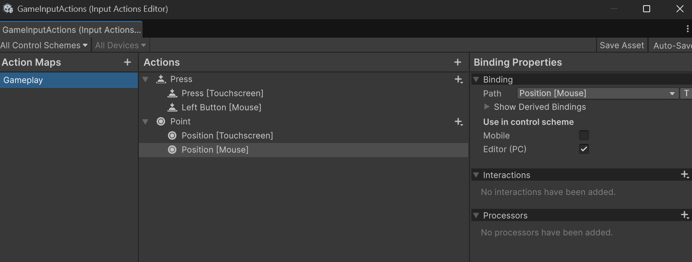
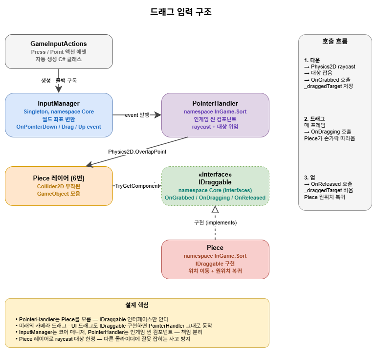
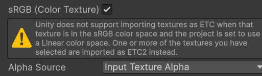
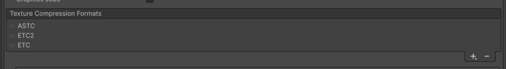
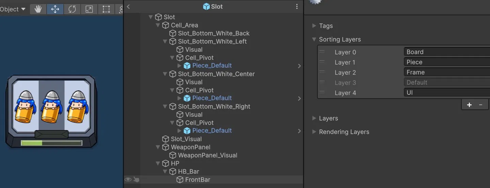
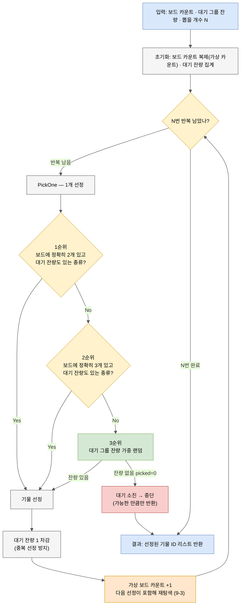
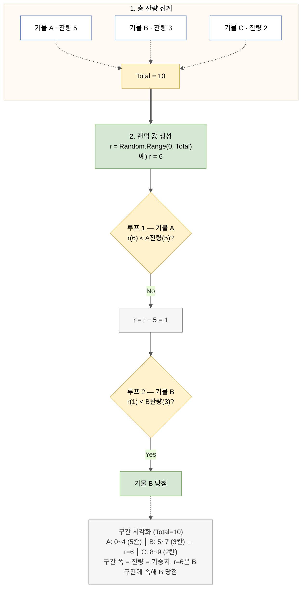

# 기업협약 팀프로젝트 작업 노트

**작성자**: 이성규 (7팀 / 플밍 팀장)  
**게임명**: 총알소녀 (가제)  
**작성일**: 2026-05-19  
**최종 수정**: 2026-07-06

## 프로젝트 개요

- **진행 기간**: 2026.05.07 ~ 2026.07.16 (개발 착수 05.19)
- **개발 환경**: Unity 6.3 LTS / C# / URP 2D / Android
- **장르**: 2D 캐주얼 모바일 3-Sort 디펜스

---

# 작업 일지

## Day 1 — 2026-05-19

### 한 일

- 기획반 발표 청취, 팀원 간 아이스브레이킹
- 프로젝트 템플릿 사전 생성 (URP 2D, 업무 시간 외 진행)
- 기본 2D 패키지 전체 업데이트
- 패키지 설치
  - Unity Recorder — 화면 캡처용
  - Mobile Feature 패키지 — 모바일 성능 분석용
  - 2D Feature 패키지 — 2D 개발 편의
  - Addressables for Android — 사용 가능성 높음
  - Project Auditor — 프로젝트 분석용
- 프로젝트 폴더 세팅
- 코어 스크립트 추가
  - 제네릭 싱글톤 (`Singleton.cs`)
  - 로거 (`Logger.cs`) 및 로거 UI 캔버스 프리팹

### 결정 / 시행착오 메모

- **싱글톤 강화 — 도메인 리로드 끄기 대응**
  - 도메인 리로드를 꺼도 안전하게 동작하도록 `static` 리셋을 넣으려 했으나,
    `[RuntimeInitializeOnLoadMethod]`는 **제네릭 클래스 안에 둘 수 없음** (컴파일 에러).
  - → 비제네릭 `SingletonBase`를 만들어 리셋 로직을 분리. `Singleton<T>`는
    자기 `_instance` 리셋 함수를 `SingletonBase`의 레지스트리에 등록하는 구조로 해결.
  - 리셋 등록 모음은 `HashSet` 사용 (중복 등록 자동 차단). 단 리셋 델리게이트는
    `static readonly`로 한 번만 만들어야 중복 판정이 동작함.
  - 중복 인스턴스가 초기화 코드를 실행하는 문제는, 자식이 `Awake` 대신
    `Init()`을 오버라이드하고 베이스가 살아남은 인스턴스에서만 `Init()`을
    호출하는 구조로 해결.
  - `Singleton<T>`에 `[RuntimeInitializeOnLoadMethod]`가 없어 UDR0001 경고가
    남지만, 제네릭 우회 설계상 불가피 — 무시하기로 결정.
- **Logger 위치**: 코어 구성요소이므로 `Utils`가 아니라 `Core` 폴더 / `Core`
  네임스페이스로 정리. `Utils` 폴더는 범용 유틸용으로 유지.
- **Addressables 채택**: 데이터·리소스 로딩을 Addressables 기준으로 통일 검토 필요.
  `DataManager` 로드 경로 방침에 반영 예정.

### 다음 할 일

- **플밍 3인에게 코어 셋업 공유 및 합의 받기**
  - 코어 가이드 2.2 합의 규약(매니저는 `Init()` 오버라이드, `Awake` 손대지 말 것) 공지
  - Unity 6.3 LTS / 패키지 구성 / 폴더 구조 동일하게 맞췄는지 확인
- **셋업 검증**
  - 빈 프로젝트로 Android APK 빌드 한 번 통과
  - 실기기에서 Logger 화면 출력 확인 (`Logger.Instance.LogInfo(...)`)
- `GameManager` / `Define` 골격 작성
- 데모 범위 확정 후 3-Sort 판정기 설계 착수

---

## Day 2 — 2026-05-20

### 한 일

- **학원에서 팀 공용 GitHub 레포(`finalproject-dev-LS-archive`) 수령**
- 팀 공용 레포 초기 셋업
  - 어제 만든 Unity 프로젝트 템플릿(로컬 보관분)을 팀 공용 레포에 올려 프로젝트 세팅
  - `Docs/` 폴더에 가이드 3종 + 작업 노트 커밋
  - `main` 브랜치 보호 규칙 적용 (※ `develop`은 미생성, Day 3에 활성화 예정)
- DOTween 임포트 → `Assets/Imports/` 폴더에 배치 (협업 가이드 7.1: 외부 에셋은 별도 폴더 + gitignore)
- 플밍 3인(김경민·안정연·연동준)에게 셋업 공유
  - 팀 공용 레포 클론 안내
  - 코어 가이드 / 개발 환경 가이드 / 협업 가이드 위치 안내
  - 코어 합의 규약(매니저는 `Init()` 오버라이드) 공지
- 협업 구조 추가 회의 진행
  - 플밍팀 역할 배정
  - 팀내 TF 설계 — 각 파트 2명, 회당 1회, 3~5일 단위
- 기획 안내 수신 및 수락
  - **포탑은 모듈형 구조로 간다**
  - 뼈대(발사 방식: 일반 / 탱커 / 보조) + 공격 타입(기본 / 산탄 등)을 조립
  - 3-Sort로 타입을 맞춰 포탑 조립
  - 가챠 시스템 도입 — 외부 활성, 1성/2성/3성 등 성급제

### 결정 / 시행착오 메모

- **Git 브랜치 보호 정책 (정책 합의)**: 최종적으로 `main` / `develop` 양쪽 보호,
  admin bypass = 본인(팀장)만. 모든 머지가 팀장을 거치는 구조. 협업 가이드 6.3
  "PR 병합 담당자" = 본인으로 확정. 플밍 3인이 PR을 올리면 팀장이 머지하는 흐름.
  단, Day 2 시점에는 `main`에만 보호가 걸려 있었고 `develop`은 미생성 상태.
  실제 양쪽 보호 적용은 Day 3 develop 생성 시 동시 진행.
- **DOTween 위치 및 배포 방식**: `Assets/Imports/` 배치 + `.gitignore` 대상.
  팀원은 팀장에게 DOTween 패키지를 받아 동일 위치에 배치한다.
  유료/외부 에셋은 GitHub 업로드 금지(라이선스) 원칙에 따른 처리.
- **사전 셋업 → 팀 공용 레포 일원화**: 어제 만든 템플릿은 로컬에만 보관 상태였고,
  오늘 학원에서 팀 공용 레포를 받은 시점부터 그 레포 하나로 일원화.
  별도 보관용 레포 없음.
- **모듈형 포탑 = 뼈대 + 공격 타입 조합**
  - 세부(슬롯 메커닉 변동, 정렬 단위 등)는 미정. TF 회의에서 확정 예정.
- **가챠 = 외부 활성**: 가챠는 외부 시스템이라 인게임 성장 트랙과는 별개로 다룬다.
- **앞으로 핵심 고려 요소 3가지** (데모 ~6/8 들어가기 전 의식 유지)
  - 해상도 대응 (Android 세로, 다양한 화면비)
  - 성능 최적화 (메모리, 오브젝트 풀링, GC 최소화)
  - 데이터 드리븐 설계 (스키마 + 로드 파이프라인 우선 합의)

### 다음 할 일

- 팀원 셋업 동기화 상태 확인 (Unity 버전, 패키지, DOTween 배치)
- 빌드 검증 (Android APK + 실기기 Logger 출력)
- PR 머지 시간대 운영 (17:10 보고 직후 일괄 처리 고정)
- `GameManager` / `Define` 골격 작성
- TF 회의에서 모듈형 포탑 세부 메커닉 확정
  - 정렬 단위(기물=모듈인지, 기물=완성품인지)
  - 슬롯에서 뼈대+공격 조합되는 방식
  - 가챠 풀과 인게임 흐름의 연결
- 모듈형 확정 후 SO 데이터 구조 설계
  - 뼈대 SO / 공격 타입 SO / 조합 결과 SO 분리 검토
- 데이터 테이블 스키마 합의 (타워 모듈·적·웨이브·특전·가챠 풀)

---

## Day 3 — 2026-05-21 (가이드 문서 정리 & 데모 진입 준비)

#### 가이드 문서 갱신 및 회의자료 작성

데모(~06/08) 들어가기 전 가이드 문서 4종을 한 묶음으로 정리했다. 협업 가이드 / 코어 시스템 가이드 / 개발 환경 가이드는 이전 정리분에서 큰 변경 없이 유지했고, **역할 분담 회의자료(데모)**를 신규 작성했다.

회의자료는 묶음 A~G로 시스템을 나누고, 각 묶음 안에 세부 항목 체크박스 형태로 펼쳤다. 회의에서 각자 자기 영역을 가져갈 수 있도록 큰 묶음 단위와 세부 항목 단위 둘 다 보이게 짰다. 묶음 G(데이터 드리븐)는 별도로 분리했는데, 미션 필수 기술이라 한 사람이 표준·파이프라인을 잡고 각 시스템 담당이 그 표준 따라 자기 SO를 만드는 구조다.

같이 작성한 **일별 브리핑 양식**은 오전 1교시에 보고자(서기 로테이션)가 작성하고 2교시에 팀장 동행 보고하는 흐름으로 잡았다. 보고자 순서는 김경민 → 안정연 → 연동준 → (반복).

#### 기획 안내 수신 — 모듈형 포탑 세부 사항 (안내 단계)

기획팀에서 특전·전투 회의 결과를 정리해 공유. 다만 모두 **확정이 아니라 안내 단계**이며, 모듈형 포탑의 세부 사항은 추후 다시 알려준다고 함. 회의자료에는 일단 참고로 반영하되 비고에 "안내 단계"임을 표기.

안내 내용 요지:

- **포탑 등급제** — 타입 × 등급(1성/2성/3성) 두 축으로 식별. 같은 (타입, 등급)이라도 인스턴스별 레벨이 다름. 조각으로 레벨업하며, 큰 레벨 차이가 없는 한 등급 높은 쪽이 무조건 우위.
- **포탑 수치 항목** — 기본 6종(공격력·공격속도·사거리·투사체 갯수·피격 범위·보유 탄환)에 데이터 드리븐용 추가 4종(폭발 범위·관통력·효과 유지 시간·효과 수치). 모든 포탑이 10종을 다 쓰는 게 아니라 타입별로 의미 있는 필드가 다름 — 폭발 범위는 폭발형만, 관통력은 관통형만, 효과 유지·수치는 버프·둔화형만.
- **공격 우선순위 단순화** — 거리순(가장 먼 / 가장 가까운) 두 가지만. 타입별 우선·체력별 우선은 삭제.

이 안내가 확정으로 굳으면 묶음 G-2 스키마 합의 회의에서 SO 구조(단일 SO + 옵션 필드 vs 베이스 + 파생 SO)를 정해야 한다.

#### 회의자료에 신규 메커닉 2종 반영

본인 정리 + 기획 안내를 종합해 회의자료에 두 가지를 추가했다.

**보드 클리어 보너스** (묶음 B): 모든 슬롯의 기물을 다 비우면 필드 전체 적에게 데미지가 들어가고 슬롯이 새 기물로 리필된다. 정렬을 끝까지 밀어붙일 동기를 만드는 메커닉. 이벤트 흐름상 B가 발동시키고 C-1이 살아있는 몬스터에 데미지 적용, 다시 B가 리필하는 구조라 인터페이스 합의가 필요하다.

**데모 덱 편성** (묶음 E): 로비에서 인게임 진입 전 포탑 셋을 미리 구성. 가챠 보유 풀과 연계되는 메타 시스템이라 가챠와 같은 묶음에 둠.

#### R&D 방향 정리

회의자료에 R&D 섹션을 별도 박아 각자 방향을 명시했다.

- **안정연(C-2)** — 포탑 타깃 서칭 방식. 거리순 우선순위 후보 탐색·캐싱 전략, 매 프레임 부하 최소화가 핵심.
- **연동준(C-1)** — 오브젝트 풀링. 누적 처치 수천 단위에 견디는 몬스터·발사체 풀 구조.
- **김경민(D·E)** — R&D보다 docs 정독으로 기획 이해, 이벤트 구조 연결 이해, 시스템 설계 사고. 로그라이크는 다른 시스템 출력을 받아 처리하는 위치라 인터페이스 이해가 코드보다 우선이다.
- **본인(팀장)** — 각종 문서 작성 + 추후 예시 `GameManager` 작성.

#### Player Settings — 화면 회전 (세로 모드 고정)

모바일 세로 화면 컨셉에 맞춰 Player Settings에서 화면 회전을 제한했다. **Portrait + Portrait Upside Down 허용**, **Landscape Left/Right 차단**. `Edit > Project Settings > Player > Resolution and Presentation > Allowed Orientations for Auto Rotation`에서 설정. 개발 환경 가이드 9.1에 빌드 설정으로 박아뒀다.

#### 기획팀용 GitHub Issue 템플릿 추가

기획팀이 GitHub Issue로 요청·문의·버그 리포트를 던질 수 있도록 템플릿을 추가했다. 위치는 `.github/ISSUE_TEMPLATE/기획_요청.md`. **이슈 템플릿은 default branch(main)만 인식**하므로 별도 chore 브랜치로 main 직접 PR로 적용했다.

구성은 종류(기능/수정/버그/문의 체크박스) / 내용 / 의도·이유 / 관련 문서 / 우선순위(데모/CBT/OBT/시점 무관) / 기타 6칸. 의도·이유 칸은 "왜 필요한지"를 적게 유도해 플밍이 맥락 없이 작업하는 사고를 막기 위함이고, 우선순위 칸은 모든 이슈를 "급함"으로 던지지 못하게 마일스톤 기준으로 분류하게 했다.

#### Day 2 사실관계 정정

어제 작성 시점에 "develop 브랜치 생성 + 양쪽 보호 규칙 적용"으로 적어뒀으나, 실제로는 `main`만 보호된 상태였고 `develop`은 미생성이었다. Day 2 노트를 사실대로 정정.

#### 가이드 문서 main 커밋 → develop 생성 → 보호 재활성화

오늘 진행 순서는 다음과 같다.

1. 보호 임시 해제 상태에서 가이드 문서 4종을 `main`에 직접 커밋
2. `develop` 브랜치 생성
3. `main`/`develop` 양쪽 보호 재활성화 (admin bypass = 본인)

문서를 올린 시점에는 `develop`이 아직 없었기 때문에 PR을 거칠 대상이 없었다. develop 생성 이후의 모든 코드 작업은 `feat/*` 브랜치 → develop PR 흐름으로 들어간다. 팀장도 예외 없이 이 룰을 따르며, 다음 작업인 `GameManager`도 `feat/game-manager_LSG` 브랜치로 진행 예정.

#### 팀원에게 셋업·문서 공유 완료

플밍 팀원에게 갱신된 회의자료·브리핑 양식·코어 합의 규약(매니저는 `Init()` 오버라이드)을 직접 설명했다. 가이드 위치, 일별 브리핑 작성 흐름, R&D 방향(각자 영역별), 팀 공용 레포 클론 안내까지 한 번에 정리.

#### Localization 패키지 채택 결정

한/영 현지화는 Unity Localization 패키지로 처리하기로 했다. 데이터 측(묶음 G-1)에서는 String Table + Locale + 키 조회 API를 패키지가 제공하고, UI 측(묶음 F)에서는 `LocalizeStringEvent` 컴포넌트로 TMP에 부착하면 자동 갱신된다. 데이터/UI 두 영역에 걸친 작업이 패키지로 거의 다 해결된다.

다만 한 가지 검토 사항. 미션 요건은 "메타데이터가 정리된 JSON/Excel"인데 Localization 패키지의 String Table은 Unity 에셋 형식이다. 평가 시 미션 요건 충족 여부가 애매할 수 있어, 필요 시 별도로 JSON/Excel 보관본을 두는 방안을 추후 검토.

**패키지 설치는 일과 외 시간에 본인이 진행**하기로 했다. 패키지 설치는 `manifest.json`·Settings 등 공용 파일 변경이 커서 다른 팀원이 작업 중이면 머지 충돌이 확정이다. 임시 한글 폰트도 같이 셋업.

#### 기본 폰트 결정 — 기획팀 제공 폰트 / 로거는 임시 폰트 유지

기획팀에서 게임 기본 폰트를 제공받았다. 인게임·로비·UI 등 사용자가 보는 모든 텍스트는 이 폰트로 통일.

다만 **Logger UI는 임시 폰트를 그대로 사용**한다. 로거는 디버그용이라 게임 본 분위기와 시각적으로 분리되는 게 오히려 깔끔하고, 릴리즈 빌드에서는 `Debug.isDebugBuild`로 자동 비활성되니 폰트 통일이 의미 없다.

#### `GameManager` 골격 작성

`feat/game-manager_LSG` 브랜치에서 `GameManager` 골격을 작성. `Singleton<GameManager>`를 상속하고 `Init()`만 오버라이드 — 합의 규약(매니저는 `Awake` 안 건드림) 그대로 따랐다.

`Init()` 안에서는 `Logger.Instance` null 체크 후 초기화 로그를 찍고, 매니저 등록 헬퍼 `RegisterManager<T>()`로 필요한 매니저들을 순서대로 등록하는 구조. 현재는 등록부가 TODO·주석 상태이며 묶음 G(DataManager)·A(InputManager)가 작성되는 대로 실제 호출을 채워 넣는다. 데모 단계 확정 시 InGameManager·SortManager 등도 추가 등록 예정.

`RegisterManager<T>()`는 `Singleton<T>.Instance` 호출로 자동 생성 로직을 발동시키고, 생성된 매니저를 `GameManager`의 자식으로 reparent. 부모를 따라 `DontDestroyOnLoad`되도록 만드는 패턴이다.

develop PR(#2) 후 admin bypass로 머지 완료. 4 커밋(작업 폴더·씬, 문서 갱신, GameManager 골격, 작업 노트)을 한 PR에 묶었다.

#### 폰트 셋업 — 기획팀 제공 기본 폰트

`feat/font-setup_LSG` 브랜치에서 기획팀이 준 기본 폰트를 `Assets/Project/Font/` 폴더에 배치. 두 종(Hakgyoansim, NotoSansKR) + **OFL 라이선스 파일** 포함. TMP SDF 폰트 에셋 생성. 라이선스 파일은 SIL Open Font License상 *재배포 시 라이선스 동봉* 의무를 충족하기 위해 같이 커밋한다.

Logger 프리팹은 임시 폰트를 그대로 사용 — 디버그 UI라 게임 본 분위기와 분리되는 게 깔끔하고, 릴리즈 빌드에서 자동 비활성되니 통일 의미가 없다.

#### 부팀장 권한 부여 — 안정연 (Maintain + bypass)

팀장 부재 시 PR 머지가 멈춰 데모 일정이 막히는 사고를 방지하기 위해, **부팀장 안정연에게 GitHub Maintain 권한 + 브랜치 보호 bypass 권한 부여**.

이번 변경으로 협업 가이드 갱신.

- 2장 플밍 파트 표 — 안정연 "플밍 부팀장, PM"으로 명시, 비고에 머지 대행 추가
- 6.3 PR 규칙 — 팀장 부재 시 부팀장 머지 대행, bypass 운영 약속("팀장만 평상시 bypass 사용 가능, 부팀장은 팀장 부재 시에만, 본인 PR은 본인이 bypass로 머지하지 않음") 명시

협업 가이드 갱신분은 이번 폰트 PR에 같이 묶어 올린다.

#### Localization 패키지 설치 (일과 외)

일과 외 시간에 Unity Localization 패키지 설치 + 임시 한글 폰트 셋업. 패키지 설치는 `manifest.json`·Settings 등 공용 파일 변경이 커서 다른 팀원이 작업 중이면 머지 충돌이 확정이므로 일과 외로 미뤘다. 이번 폰트 PR에 같이 묶어 올린다 — 셋 다 환경·운영 정비 성격이라 한 묶음으로 다루는 게 정합성 있다.

한/영 현지화 기반이 갖춰졌으니, 묶음 G-1 담당이 이후 String Table·Locale 설정을 이어 가면 된다.

---

### Day 3 다음 할 일

(오늘 작업 모두 완료.)

---

## Day 4 — 2026-05-22 (테스트 빌드 & 입력 매니저 구현)

#### 기획팀과 운영 합의 — WBS 흐름 / 문서 허브 분류

플밍 팀 일일 보고 완료 후 기획팀과 운영 흐름을 상의했다. 두 가지가 합의됨.

**WBS 운영 흐름** — 플밍팀은 별도 작업 현황 구글 시트(`7팀_작업_현황`)를 활용해 자체 관리하고, 그 내용을 기획팀 PM이 공유받아 전체 WBS를 업데이트한다. 플밍팀은 업데이트된 WBS에 피드백 가능. 즉 플밍 진척 → PM이 WBS 반영 → 플밍이 본 후 피드백의 순환.

**문서 허브 분류** — 문서 허브에 기획 리뷰가 완료된 문서를 별도 분류 영역으로 두고, 플밍은 그 분류만 본다. 리뷰 중인 안건이 플밍에게 잘못 전달되는 사고를 막기 위함.

#### 데이터 / UI 담당 결정 — 김경민 (묶음 D·E·G + 실질적 F)

오늘 마지막 교시 직전(4시 반경) 기획 팀장에게서 **기획 검수가 완료된 기획 리뷰 시트**를 전달받음. 이를 보고 플밍 팀원에게 같이 안내했고, 데이터 담당을 결정.

**데이터(묶음 G) — 김경민**. 데이터 스키마·로드 파이프라인은 아직 완전히 정해지진 않았으나, 지금 시점에 *기획·문서 파악으로 시간이 붕 떠 있는* 김경민에게 맡기는 게 자연스럽다. 로그라이크 담당이 데이터(특전 풀·경험치 곡선 등)와 가장 많이 닿기도 함.

**UI/UX(묶음 F) — 사실상 김경민**. 회의자료에선 후순위로 담당자 미정이었으나, 현지화(Localization)와 엮여서 같이 개발하는 게 자연스럽고, 로그라이크는 선택지·정비창 같은 *텍스트 많은 UI*를 다수 다루는 특성이라 김경민이 자연스럽게 같이 맡게 됨.

**업무 분산 의식** — 이러면 김경민 담당이 D·E·G·F 4개 묶음으로 늘어남. 본인(팀장)이 A·B를 잡는 것과 비슷한 부피인데, 본인은 매니저·인프라 위주라 *코드량 자체*는 김경민 쪽이 더 클 수 있음. **김경민에게 "구현 중 분업 가능한 파트가 보이면 즉시 팀에 공유해달라"고 안내**. 첫 주 진행을 보고 필요 시 재분배 회의.

#### 테스트 빌드 — GameManager + Logger 정상 동작 확인

`GameManager`와 `Logger`를 씬에 배치한 상태로 Development Build로 APK 추출. 안드로이드 핸드폰을 PC에 연결해 **Build and Run**으로 빌드·전송·실행. 실기기에서 Logger가 정상 동작하는 모습 확인.

이번 빌드는 **검증 목적이라 변경사항을 모두 디스카드, 브랜치도 파지 않았다**. 빌드 설정·씬 구성 변경 자체가 PR로 올릴 만큼 의미 있는 결과물이 아니고, 정상 동작 확인이 목적이었음. 작업 노트에 "정상 동작 확인됨" 사실만 남긴다.

코어(Singleton·Logger·GameManager) + Player Settings(세로 모드 고정) + 패키지(Localization·DOTween 등)이 실기기에서 정상으로 도는 것이 확인된 시점.

#### `GameInputActions` 인풋 액션 에셋 셋업

`feat/input-manager_LSG` 브랜치에서 작업 시작. Input System 기반, 모바일 터치·드래그 이벤트 발행 — 묶음 B(3-Sort 드래그)의 선행 작업.

**입력으로 처리해야 할 것** — 화면 터치로 기물을 드래그하고 슬롯에 놓는다. 필요한 정보는 ① 매 프레임 *드래그 포지션*과 ② 들고 / 떼고 / 내리는 상태 전환 — 즉 다운 / 드래그 / 업 3단계.

**액션 구성**:

| 액션 | Action Type | Control Type |
|---|---|---|
| `Press` | Button | — |
| `Point` | Value | Vector2 |

`Press`는 *누르고 떼는 값 체크*, `Point`는 *매 프레임 좌표 추적*. 두 액션을 분리해서 콜백 자체가 다운/업 분기를 처리하게 했다.

**Control Scheme 분리** — `Mobile`과 `Editor (PC)`. 같은 액션을 두 디바이스로 받게 해 *에디터에서 마우스로, 빌드에서 터치로* 같은 코드가 동작하도록 했다. 에디터 테스트 효율 ↑.

| 액션 | Mobile 바인딩 | Editor (PC) 바인딩 |
|---|---|---|
| Press | `<Touchscreen>/primaryTouch/press` | `<Mouse>/leftButton` |
| Point | `<Touchscreen>/primaryTouch/position` | `<Mouse>/position` |

프로젝트의 기본 Input Action으로 등록 + **Generate C# Class 토글 ON** — `GameInputActions.cs` 자동 생성. 런타임 로딩 없이 `new GameInputActions()`로 인스턴스화. (에셋 로딩 방식 결정: 매니저에서 에셋을 들어야 하는 경우는 씬 배치로 가되, InputActions는 자동 생성 클래스라 그 규칙에서 빠진다.)



#### `InputManager` 스크립트 작성

`Singleton<InputManager>` 상속 + `Init()` 오버라이드 — GameManager와 같은 합의 규약 따름. `GameManager.Init()`에서 `RegisterManager<InputManager>()` 호출로 자동 생성·자식 등록 흐름에 들어간다.

발행할 이벤트 시그니처 (구독자가 받는 것):

- `event Action<Vector2> OnPointerDown` — 다운, 월드 좌표
- `event Action<Vector2> OnPointerDrag` — 드래그 중, 월드 좌표
- `event Action<Vector2> OnPointerUp` — 업, 월드 좌표

InputManager의 책임은 *원시 입력 + 화면→월드 좌표 변환*까지. 구독자는 월드 좌표만 받고 카메라 변환 코드를 작성하지 않는다.

**Raycast로 어떤 오브젝트가 잡혔는지 판단하는 책임은 InputManager가 가지지 않는다.** 그건 묶음 B 진입 시 별도 레이어(PointerHandler / DragSystem)로 결정할 예정. InputManager는 *모든 씬에서 살아 있는 코어 매니저*이고, 입력↔게임 오브젝트 매핑은 인게임 씬에서만 의미가 있어 책임이 다르다.

→ `IsPressed`는 `=> _isPressed` 단순 조회로 정리하고, **드래그 발행은 `Update()`로 분리**. 드래그는 본질적으로 *프레임 단위 연속 갱신*이라 비동기로 처리할 게 아니고 Update가 가장 단순하고 효율적임. 매 프레임 한 번씩 결정론적으로 발행되는 구조로 확정.

`Camera.main` null 가드도 추가 — 씬 전환·MainCamera 태그 누락 시 참조가 null인 채로 메서드 호출되어 에러 나는 상황 방지.

#### 빌드 / 검증 (5/22 금요일 마무리)

`feat/input-manager_LSG` 브랜치에 커밋 완료. 임시 테스터 스크립트로 빈 GameObject에 InputManager 이벤트 구독해 다운/드래그/업 좌표를 Logger에 찍어 검증. 에디터 마우스 + 실기기 터치 양쪽 정상 동작 확인. 테스터는 develop에 포함하지 않고 로컬에서만 사용.

Device Simulator 패키지(`com.unity.device-simulator.devices`)는 기본 포함이 아니라 별도 설치 필요했음 — 이번 브랜치에서 같이 설치해서 PR에 포함. 다른 팀원도 풀 받을 때 자동으로 따라옴.

PR은 24일(일)에 올림.

---

### Day 4 다음 할 일

- `feat/input-manager_LSG` → develop PR + 머지 (5/24 일 진행 완료)
- 매치-3 코드 분석 정리 (`BlockDragHandler`·`SGrid2D`·`BlockDataSO`·`EBlockStatus`·`EBlockType`·`SMatch`·`MatchFinder`·`PuzzleResult` 8종 재활용 범위 메모) — 묶음 B 진입 R&D — Day 5에 작성 완료

---

## Day 5 — 2026-05-26 (드래그 구현 & 이전 코드 재활용 R&D)

#### 매치-3 코드 재활용 분석 (잠정 메모 작성)

이전 매치-3 프로젝트 코드 13종(`SGrid2D`·`BlockDataSO`·enum 2종·`Block`·`BlockDragHandler`·`IBoard` 인터페이스 4종·`SMatch`·`MatchFinder`·`PuzzleResult` + 추가로 받은 `BoardManager`·`BoardLayout`·`BoardSpawner`·`BoardSwapper`·`BoardProcessor`·`BoardValidator`)을 훑고 「총알소녀」 도메인에 어떻게 가져갈지 정리.

결론은 **구조·패턴·인터페이스 분리 철학은 거의 살리되, 매치-3 도메인 종속 코드(라인 매치 알고리즘·낙하 연출·UGUI 드래그)는 폐기**하고 「총알소녀」 도메인(슬롯 묶음 정렬·드래그→슬롯 이동·월드 스페이스)에 맞춰 새로 짠다. `SGrid2D<T>`는 그대로, `BlockDataSO`·enum 2종은 도메인 맞춰 값·필드 재정의, `Block`·드래그 핸들러·인터페이스들은 패턴만 참조하고 새로 작성, `MatchFinder`·`SMatch`·`PuzzleResult`·`BoardValidator`·`BoardSwapper`는 폐기.

분석 본문은 본인 폴더의 잠정 메모로 작성: [`Docs/문서정리_이성규/매치3_재활용_분석.md`](문서정리_이성규/매치3_재활용_분석.md). 잠정 표기로 둔 이유 — PDF 기획안 검수 완료 여부와 인터랙션 방식(드래그 vs 탭-탭)이 확정 안 된 상태라 본격 코드 진입 전 갱신 필요.

#### MVP 일정 재조정

원래 6/1 모의 전투 완성 목표였으나 현재 진행도상 무리. 마일스톤 세분화해 다음 흐름으로 재조정:

- **6/3 (수)** — 각자 기능 구현 완료
- **6/5 (금)** — 각자 개발 기능 통합 + 기획팀 시연
- **6/8 (월)** — 기획 피드백 반영해 데모 완성

이후 게임 루프(레벨 시스템·웨이브 추가)는 데모 이후 CBT 작업(~6/22)에 들어간다.

**통합 일정을 명시적으로 박은 이유** — 통합은 따로 시간 잡지 않으면 데모 직전에 갑자기 합치다가 무너지는 흔한 지점이라, 5일에 *통합 + 시연* 단계를 분리. 추가 지연 불가 상태이므로 6/3 구현 완료에서 밀리면 통합·시연 단계가 전부 압축됨.

오늘이 5/26 화요일, 6/3까지 8일. 그 중 화·수(오늘·내일)는 R&D·재정비 단계라 페이스가 느리지만, **목·금(5/28·29)부터 가속 필수**.

오후 기획팀 기획 리뷰 전달 자리에서 MVP 일정·기획 확인 관련 이야기도 같이 함.

#### UI/UX & 로컬라이제이션 담당 변경 — 김경민에서 미정으로

Day 4에 김경민이 D·E·G + 실질적 F 4묶음 가져가는 것으로 결정했으나, **업무 과다 우려가 현실적으로 너무 큰 부담**이라 F는 김경민 담당에서 빼고 미정으로 환원. 추후 일정에 여유가 있는 사람이 담당.

현지화는 *데이터 담당이 파싱한 결과물을 Localization 패키지 컴포넌트로 UI 담당이 몇 번 클릭만 하면 되는 작업*이라 데이터 담당과 UI 담당이 굳이 같은 사람일 필요는 없음. 분리 가능성 확인됨.

**적어도 데모 이후엔 F 담당이 정해져야 함** — CBT(~6/22) 작업에서 UI가 형태를 잡아야 하기 때문. 회의자료의 묶음 F 헤더는 "(김경민)"에서 "(미정 / 데모 이후 확정 예정)"으로 환원.

#### 데이터 기획 분류 요청 (액션 아이템)

기획팀에게 데이터를 다음 3등급으로 분류해 전달 요청:

- **확정**: 변동 없음, 그대로 SO/JSON 구조 설계 가능
- **변동 가능성 있음**: 수정될 여지가 있으니 SO 구조는 유연하게
- **버릴 수도 있음**: 데이터 자체가 폐기될 가능성, 의존 로직 작성 보류

G-2 스키마 합의 회의 전에 이 분류가 있어야 SO 구조(단일 SO + 옵션 필드 vs 베이스 + 파생 SO)를 의미 있게 결정 가능. 오후 기획 리뷰 자리에서 같이 요청한다.

#### 드래그 핸들러 구현 시작 — InputManager + PointerHandler raycast 방식

스프라이트를 드래그하는 기능을 우선 구현. Piece(기물 드래그 핸들러)는 이후 이 시스템을 기반으로 작성.

**방식 결정 과정** — UGUI EventSystem 방식(IPointerDownHandler 인터페이스 상속 + Physics2DRaycaster + Collider2D)과 Input Action 기반 raycast 방식(InputManager 이벤트 구독 + PointerHandler가 직접 `Physics2D.OverlapPoint`)을 비교. 두 방식은 같이 못 쓰는 배타적 선택지.

**Input Action 기반 raycast로 결정**. 이유:

- Day 4에 짠 InputManager의 책임 분리(원시 입력)가 그대로 살아남음 — UGUI 방식이면 InputManager가 무의미해짐
- 9개 슬롯 × 3 = 최대 27개 Piece가 각자 raycast하지 않고 PointerHandler 한 곳에서만 처리
- 드래그 중인 단 하나의 Piece 추적, hover된 슬롯 추적 등 *상태 보유*가 자연스러움 — PointerHandler가 한 곳에서 관리

**셋업**:

- 유니티 6번 레이어 `Piece` 추가 — `Physics2D.OverlapPoint(worldPos, LayerMask.GetMask("Piece"))`로 Piece만 잡음. 다른 오브젝트 콜라이더에 잘못 잡히는 사고 방지
- 각 Piece에 Collider2D 추가 (BoxCollider2D 또는 CircleCollider2D)
- `Physics2DRaycaster`·UGUI EventSystem 셋업은 *불필요* — `Physics2D.OverlapPoint` 직접 호출 방식이므로

PointerHandler는 *모든 씬에서 살아 있는 코어 매니저가 아니라* 인게임 씬의 컴포넌트로 둔다 (Day 4 결정 그대로). 묶음 B 안의 한 컴포넌트로.

#### 기획 리뷰 1~4번 받음 — 데이터 시트 기준 12개 항목 진행

오후에 기획 팀장으로부터 기획 리뷰가 정리된 시트를 전달받음. 데이터 시트 기준으로 12개 항목 단위로 정리돼 있고, 오늘은 1~4번까지 리뷰 받음. 나머지는 후속 자리에서.

리뷰 단위 12개와 *플밍 잠정 담당* 매핑:

| # | 항목 | 잠정 담당 | 회의자료 묶음 |
|---|---|---|---|
| 1 | 데이터 구조 / 스키마 (JSON 등) | 김경민 | G |
| 2 | 3-Sort 시스템 / 포탑 소환 | 이성규 / 안정연 | B / C-2 |
| 3 | 스테이지 시작 + 기물 배치 | 이성규 | B 일부 |
| 4 | 전투 시스템 | 안정연 | C-2 (+ C-1 흡수 검토 중) |
| 5 | 몬스터 스폰 시스템 | 안정연(C-1 흡수 잠정) | C-1 |
| 6 | 웨이브 / 게임 플로우 | 이성규(본인 흡수) | D 일부 |
| 7 | 레벨업 시스템 | 김경민 | D |
| 8 | 특전 시스템 | 김경민 | D |
| 9 | 스테이지 종료 / 게임 플로우 | 이성규(흐름)·김경민(메커닉) | D 일부 |
| 10 | 스테이지 선택 | 미정 | F·로비 |
| 11 | 가챠 | 김경민 | E |
| 12 | 덱 편성 | 이성규 | E 일부 (Day 4까지는 김경민, 게임 플로우 관계로 이전) |

이 매핑은 *기획팀의 리뷰 진행 단위*고 회의자료의 묶음 A~G 분담은 그대로 유지. 리뷰 단위는 *데이터 시트별*로 잘려 있어 묶음 D가 분해돼 있지만, 코드 작업은 묶음 단위로 그대로 진행한다.

데이터 기획 분류(확정/변동/폐기 3등급) 요청도 같이 전달.

#### 팀원 변동 — 연동준 개인 플젝 전환 (5/27부터)

**연동준이 개인 사정으로 개인 플젝으로 빠지게 됨**. 5/27 수요일부터 적용. 본인이 기획 팀장에게 먼저 공유했고, 연동준 본인이 내일 오전에 팀에 직접 알릴 예정.

**플밍 인원 4 → 3** (이성규·안정연·김경민). 학원측에서도 회의 후 지원 방안을 검토한다고 함.

**잠정 재분배안** (확정 아님 — 학원 지원·안정연 의사 확인 후 변경 가능):

- **이성규**: A·B + 게임 플로우 흡수 (#6 웨이브·게임 플로우, #9 스테이지 종료의 흐름 부분, #12 덱 편성)
- **안정연**: C-2 + **C-1 흡수 검토** — 전투 묶음 통일이 자연스럽다는 판단. 단 안정연 본인 의사·부담 확인 필요. C-1과 함께 *연동준이 진행하던 오브젝트 풀링 R&D 결과물도 안정연이 인계*받는 흐름.
- **김경민**: D·E·G 그대로 — Day 5에 F를 미정으로 환원한 결정과 일관성 유지. 추가 부담 안 줌.

C-1·게임 플로우는 4인 기준에서 3인 기준으로 분배가 가야 하는 항목이라, *학원 지원이 들어오면 그쪽이 가장 큰 변수*가 됨.

기획팀은 *4인 기준*으로 리뷰·일정을 잡은 상태였으니, 3인으로 변경된 사실을 일정·범위 조정에 반영해야 한다. 이건 기획 팀장에게 이미 공유함.

---

### Day 5 다음 할 일

- 5/27 오전 — 연동준 팀 공유, 학원 지원 회의 결과 확인
- 안정연에게 C-1 흡수 의사 확인 (오브젝트 풀링 R&D 결과물 인계 포함)
- 재분배 확정 → 회의자료 갱신 (담당 표·묶음 C-1·R&D 표)
- 기획 리뷰 5~12번 후속 자리 일정 잡기
- 드래그 핸들러(`PointerHandler`) 본격 구현 — `feat/DragHandler_LSG` 브랜치
- 매치-3 분석 메모 갱신 — PDF 검수 완료 후, 인터랙션 방식 확정 후

---

## Day 6 — 2026-05-27 (재분배 확정 & 드래그 핸들러 진입)

#### 재분배 회의 — 잠정안 그대로 확정

어제 만든 잠정 재분배안에 플밍 3인 모두 동의. Day 5 본문의 안 그대로:

- **이성규**: A·B + 게임 플로우 흡수 (#6 웨이브·게임 플로우, #9 스테이지 종료의 흐름 부분, #12 덱 편성)
- **안정연**: C-2 + **C-1 흡수 확정** — 전투 묶음 통일
- **김경민**: D·E·G 그대로 (게임 플로우·덱 편성 제외)

회의 자체는 화면 공유로 잠정안 보면서 짧게 진행. 어제 자료(`재분배_회의자료_2026-05-27.md`)에 결정 항목 박아둔 게 회의를 짧게 가져가는 데 도움이 됨.

#### `PoolManager` 인계 — 연동준 → 안정연

오브젝트 풀링 R&D 인계는 결과물이 단순. **`PoolManager.cs` 한 파일**만 받은 게 전부였음. 연동준이 풀링 구조 R&D를 본격 진행하기 전에 빠지게 된 셈.

본인이 그 코드를 안정연에게 전달하면서 "**자유롭게 편집하거나 아예 새로 만들든 알아서 진행**"으로 안내. C-1·발사체 풀링이 안정연 책임이 됐으니 본인 판단으로 가는 게 맞음.

R&D 부담은 안정연에게 풀링·타깃 서칭 두 가지가 됨. 다만 두 R&D 모두 *전투 묶음 내부 작업*이라 통일성은 있음.

#### 학원 회의 결과 — 인력 충원 없음, 기술 지원 카드

학원측 회의 결과:

- **인력 충원 없음** — 다른 팀 분배가 이미 일주일 굳어진 상태라 추가 충원은 어렵다는 결론
- **기술 지원·문의 지원 자유롭게 가능** — 막히는 부분 있으면 학원에 문의 가능. 데모 직전 통합 단계나 CBT에서 막힐 때 쓸 수 있는 안전망

기술 지원 카드는 *지금 당장 쓰는 게 아니라 막혔을 때 쓰는 카드*라 기록만 해둠. 데모(6/5·6/8) 또는 CBT 단계에서 막히면 활용 검토.

#### 회의자료(`04_개발_역할_분담_문서__데모_.md`) 갱신

재분배 확정 → 정식 회의자료 갱신:

- 담당 표 — 연동준 행 제거, 본인·안정연·김경민 담당 갱신
- 묶음 C-1 헤더 — *(연동준)* → *(안정연)*
- R&D 표 — 연동준 행 제거, 안정연에 풀링 추가
- 하단 이력 — 5/27 갱신 사유 명시

협업 가이드(`01_프로젝트_협업_가이드_공용.md`)도 같이 갱신 — 2장 플밍 표에서 연동준 행 제거, *플밍 4인* 문구를 *플밍 3인 (5/27부터)*으로 정정.

#### 일별 보고자 로테이션 — 김경민 → 안정연 → (반복)

연동준이 빠지면서 보고자 순서도 단축. 원래 *김경민 → 안정연 → 연동준 → 반복* → **김경민 → 안정연 → 반복**. 브리핑 양식도 갱신.

오늘(5/27) 보고자는 원래 *안정연 차례*였고 그대로 진행. 내일(5/28)부터는 김경민 → 안정연 2인 로테이션.

#### 서기 역할 — 안정연 흡수

연동준이 *서기*였는데 빠지면서 그 역할도 안정연이 흡수. **안정연 = 플밍 부팀장, PM, 서기 + C-1·C-2**. 코드 영역 외 *팀 운영* 부담이 가장 큰 사람이 됨. PM 역할과 서기 역할이 모두 *팀 진행 공유* 성격이라 겹치는 부분 많음 — 합리적.

#### 묶음 F — 데모 이후 본인 흡수 결정

Day 5에 미정으로 환원했던 F를 **데모 이후 본인이 가져가는 것**으로 확정.

**데모(~6/8)에서 F는 안 만듦** — 후순위 영역 일부 미구현 가능성을 기획팀에 미리 공유했고 동의 받음. 데모 시연용 UI는 임시·최소 형태로.

**CBT 단계(6/9~6/22)부터 본인이 F 작업** — 회의자료 묶음 F 9개 항목(HUD·로비·옵션·정산·현지화 UI 등) 본격 구현. 본인의 A·B·게임 플로우는 데모 끝나면 *유지보수 위주*로 작업량이 줄어들기 때문에, 그 시점에 *새 영역 F*를 추가해도 부담 균형이 맞음. 본인 어제 판단 (*CBT 진입 전 F 담당 결정 필요*)과 일관성 유지.

회의자료 묶음 F 헤더는 *(미정 / 데모 이후 확정 예정)* → **(이성규 / 데모 이후 작업)**.

#### 회의자료(`04_개발_역할_분담_문서__데모_.md`) 갱신

재분배 + F 흡수 확정 → 정식 회의자료 갱신:

- 담당 표 — 연동준 행 제거, 본인 행에 F 추가 (*데모 이후* 표기), 안정연·김경민 담당 갱신
- 묶음 C-1 헤더 — *(연동준)* → *(안정연)*
- 묶음 F 헤더 — *(미정)* → *(이성규 / 데모 이후 작업)*
- R&D 표 — 연동준 행 제거, 안정연에 풀링 추가
- 하단 이력 — 5/27 갱신 사유 명시

협업 가이드(`01_프로젝트_협업_가이드_공용.md`)도 같이 갱신 — 2장 플밍 표에서 연동준 행 제거, *플밍 4인* 문구를 *플밍 3인 (5/27부터)*으로 정정. 안정연 비고에 *서기 흡수* 반영.

#### 웨이브 시스템 분할 — 본인 주 담당, 인터페이스로 안정연(C-1) 연결

기획팀 시트의 *웨이브 시스템 = 연동준* 표기를 보고 누가 흡수할지 검토. 웨이브가 *몬스터 스폰(C-1)*과 *게임 플로우(D)* 사이에 걸친 영역이라 *결합도 분석*이 필요했음.

**결정**: **본인이 웨이브 시스템 본체 주 담당**. 다만 *몬스터 스폰 데이터·실제 스폰 처리*는 안정연(C-1)이 담당하고, 두 매니저 사이는 *읽기 전용 프로퍼티 + 이벤트* 인터페이스로 연결.

**근거**:

- 웨이브는 *스테이지 진행 → 웨이브 시작 → 정비시간 → 다음 웨이브* 흐름의 일부 — *게임 플로우*에 속함
- 안정연이 *부팀장·PM·서기·C-1·C-2*로 이미 부담이 가장 큼. 웨이브까지 얹으면 *1인 의존도 위험*. 학원 인력 지원이 없는 상태에서 안정연이 무너지면 데모 같이 무너짐
- *웨이브 → 몬스터 스폰* 인터페이스를 *이벤트 기반*으로 깔끔하게 분리하는 게 가능. 같은 사람이 양쪽 다 짜면 *결합이 강해지고 모듈 분리가 약해지는* 안티패턴

**`WaveManager` 인터페이스 패턴** (인터페이스 합의 회의에서 구체 확정):

```csharp
public class WaveManager : Singleton<WaveManager>
{
    // 읽기 전용 — 다른 매니저가 상태 조회
    public int CurrentWave => _currentWave;
    public float RemainingTime => _remainingTime;
    public WaveState State => _state;            // Battle/Intermission/Paused
    public WaveType CurrentWaveType => _type;    // Normal/Rush/MidBoss/FinalBoss
    
    // 이벤트 — 다른 매니저가 구독
    public event Action<int> OnWaveStart;        // 웨이브 N 시작
    public event Action<int> OnWaveEnd;
    public event Action OnIntermissionStart;
    public event Action OnIntermissionEnd;
}
```

C-1·D는 *읽기와 구독만* — 본인의 내부 상태는 `private`로 보호. **매니저 간 협업 규약: 읽기 전용 프로퍼티 + 이벤트만 노출, 내부 상태는 private** — 회의자료 또는 코어 가이드에 명문화 검토.

기획팀 시트의 *웨이브 시스템* 플밍 담당은 *연동준 → 이성규*로 정정 요청 필요. 시트 관리자에게 전달.

#### 기획팀 데이터 구조도 (ERD) 검토 — 1차 안

기획팀에서 데이터 구조도 1차 안을 작성·공유. 변동 가능성 있고 *지금은 구현 참고용*. 검토 결과 책임 분할이 *데이터 차원에서도 자연스럽게 떨어짐*.

**테이블 11개 + 책임 매핑**:

| 테이블 | 책임 |
|---|---|
| `StageData` (스테이지·클리어 보상) | 이성규 (게임 플로우) |
| `WaveData` (시간 구간별 6개 SpawnGroup) | 이성규 (웨이브 본체) |
| `LevelData` (레벨별 필요 경험치) | 김경민 (D) |
| `SpawnGroupData` (그룹·몬스터 수량 4쌍) | 안정연 (C-1) |
| `MonsterData` (몬스터 스탯·경험치) | 안정연 (C-1) |
| `PieceData` (기물·등급·연결 포탑) | 이성규 (B) |
| `TowerData`·`TowerAiData`·`SkillData`·`ProjectileData`·`EffectData` | 안정연 (C-2) |
| `PerkData` (특전·효과 참조) | 김경민 (D) |

**핵심 발견 — 웨이브 분할이 데이터에서 강제됨**:

`WaveData` 구조가 *시간 구간별 6개 `SpawnGroupID` FK*만 들고 있고, 실제 몬스터·수량은 `SpawnGroupData`에 분리. 즉:

- `WaveManager`(본인)는 *시간 구간 도달 → `SpawnGroupID` 발행*만 함
- `MonsterSpawner`(안정연)는 *`SpawnGroupID` 받아 → 실제 스폰 처리*

본인이 *"숫자만 읽을 수 있게 열어둔다"*고 말한 인터페이스 패턴이 *데이터 차원에서 자연스럽게* 떨어짐.

**`PieceData`의 `ConnectTower` (FK to `TowerID`)**:

기물 ↔ 포탑 연결이 데이터에 박혀 있음. 정렬 성공 시 *B → C-2*로 `ConnectTower` 값을 넘기는 인터페이스가 자연스러움.

**미정·변동 가능 항목**:

ERD에 *물음표 표기*가 있는 필드 — 기획 확정 필요:
- `MonsterData.???경로?` — 몬스터 등장 경로 (단일/다양)
- `TowerAiData.AIScript?` — AI 스크립트 형태
- `SkillData.SkillScript?`, `EffectData.EffectScript?` — 스크립트 참조 방식
- `PerkData.PrekEffectID` — 오타로 추정 (`PerkEffectID`)

**ERD에 없는 항목** (별도 확인 필요):
- 슬롯 정적 스탯 데이터 — PDF 기획안 4.1.1의 `SlotRuntimeData`는 런타임 상태, 정적 SO는 ERD에 없음. *모든 슬롯 공통 상수*로 둘지 *데이터로 분리*할지 기획 확인 필요
- 가챠 풀 — 후순위라 미포함, 데모 단계엔 OK

이 ERD를 기준으로 G-2 스키마 합의 회의 시 *데이터 분류 3등급(확정/변동/폐기)* 받은 후 본격 구조 결정.

#### #3 기획서 검토 — 스테이지 시작 및 슬롯 기물 배치 (임소영 v1.3)

본인이 #3 담당이라 *직접 짜야 하는 영역*. 기획서 v1.3 확인.

**확정 사항**:

- **3×3 = 9슬롯 / 슬롯당 3칸 / 총 27칸** — Day 4 결정과 정합
- **슬롯 위치는 모든 스테이지에 고정** — 동적 배치 아님. 데이터 드리븐 불필요. 씬에 프리팹으로 직접 배치 + SlotID SerializeField로 박는 방식 가능
- **초기 18개 배치** — 각 슬롯에 3칸 중 2칸만 채움 (1칸 빈 상태). 슬롯별 2종 기물 = 9슬롯 × 2 = 18개
- **기물 대기 그룹 패턴** — 시스템 DB 내부에 *유한 풀*로 보관, 슬롯에서 꺼내 쓰는 방식. *유저에게 보이지 않음*
- **대기 그룹 재생성 조건** — *대기 그룹 비어 있음 + 모든 슬롯 비어 있음* AND. 둘 다 만족 시 새 세트 생성
- **빈 슬롯 배치 우선순위** — 1) 동일 기물 2개인 기물 → 2) 동일 기물 3개인 기물 → 3) 대기 그룹 랜덤. 두 번째 기물 선정 시 첫 번째 기물 포함해 재계산

**핵심 발견 — 우선순위 알고리즘은 *데드락 방지* 목적**:

기획서 9-1에 AI 시뮬레이션 결과 박혀 있음. 초기 배치 데드락은 *0%에 근접*하나 저점 유저는 *10~20%*. 우선순위 배치가 *유저 친화 + 데드락 최소화 동시 달성*. 매치-3 `BoardValidator`(데드락 판정)를 폐기한 결정과 정합 — 이 기획서가 *데드락 방지 데이터 흐름*으로 대체.

**기획팀 확인 필요 항목**:

- *빈 슬롯 발생 → 새 기물 배치* 타이밍 (즉시? 다음 프레임? 연출 후?)
- 기물 *54개 합계*가 9슬롯×27칸=27의 *정확히 2배*인 게 우연인지 의도인지

**기획서 그대로 구현 시 필요한 클래스 (1차안)**:

```
InGame/Sort/
├─ Slot.cs               — 9개 슬롯 각각의 상태 (HP·셀 3개·정렬 판정)
├─ SlotCell.cs (struct)  — 한 칸 (Piece 참조 또는 null)
├─ Piece.cs              — 기물 (Day 6 1차 작성 중)
├─ PointerHandler.cs     — 드래그 입력 (Day 6 1차 작성 중)
├─ WaitingGroup.cs       — 대기 그룹 (Piece 풀)
├─ SlotBoardManager.cs   — 9슬롯 + 대기 그룹 통합 컨트롤러 (매치-3 BoardManager 패턴 참조)
└─ PieceSelector.cs      — 우선순위 배치 알고리즘 (9-2) — 별도 캡슐화, 단위 테스트 쉬움
```

드래그 핸들러 1차 PR 머지 후 본격 진입. 6/3 구현 완료까지 시간 빠듯하므로 *드래그 마무리 → 슬롯 시스템 즉시 진입* 흐름.

#### 드래그 핸들러 본격 진입

`feat/DragHandler_LSG` 브랜치에서 작업 시작. Day 5에 결정한 *InputManager + PointerHandler raycast* 방식 그대로. Piece 레이어 6번, `Physics2D.OverlapPoint`, PointerHandler가 raycast·상태 관리.

구현 완료. 4개 클래스(`GameInputActions` → `InputManager` → `PointerHandler` → `Piece`)가 체인으로 연결되는 구조다.

역할은 넷으로 나뉜다.

**InputManager**는 입력 신호만 받는다. 화면을 누르면 "눌렸다", 떼면 "떼졌다", 누르고 있는 동안은 매 프레임 "지금 여기 있다"를 쏜다. 좌표는 항상 게임 월드 기준으로 변환해서 내보내기 때문에, 이걸 받는 쪽은 화면 좌표 변환을 신경 쓰지 않아도 된다. 모든 씬에 걸쳐 살아 있는 코어 매니저다.

**PointerHandler**는 그 신호를 받아 실제로 뭔가를 잡았는지 판단한다. 손가락이 닿은 자리에 기물이 있으면 집어들고, 이후 드래그·놓기 신호가 오면 잡은 기물에 그대로 전달한다. 뭔가 잡고 있는 상태에서 다른 손가락이 닿으면 무시한다. 인게임 씬에만 존재하는 컴포넌트로, InputManager와 역할이 분리되는 지점이 여기다.

**IDraggable**은 "드래그 가능한 오브젝트라면 이 세 가지는 반드시 처리할 수 있어야 한다"는 약속이다. 잡혔을 때 / 끌리는 동안 / 놓였을 때. PointerHandler는 이 약속만 보고 동작하기 때문에, 나중에 카메라나 UI를 드래그할 일이 생겨도 PointerHandler를 건드릴 필요가 없다.

**Piece**가 그 약속의 실제 구현이다. 잡힌 순간 원래 자리를 기억하고, 손가락과 기물 중심 사이의 오프셋을 계산해둔다. 덕분에 기물 가장자리를 잡아도 중심으로 튀지 않고 자연스럽게 손가락을 따라온다. 지금은 1차 구현이라 놓으면 무조건 원위치로 돌아간다. 슬롯 시스템이 붙으면 빈 셀에 내려놓는 로직으로 교체 예정이다.



에디터 마우스 + 실기기 터치 양쪽 정상 동작 확인. develop PR 예정.

---

### Day 6 다음 할 일

- ~~`feat/DragHandler_LSG` 본격 구현 → develop PR~~ → 구현 완료, PR 예정
- ~~매치-3 분석 메모 갱신 — PieceData 필드(`ConnectTower`·`PieceGrade`·`PieceLv`)가 `BlockDataSO`와 다른 점 보강~~ → 완료. #3 기획서 정보(우선순위 알고리즘·대기 그룹 패턴·드래그 방식 확정)도 같이 보강
- 1차 드래그 머지 후 묶음 B 본격 진입 — `Slot`·`SlotCell`·`WaitingGroup`·`SlotBoardManager`·`PieceSelector`
- 기획팀 시트 *웨이브 시스템* 담당 정정 요청 — 연동준 → 이성규
- 기획 리뷰 5~12번 후속 자리 일정 잡기
- 인터페이스 합의 회의 일정 잡기 (데모 첫 주 안) — `WaveManager` 노출 API·이벤트 시그니처·`WaveData` SO 구조 확정
- ERD 미정 항목 기획팀 확인 (`???경로?`·`AIScript?`·슬롯 정적 SO 등)
- #3 기획서 확인 — *빈 슬롯 발생 → 새 기물 배치* 타이밍 (즉시/연출 후)


---

## Day 7 — 2026-05-28 (슬롯 및 그리드 시스템 구현)

#### 기획팀 회의 — 기물·포탑 데이터 연결 방식

오전 중 기획팀과 기물 이름 및 포탑 이름, 데이터 연결 방식에 대한 회의를 완료했다. 추가로 궁금한 사항들도 문답 시간을 가졌다.

#### DragHandler PR 머지

(진행 후 채워 넣음)

#### 슬롯 시스템 구현

구현에 앞서 피그마에서 임시 UI 이미지를 복사해 사용했다. 이미지를 임포트하는 과정에서 sRGB 압축 관련 경고가 떴는데, Player Settings의 텍스처 압축 포맷에 ASTC와 ETC2를 추가해서 해결했다. 기존에는 ETC만 있던 상태였다.




슬롯 시스템을 구현하면서 구조 상의 불편함이 하나 드러났다. 기획서 기준으로 슬롯은 3×3 배치이고 슬롯 하나에 셀이 3칸, 총 27칸의 월드 스페이스 오브젝트다. 그런데 스프라이트 기반이라 UGUI의 Canvas Scaler나 Layout Group 같은 화면 크기 대응 편의 기능을 그대로 쓸 수 없다. 슬롯 배치가 모든 스테이지에서 고정 위치이므로(기획서 3-2) 동적 배치 문제는 아니지만, 다양한 해상도에서 슬롯이 화면에 맞게 스케일되도록 별도 처리가 필요한 상황이다.

**슬롯·셀 구조 (기획서 기반)**

기획서에서 정의한 구조는 다음과 같다. 슬롯은 9개(3×3 배치), 각 슬롯은 셀 3칸을 보유하며 셀 하나에 기물 하나만 들어간다. 스테이지 진입 시 각 슬롯의 3칸 중 2칸에만 기물이 배치되어 총 18개로 시작한다.

기물 이동 성공 조건은 세 가지를 모두 만족해야 한다 — 선택된 기물이 핸들에 등록돼 있을 것, 이동하려는 대상 셀이 존재할 것, 대상 셀이 비어 있을 것. 대상 셀이 비어 있지 않으면 이동 실패로 처리하고 원위치로 돌려보낸다. 멀티터치 두 번째 터치는 무시한다(이건 Day 6 PointerHandler에서 이미 처리됨).

**정렬 판정 구조 (3-Sort 기획서 기반)**

슬롯 내 동일 기물 3개가 모이면 정렬 성공이다. 기물 이동이 완료된 시점에 해당 슬롯을 검사해서 3개가 동일한지 확인하고, 성공이면 정렬 성공 데이터(슬롯 ID, 기물 ID)를 생성해 포탑 소환 시스템으로 넘긴다. 슬롯의 셀 데이터는 Empty로 초기화된다. 동일 기물 3개가 아니면 정렬 실패로 플로우를 종료한다.

포탑 소환 시스템은 정렬 성공 데이터를 받아 소환 위치(슬롯 ID)와 포탑 종류(기물 ID)를 결정한다. 해당 슬롯에 이미 가동 중인 포탑이 없으면 즉시 소환하고, 있으면 대기열에 등록한다.

**구현할 클래스 1차안**

```
InGame/Sort/
├─ Slot.cs            — 슬롯 1개 (셀 3개 보유, 정렬 판정, 포탑 소환 이벤트 발행)
├─ SlotCell.cs        — 셀 1칸 (MonoBehaviour, 드롭 판정 + 배치 기준점)
├─ WaitingGroup.cs    — 기물 대기 그룹 (내부 풀, 재생성 조건 관리)
├─ SlotBoardManager.cs — 9슬롯 + 대기 그룹 통합 컨트롤러
└─ PieceSelector.cs   — 우선순위 배치 알고리즘 (동일 기물 2개 → 3개 → 랜덤)
```

`SGrid2D<T>`(매치-3 재활용)는 보드의 *논리 데이터*를 들고, 위 클래스들은 *씬 표현*을 맡는 구조로 분리한다(아래 셀 구조 결정 참고).

Piece와 PointerHandler는 Day 6에 이미 작성됐으니 이 위에 쌓는 구조다.

**셀 배치 방식 검토 — 비주얼과 판정 분리**

슬롯 안에 기물 3개를 나란히 배치하는 부분에서 구조 결정이 필요했다. 출발점은 단순한 의문이었다 — 스프라이트 피벗이 이미지 중심이라, 검은 테두리·그림자까지 포함된 통이미지로 두면 기물마다 피벗이 미묘하게 달라져 셀 중심 정렬이 흔들린다. Canvas였다면 RectTransform이 영역을, Layout Group이 정렬을 공짜로 해주지만 월드 스페이스 스프라이트엔 그게 없다.

결론은 **비주얼과 판정·배치를 별도 계층으로 분리**하는 것. 분리본을 받아 잡은 슬롯 프리팹 구조는 다음과 같다.

```
Slot (root)
├─ Cell_Area              — 셀 배치 영역 기준
├─ Slot_Bottom_White_Back — 바닥 보드 (3분할)
│   ├─ Slot_Bottom_White_Left
│   ├─ Slot_Bottom_White_Center
│   └─ Slot_Bottom_White_Right
├─ Slot_Visual            — SpriteRenderer + Box Collider 2D (적군 충돌·슬롯 피격)
├─ CellAreaPivot          — 안쪽 배치 영역 기준
│   ├─ CellAnchorLeft     — SlotCell(Mono) + Collider2D(Cell 레이어) → Piece
│   ├─ CellAnchorCenter   — SlotCell(Mono) + Collider2D(Cell 레이어) → Piece
│   └─ CellAnchorRight    — SlotCell(Mono) + Collider2D(Cell 레이어) → Piece
├─ WeaponPanel            — 스프라이트 (배경 판때기)
└─ HB                     — HP 바 (아래 HP 바 항목 참고)
```

앞서 기획팀 UI 담당에게 요청한 *바닥 보드 3칸 분리*가 분리본에 반영되어 `Slot_Bottom_White_Left/Center/Right`로 들어왔다.

슬롯은 영역이 두 종류다. *안쪽 배치 영역*(셀 3칸, 테두리 제외)과 *충돌 영역*(외형 전체, 적군 충돌)이 기준이 정반대라 하나의 Transform으로 둘 다 만족할 수 없어 분리가 강제됐다. 기물도 같은 원리로 *루트(판정·배치 기준)* + *자식 비주얼*로 나눠, 테두리·그림자 여백과 무관하게 판정·정렬이 일정하게 유지되도록 했다.

**슬롯 콜라이더 수동 조정**

분리본을 받아보니 바닥 보드(앞쪽 판때기)가 셀 영역 일부를 *가리는* 형태로 만들어져 있었다. `Slot_Visual`의 Box Collider 2D를 자동/기본값 그대로 두면 가려지는 영역까지 포함해 판정이 어긋나, **Edit Collider 모드로 직접 조정**했다. 외형 외곽이 아니라 실제 판정에 의미 있는 영역에 맞춰 Offset Y ≈ 0.18, Size ≈ 0.9×1.81로 손봤다. 슬롯 콜라이더는 적군 충돌·슬롯 피격용이므로, 보이는 외형보다 "실제로 맞아야 하는 영역"이 기준이다.

**기물 배치 기준점 — Cell_Pivot (스프라이트 의존 회피)**

처음 우려했던 피벗 문제는 분리본을 받아도 결국 남았다. 각 파츠 스프라이트의 피벗이 "그 이미지 기준 중심"이라, 바닥 보드가 셀을 가리는 구도와 맞물려 기물을 그냥 올리면 보이는 칸 중심에서 어긋난다. 스프라이트 임포트에서 피벗을 일일이 Custom으로 잡는 방법도 있지만, 아트가 export를 다시 하면 임포트 세팅이 날아가는 약점이 있다.

그래서 콜라이더 조정과 같은 원칙 — *스프라이트 자체에 의존하지 않고 프리팹에서 잡기* — 으로 처리했다. 각 바닥 보드 칸을 `Visual`(스프라이트) + `Cell_Pivot`(빈 Transform) 2계층으로 나누고, `Cell_Pivot`을 콜라이더 Y 오프셋만큼 위로 올려 **기물의 실제 배치 기준점**으로 삼았다. 기물은 `Cell_Pivot` 자식으로 들어가니 보이는 셀 칸 정중앙에 떨어진다. export를 다시 받아도 프리팹 안 `Cell_Pivot` Transform은 유지되므로 보정이 날아가지 않는다. `SlotCell`은 배치 시 `Cell_Pivot.position`만 기준으로 쓰면 되어 코드도 단순해진다.

UI 담당에게는 *파츠 export 시 프레임(여백) 크기·피벗 기준점을 일정하게* 한 번 더 요청 — 보정량 자체를 줄이기 위함(완전히 없앨 순 없음).

**소팅 레이어 — 그리기 순서 (판정 레이어와 별개)**

겹침 순서를 위해 Sorting Layer를 구성했다. 주의할 점은 **Sorting Layer(그리기 순서)와 Collision Layer(판정)는 완전히 별개 시스템**이라는 것 — 이름이 같아도 안 통한다. 드롭·충돌 판정용 `Piece`/`Cell`/`Slot`은 `Tags & Layers`의 `Layers`(User Layer) 섹션에 따로 등록하고, 아래 소팅 레이어는 순서 의미가 드러나는 이름으로 분리했다.

소팅 순서(뒤 → 앞): **Board → Piece → Frame → UI**

- `Board` — 바닥 보드 (가장 뒤)
- `Piece` — 기물
- `Frame` — 슬롯 외곽(`Slot_Visual`). 기물보다 앞이라 기물이 슬롯 안에 담긴 느낌
- `UI` — HP 바·웨폰 패널 (가장 앞). Default로 두지 않고 UI 레이어로 통일

**드래그 중 기물은 코드로 최상단 처리.** 평소엔 Piece가 Frame보다 뒤(담긴 느낌)지만, 드래그 중엔 손가락을 따라 움직이므로 옆 슬롯 테두리 뒤로 숨으면 안 된다. 정적인 Sorting Layer로는 못 풀어서, `OnGrabbed` 때 기물 소팅을 최상단으로 올리고 `OnReleased` 때 복귀시킨다. **드래그 시작 시 콜라이더 OFF + 소팅 최상단 / 놓을 때 콜라이더 ON + 소팅 복귀**를 한 쌍으로 묶어 처리.

슬롯 외곽이 앞턱 없는 평평한 테두리 형태라, Frame이 Piece보다 앞이어도 기물을 가리지 않는다. 담긴 느낌은 나면서 가림 문제는 없는 케이스.

**슬롯 프리팹에 소팅 레이어(Board → Piece → Frame → UI) 적용 결과**  


**SGrid2D(논리) ↔ SlotCell(표현) 분리**

셀을 단순 구조체로 두려던 1차 생각을 폐기하고 두 레이어로 나눴다.

- `SGrid2D<CellData>` — 보드의 *논리 데이터*. 어느 칸에 무슨 기물이 있는지를 들고, 정렬 판정·보드 클리어·데드락 검사를 전부 여기서 한다. 콜라이더도 Transform도 없는 순수 자료구조(매치-3 `SGrid2D` 재활용).
- `SlotCell` (MonoBehaviour) — 씬의 *표현*. anchor에 붙어 콜라이더로 드롭을 받고, 자기 인덱스(`slotIndex`, `cellIndex`)와 월드 위치를 들고, 기물을 올려놓는다.

갱신은 **단방향 동기화** — 데이터(`SGrid2D`)를 먼저 바꾸고 그 결과로 씬(`SlotCell`)을 맞춘다. 데드락 시뮬레이션이 보드를 복제·시도해도 씬엔 영향이 없도록, "화면엔 있는데 논리상 빈 칸" 같은 불일치를 막기 위함이다.

**드롭 판정 규칙 — 정확히 빈 셀에만**

스왑·자동 보정 없이, **놓은 자리가 빈 셀이면 배치 / 찬 셀이거나 셀 밖이면 원위치 복귀**로 확정. 유저가 셀을 정확히 조준하는 방식이라 "가까운 빈 칸으로 보정"은 넣지 않는다(3-Sort 기획서 이동 성공 3조건과 정합). 셀 위치 자체는 게임적 의미가 없지만(정렬은 "슬롯 내 동일 3개"지 순서 무관), 규칙이 "정확히 빈 곳"이므로 판정 단위는 셀로 둔다.

판정은 **Cell 레이어 콜라이더 + `OverlapPoint`** 방식. 인접 셀 경계에서 둘 다 걸리는 모호함은 **콜라이더를 셀 칸보다 살짝 작게**(경계에 데드존) 만들어 해결 — 애매한 위치에 놓으면 실패가 규칙과 일치하니 자연스럽다.

**레이어 구성 (3종)**

- `Piece` (6번) — 기물 잡기 (`OnPointerDown` 시 OverlapPoint)
- `Cell` — 드롭 판정 (`OnReleased` 시 OverlapPoint)
- `Slot` — 슬롯 Visual 콜라이더, 적군 충돌 전용

레이어 마스크로 캐스트가 갈리므로 콜라이더 3종이 같은 공간에 겹쳐도 서로 간섭 없다. 슬롯 Visual 콜라이더는 드롭 캐스트에서 그 레이어를 안 넣으니 자동으로 무시된다. 레이어는 자식에게 상속되지 않으므로 프리팹에서 **콜라이더 달린 오브젝트(Visual / anchor 3개)만 개별 지정**한다.

레이어로 안 풀리는 건 하나 — **드래그 중인 Piece 콜라이더 끄기**. 잡은 기물도 Piece 레이어라, 안 끄면 자기 자신이 캐스트에 걸릴 수 있다. 잡을 때 끄고 놓을 때 켠다.

**보드 클리어·데드락 판정 — SGrid2D에서**

확장성을 위해 두 판정을 논리 그리드에 둔다. *보드 클리어 보너스*(묶음 B, 전 슬롯 비면 전체 데미지 + 리필)는 전체 빈 칸 검사로, *데드락*(#3 기획서 9-1: 저점 유저 10~20% 발생)은 보드를 복제해 가능한 수를 시뮬레이션하는 방식으로. 둘 다 순수 데이터 위에서 돌아야 해서 `SGrid2D`가 제격이다. 매치-3에서 폐기한 `BoardValidator`의 *데드락 시뮬레이션 패턴*은 여기서 재활용하되, *라인 매치 로직*은 폐기 유지.

데드락은 *기획 확인 필요* — ① 검사 시점(매 이동마다는 낭비, 배치·리필 직후가 유력), ② 검사 범위(현재 보드만인지 대기 그룹까지 포함인지), ③ 데드락 시 처리(REROLL 버튼? 강제 리필?).

**HP 바 — 슬롯 자식 World Space Canvas**

HP 바 Fill은 스프라이트로 깎지 않고 **월드 스페이스 UI(`Image type=Filled`)**로. `fillAmount` 한 줄로 Fill이 되고 9-slice도 깔끔해서 스프라이트보다 품이 훨씬 적다.

핵심은 **Canvas Scaler를 쓰지 않는 것**. 슬롯 스프라이트는 카메라 ortho size 보정으로 스케일되는데, Canvas Scaler가 별도로 스케일을 정하면 두 체계가 충돌해 HP 바가 슬롯에서 어긋난다. 그래서 HP 바를 **슬롯 프리팹 안의 World Canvas 자식**으로 두고 Scaler를 제거(또는 Constant), 스케일 결정권을 **슬롯 Transform 하나로 단일화**한다. 3D 게임에서 캐릭터 머리 위 HP 바를 자식 World Canvas로 박는 패턴과 같고, 2D 고정 시점이라 빌보드도 불필요하다.

배칭은 슬롯마다 Canvas가 생겨 손해지만 데모 슬롯 9개 규모에선 무시 가능. 최적화는 CBT 이후로. HP 바 Canvas엔 `GraphicRaycaster`를 빼 드래그 입력과 안 섞이게 한다.

**아트 리소스 워크플로우 합의**

별도 아트팀이 없어 **기획팀 UI 담당이 피그마로 제작**, 피그마에서 내려받기로 합의. 자체 제작분이라 외부 에셋 규칙(`Imports/` + gitignore)과 달리 **공용·라이선스 무관 → GitHub 정상 커밋** 대상(풀로 동기화). 요청 사항으로 ① 파츠별 레이어 분리 export(슬롯 프레임 / HP 배경·Front / 셀 3칸), ② HP Front는 Fill용으로 배경과 분리, ③ 투명 여백 일정하게(피벗·중심 정렬 어긋남 방지)를 전달.

정적 UI는 피그마, **도트 애니메이션 리소스가 필요해지면(몬스터·이펙트 등, CBT 이후 가능성) Aseprite Importer 검토**. `.aseprite`를 유니티가 직접 읽어 애니메이션 클립까지 생성해줘 반복 수정에 유리.

**텍스처·PPU 세팅**

피그마 임시 이미지 임포트 시 sRGB 압축 경고가 떠 Player Settings 텍스처 압축 포맷에 **ASTC·ETC2 추가**(기존 ETC만 있던 상태). Pixels Per Unit은 **기본 100 유지** — 리소스 출처가 피그마로 단일하고 카메라 ortho size가 화면을 흡수하므로 문제없다. 단 *프로젝트 기본 PPU = 100*을 팀 합의로 박아, 출처 다른 리소스(특히 Aseprite 도트)가 들어올 때 그쪽 PPU만 픽셀 크기에 맞춰 따로 잡는다.

---

### Day 7 다음 할 일

- `SlotCell`(Mono) + `Slot` + `SGrid2D<CellData>` 연결 — 단방향 동기화 구현
- 드롭 판정 구현 — Cell 레이어 콜라이더(칸보다 작게), 빈 셀 배치/원위치 복귀
- ~~드래그 중 처리 — Piece 콜라이더 OFF + 소팅 최상단(놓을 때 복귀)을 한 쌍으로~~ → Day 8 완료
- 판정용 Collision Layer 등록 — `Piece`/`Cell`/`Slot` (소팅 레이어와 별개, User Layer 섹션에)
- `WaitingGroup`·`PieceSelector` — #3 기획서 우선순위 배치 알고리즘 구현
- 카메라 ortho size 해상도 보정 스크립트
- 슬롯 자동 레이아웃(레이아웃 그룹 대체, 해상도 대응) — CBT 단계 작업
- 기획 확인 — 데드락 검사 시점·범위·처리(REROLL/리필), 빈 슬롯 발생 시 새 기물 배치 타이밍
- 기획팀 UI 담당에게 피그마 파츠 분리 export 요청 전달
- 팀 합의 — 프로젝트 기본 PPU 100 명문화

---

## Day 8 — 2026-05-29 (드래그 소팅 처리 & Define 정리)

#### 드래그 중 소팅·콜라이더 처리

Day 7에 결정해둔 *드래그 시작 = 콜라이더 OFF + 소팅 최상단 / 놓기 = 콜라이더 ON + 소팅 복귀* 한 쌍을 `Piece`에 구현했다. `IDraggable`의 `OnGrabbed`/`OnReleased`가 이미 `Piece`에 있으니 같은 자리에 묶는 게 자연스럽고, `PointerHandler`는 구체 타입을 모르는 원칙(인터페이스만 의존)을 유지한다.

`SpriteRenderer`는 `Piece` 루트가 아니라 자식(`Piece_Visual`)에 있으므로 `GetComponentInChildren<SpriteRenderer>()`로 캐싱. 콜라이더는 루트의 `Collider2D`. 인스펙터에서 직접 꽂으면 그걸 쓰고, 비어 있으면 `Awake`에서 자동으로 찾는 방식으로 처리해 프리팹 수동 셋업과 자동 fallback을 둘 다 지원했다.

`OnGrabbed`에서 현재 sortingLayer/sortingOrder를 백업 후 드래그 레이어로 변경하고 콜라이더를 끈다. `OnReleased`에서 둘 다 원래 값으로 복귀. 백업 필드는 런타임 캐시라 `private`로만 두고 인스펙터엔 노출하지 않는다.

**소팅 레이어 세분화 — UI 분리**

처음엔 드래그 중 기물을 *UI* 레이어로 올리는 방안을 검토했으나, **UI가 두 종류로 갈리는 문제**가 드러나 레이어를 더 쪼갰다.

- **슬롯 안 월드 UI**(HP 바·웨폰 패널) → 드래그보다 *아래*여야 슬롯에 담긴 느낌이 유지됨
- **HUD·모달**(점수·웨이브·일시정지·게임오버 팝업 등, CBT 단계 추가 예정) → 드래그보다 *위*여야 모달이 다 가림

같은 "UI"인데 위치가 정반대라 단일 레이어로는 표현 불가. 그래서 5단으로 갈랐다. (Default 제외 운용 레이어 기준)

```
Board     — 바닥 보드 (가장 뒤)
Piece     — 평소의 기물
Frame     — 슬롯 외곽
SlotUI    — 슬롯 안 월드 UI (HP·웨폰패널)
Dragging  — 드래그 중인 기물
ScreenUI  — HUD·모달 (가장 앞, CBT 단계 사용)
```

`Dragging`이 `SlotUI`보다 위라 옆 슬롯 HP 바 뒤로 안 숨고, `ScreenUI`보다 아래라 미래에 모달이 떠도 침범하지 않는다. 데모 단계엔 `ScreenUI`에 들어갈 게 거의 없지만 CBT를 미리 대비해 자리만 잡아뒀다.

**소팅 레이어 이름 하드코딩 방지 — `Define.cs` 보강**

Unity 소팅 레이어 이름은 문자열인데, *오타가 나도 런타임 에러 없이 무시되는* 함정이 있다(기본 Default로 그려져서 디버깅이 까다로움). 처음엔 단순히 `SortingLayers` 정적 클래스에 `const string` 6종을 박는 방식으로 갔다. 코드 쪽 오타는 막아주지만, **인스펙터에 SerializeField로 string을 노출하면 거기서 오타 가능성이 다시 살아나는** 문제가 남았다. `Piece`가 *드래그 중 어떤 레이어로 올릴지*를 인스펙터에서 지정할 수 있어야 하는데(특수 케이스 대비), string 필드는 자동완성도 검증도 안 된다.

그래서 **enum + 매핑 메서드** 구조로 한 번 더 보강했다. `SortingLayerType` enum으로 6종을 정의하고, 확장 메서드 `ToName()`이 enum → Unity 문자열로 변환. 인스펙터에선 enum 필드라 **자동 드롭다운**으로 노출돼 오타 불가능, 코드에선 enum 타입 검사로 컴파일 타임에 잡힌다.

`enum.ToString()`을 그냥 쓰지 않는 이유는 **enum 이름과 Unity Tags&Layers에 등록된 실제 이름이 같다는 보장이 없기 때문**. 누가 enum 이름만 `Drag`로 바꿔도 런타임에서 깨지는 사고를 막기 위해 매핑을 명시적으로 분리. 두 시스템(enum 식별자 ↔ Unity 레이어 이름)이 *별개임을 코드로 박아두는* 역할.

씬 이름·정렬 수·웨이브 수 같은 기획 확정값은 이미 `Define`에 있었고, 이번엔 *소팅 레이어*가 같은 범주(*문자열·매직 넘버를 한 곳에 모아둠*)로 추가된 셈. 향후 슬롯에서 `Frame` 지정, HP 바 Canvas에 `SlotUI` 지정할 때도 같은 enum 사용.

#### 슬롯 시스템 스크립트 진입 — 폴더 구조 & SGrid 개조

소팅 작업이 끝나 슬롯 스크립트 작성에 들어갔다. 시작 전에 폴더 구조와 그리드 자료구조 둘을 먼저 정리.

**폴더 구조 재정비**

스크립트가 늘어나면서 `Core/` 루트가 어지러워져, 카테고리별 하위 폴더로 정리했다. 회의자료 묶음 분담과도 정합이 맞도록 `InGame/` 아래도 묶음 단위로 잡아둠.

```
Scripts/
├─ Core/
│   ├─ Interfaces/    — IDraggable
│   ├─ Managers/      — GameManager, InputManager
│   ├─ Singletons/    — Singleton 기반 클래스
│   ├─ Struct/        — SGrid1D, SGrid2D
│   └─ Utils/         — Define, Logger
├─ InGame/
│   ├─ Slot/          — 보드 구조 (데이터·상태)
│   ├─ Sort/          — 정렬·드래그 동작 (Piece, PointerHandler)
│   ├─ Lobby/         — 묶음별 자리만 잡아둠 (빈 폴더)
│   ├─ UI/
│   └─ Utils/
```

`SGrid` 두 종은 도메인에 묶이지 않은 범용 자료구조라 `Core/Struct/`로. 슬롯 도메인 스크립트는 `InGame/Slot/`, 정렬·드래그 동작은 `InGame/Sort/`로 분리(데이터 ↔ 동작 구분).

**SGrid2D 폐기 검토 → 1차원 개조로 변경**

Day 5 매치-3 재활용 분석에서 *`SGrid2D<T>`를 그대로 사용*으로 결정해뒀으나, 슬롯 셀 배치를 실제로 짜보니 *2차원이 오버스펙*이라는 게 드러났다. 우리 도메인은:

- 슬롯 1개 = 셀 3개 (1차원)
- 슬롯끼리는 *독립*적 — 인접 개념이 없음 (매치-3의 라인 매치와 다름)

2차원 `(9, 3)`으로 잡으면 *9슬롯이 같은 평면 위에 펼쳐진* 느낌이라 도메인과 어색. 슬롯끼리 인접한 것처럼 보이는 잘못된 모델이다.

→ `SGrid2D`는 보관(추후 *덱 편성 보유 유닛 그리드 정렬* 같은 진짜 2차원 도메인에서 활용 가능), **1차원 버전 `SGrid1D<T>`로 개조해 슬롯 셀 컨테이너로 사용**.

`SGrid1D`는 `int2`·`Unity.Mathematics` 의존 제거, 단순 인덱스 기반으로 가벼워짐. 각 `Slot`이 `SGrid1D<CellData>(size=3)` 하나씩 들고, `SlotBoardManager`가 슬롯 9개를 리스트로 보유하는 구조로 갈 예정.

매치-3 분석 메모(`매치3_재활용_분석.md`)는 *`SGrid2D` 그대로 → `SGrid1D`로 개조, `SGrid2D`는 보관*으로 정정 필요.

**슬롯 폴더 1차 구성**

```
InGame/Slot/
├─ CellRuntimeData.cs — 셀 한 칸 데이터 (struct, 기획서 용어)
├─ SlotCell.cs        — 셀 1개 (Mono, 드롭 판정 + 배치 기준점)
├─ Slot.cs            — 슬롯 1개 (SGrid1D<CellRuntimeData> 보유, 정렬 판정)
└─ SlotBoardManager.cs — 보드 전체 (Slot 9개 관리)
```

`Slot`에 정렬 판정 책임을 두는 이유 — *Slot은 데이터 상태*고 *Sort는 동작*이라, 데이터가 동작에 의존하지 않는 원칙으로 정렬 판정(자기 셀이 모두 같은가) 자체는 슬롯이 갖는 게 자연스럽다. 정렬 *결과 활용*(포탑 소환 트리거 등)은 Sort 쪽에서 이벤트 구독으로 처리.

#### `CellRuntimeData` struct 정의 (기획서 용어 통일)

기획팀 ERD·구조도(SlotRuntimeData/CellRuntimeData) 확인 결과, 셀 한 칸 런타임 상태를 표현하는 개념이 이미 기획서에 잡혀 있어 **이름을 기획서에 맞춰 `CellRuntimeData`로 통일**. 코드↔기획서 용어 일치로 추적성 확보.

ERD에서 `PieceData`가 PK로 `PieceID` 정수형을 갖고 있어, 셀이 들고 있을 식별자는 *정수 PieceID*로 확정. SO 참조나 문자열 키 대신. 0을 *빈 칸 예약값*으로 약속(데이터 담당과 합의 필요). 필드는 최소로 시작.

```csharp
public struct CellRuntimeData
{
    public int PieceID;  // 0이면 빈 칸, 양수면 PieceData.PieceID
    public bool IsEmpty => PieceID == 0;
    public static CellRuntimeData Empty => new CellRuntimeData { PieceID = 0 };
}
```

기획서 `SlotRuntimeData`엔 `HP`/`MaxHP`/`SlotState`/`RepairCount` 등이 더 있으나, 데이터 분류(확정/변동/폐기)가 아직 안 와서 **데모 단계 활성 범위 기획 확인 필요**. 일단 셀 데이터만 먼저.

#### `SlotCell` (Mono) 골격 — 진입점 + 배치 기준점

`SlotCell`은 *씬의 진입점*(드롭 캐스트가 잡는 대상)이고, *상태는 부모 Slot의 SGrid1D에 단방향 의존*. `_cellIndex`·`_cellPivot`을 SerializeField로 노출하고, `_slot` 부모 참조는 `Awake`에서 `GetComponentInParent<Slot>()`로 캐싱.

`IsEmpty`는 자기가 안 들고 *Slot.IsCellEmpty(_cellIndex)*에 위임 — 단방향 동기화 원칙. Pivot 좌표(`PivotPosition`)는 `Vector3`로 노출(2D 게임이라도 Transform은 3D, z 정보 살려서 일관성 유지).

#### `Slot` 골격 — `SGrid1D<CellRuntimeData>` 보유

슬롯이 셀 3개의 상태를 `SGrid1D`로 보유, 셀 1개 단위 조작 3종(`IsCellEmpty`/`PlacePiece`/`ClearCell`) 우선 구현. 정렬 판정·슬롯 전체 단위 메서드(`IsSorted`·`IsAllEmpty`·`IsAllFull`)는 다음 작업.

`SGrid1D<CellRuntimeData>(Define.SORT_COUNT)`로 초기화 — *슬롯당 셀 수 = 정렬 완성에 필요한 기물 수*가 같은 의미라 같은 상수 공유.

#### 셀 책임 분담 결정 — A vs B vs B-2

`SlotCell`을 어떻게 다룰지 세 갈래에서 고민:

- **A**: Slot이 셀 콜라이더·Pivot까지 직접 들고, 드롭 판정도 Slot이 받음. SlotCell은 *Slot 내부 데이터*에 불과.
- **B**: SlotCell이 독립 컴포넌트(각자 콜라이더·드롭 진입점·상태).
- **B-2**: SlotCell은 독립 컴포넌트지만 *상태는 Slot의 SGrid1D에 집중*. 진입점·표현만 SlotCell이.

**B-2 채택**. A는 같은 GameObject에 같은 종류 콜라이더 3개를 다는 안티패턴이 되고, B는 데이터가 셀에 분산돼 데드락 시뮬레이션 시 복제가 복잡해진다. B-2가 *진입점은 셀이, 상태는 슬롯이*로 깔끔하게 갈리고, Day 7에 결정한 *단방향 동기화*와 정합.

#### 데이터 기반 비주얼 갱신 패턴 채택 (매치-3 풀링 방식)

기물을 매번 Instantiate/Destroy 하지 않는 **데이터→비주얼 갱신** 패턴으로 결정. 매치-3에서 `Block.SetData(BlockDataSO)` 패턴을 굴려본 적이 있어 응용도 빠름.

원리는 *데이터(`CellRuntimeData.PieceID`)가 진짜 상태, GameObject(`Piece`)는 그 데이터를 비추는 표시기*. 27개 Piece를 풀로 미리 생성해두고, 셀 상태 바뀌면 대응 Piece의 `SetData(PieceData)` 호출 → 스프라이트 교체·SetActive 토글.

```
Cell 데이터 변경 (Slot.PlacePiece)
   → 대응 Piece.SetData(PieceData[N])
       ├─ data가 Empty(PieceID 0) → SetActive(false), 비주얼 끔
       └─ 정상 data            → SetActive(true), sprite·position 갱신
```

**`SetActive(false)`로 비활성**해두면 콜라이더도 자동으로 꺼져 다른 캐스트와 간섭 차단. `sprite = null`만 하면 콜라이더가 살아 *잡으려 하면 잡히는* 버그 위험.

이동 연출은 데모 단계엔 *순간 스냅*으로 단순화. 드래그 중 시각이 손가락 따라오는 건 *놓는 순간 데이터 갱신 + 비주얼 위치 스냅*으로 충분. *놓기 애니메이션* 같은 연출은 CBT 단계에서 별도 레이어로.

매치-3 분석 메모 정정 필요 — *`Block`은 패턴만 참조하고 새로 작성*에서 *`SetData` 비주얼 갱신 패턴은 그대로 살림*으로 보강.

#### 스테이지 시작 및 슬롯 기물 배치 기획서 v1.4 파악

v1.3에서 본 내용이 *18단계 플로우*로 세분화된 버전. 핵심:

- **게임 진입 고정 설정**(1회) — 슬롯 배치 + 기물 세트
- **반복 생성 사이클** — 빈 슬롯 감지 → 우선순위 배치 → 칸 선정 → 배치
- **재생성 조건** — *대기 그룹 비어있음 + 슬롯 내 기물 전체 처리 완료* AND. 둘 다 만족해야 세트 재생성. 한쪽만이면 *생성되지 않음* 상태로 멈춤 → 유저가 슬롯 정렬을 끝낼 때까지 새 기물 안 줌(페이스 조절).
- **우선순위 배치** — *동일 기물 2개 → 3개 → 랜덤*. 3Sort 가능성 높은 기물 우선 탐색으로 데드락 방지·유저 친화 동시 달성.

**데모 단계 활성 범위 판단** — 18단계 중:
- 필수: 1(고정 설정), 4(슬롯 배치), 5(기물 세트), 7(랜덤 배치), 8(빈 슬롯 감지), 13~15(우선순위 배치~칸 선정~배치)
- 미루기 가능: 6(대기 그룹 풀, 데모는 직접 생성으로 단순화), 9~12(재생성 조건, 데모 짧아 안 닿음), 17~18(스테이지 종료, 시연용은 무한 반복)

기획팀에 *데모 단계 활성 범위 확인* 항목 추가로 던질 것.

#### 멀티터치 동작 검증 중 버그 발견

드래그 동작 확인 중, 한 손가락으로 잡은 상태에서 다른 손가락 추가 터치 → 첫 손가락 떼는 시나리오에서 **`OnPointerUp`이 발생하지 않고 기물이 다른 손가락 위치에 머무르는** 현상 발견.

원인 추정 — `Press` 액션을 `<Touchscreen>/primaryTouch/press`로 바인딩했는데, `primaryTouch`가 손가락 추가/제거 시 추적 대상이 환경에 따라 바뀌어 *잡은 손가락의 떼기 이벤트를 놓침*.

해결 방향은 `InputManager`를 **`touchId` 직접 추적** 방식으로 개조(모바일 멀티터치 정석). 잡힌 순간의 touchId를 저장하고 그 ID의 phase가 Ended/Canceled일 때만 `OnPointerUp` 발행, 다른 touchId 입력은 무시.

데모 우선순위상 *알려진 버그로 기록하고 슬롯 본체 완성 후 또는 CBT 단계에서 수정*. 일반 플레이엔 영향 적음(의도적 멀티터치 시만 발생).

#### 페이스 진단

오늘 진도 — 오전 기획팀 회의 → SGrid 개조 → 폴더 정리 → CellRuntimeData → SlotCell 골격 → Slot 골격 → 데이터 기반 비주얼 갱신 방향 결정 → 기획서 v1.4 파악 → 멀티터치 버그 발견. 결정·이해가 많았고 코드량은 골격 위주. 드롭 판정 + 정렬 판정 본격 작업은 5/30(가속 첫날)로.

---

### Day 8 다음 할 일

- HP 바·웨폰 패널 SortingLayer 재할당 — `Default` → `SlotUI`
- 판정용 Collision Layer 등록 — `Piece`/`Cell`/`Slot`
- ~~`SGrid1D<T>` 개조~~ → 완료
- ~~`CellRuntimeData` struct 정의~~ → 완료 (`CellData`에서 이름 변경)
- ~~`SlotCell`(Mono) 골격~~ → 완료
- ~~`Slot` 골격 — `SGrid1D<CellRuntimeData>` 보유, 셀 조작 3종~~ → 완료
- `Piece` 확장 — `_pieceID`, `_cellLayer`, `_originSlotCell` 추가, `SetData(PieceData)` 메서드
- 드롭 판정 — `OnReleased`에서 Cell 레이어 `OverlapPoint` → 빈 셀이면 데이터 이동, 아니면 원위치
- `Slot` 정렬 판정 메서드 — `IsSorted`, `GetSortedPieceID`, `IsAllEmpty`, `IsAllFull`
- `SlotBoardManager` — 슬롯 9개 관리, 보드 클리어 검사
- 씬 시작 시 초기 18개 배치 (데모용 자동 등록, 대기 그룹 풀은 CBT로)
- 매치-3 분석 메모 정정 — `SGrid2D` 그대로 → `SGrid1D`로 개조 + `SetData` 비주얼 갱신 패턴 재활용 보강
- 기획 확인 묶음 — 데모 활성 범위(HP/State/Repair, 18단계 중 어디까지), 슬롯 정적 데이터(공통 상수 vs 슬롯별), 데드락 처리(REROLL/리필), `PieceID = 0` 빈 칸 합의
- **알려진 버그** — 멀티터치 시 잡은 손가락 떼도 `OnPointerUp` 발생 안 함, 기물이 다른 손가락 위치에 머무름. 해결: `InputManager`를 `touchId` 직접 추적 방식으로 개조 (슬롯 본체 완성 후 또는 CBT 단계)

---

## Day 9 — 2026-06-01 (슬롯 드롭 판정 & 정렬 판정)

주말은 쉬고 월요일에 이어서 작업. Day 8에서 골격까지 잡혔으니 *결정한 걸 코드로 옮기는* 단계.

#### Piece 확장 — 드래그 상태 묶기 + 기물 ID 캡슐화

기물에 쌓일 필드가 늘면서 분류가 필요해졌다. 성격별로 보면 *드래그 사이클 동안만 유효한 캐시*(원위치·터치 오프셋·소팅 백업·출발 셀), *컴포넌트 참조*(렌더러·콜라이더·셀 레이어 마스크), *기물 정체성*(기물 ID), *설정값*(드래그 중 올라갈 소팅 레이어)으로 나뉜다.

드래그 사이클 캐시는 *잡힐 때 채워지고 놓일 때까지 참조되는 같은 생명주기*라 **하나의 구조체로 묶었다**. 통째로 초기화하니 *뭘 캐싱하는지* 한눈에 보이고, 놓일 때도 *드래그 백업분*임이 코드에 드러난다.

기물 ID는 미래 데이터 SO 도입을 내다보고 정리. 추후 팀원 작업물로 들어올 파싱을 통해 만든 기물 데이터 SO가 들어오면 기물은 *ID 하나만 들고 SO 조회로 나머지 가져오는* 구조가 된다. 그래서 외부 접근은 항상 *읽기 전용 프로퍼티*로 일원화 — 미래에 SO 참조로 내부만 갈아끼우면 외부 코드(슬롯의 정렬 판정 등) 안 건드린다. 이전 프로젝트에서 굴려본 *데이터 SO 기반 비주얼 갱신* 패턴을 살리는 자리도 메서드 시그니처만 주석으로 미리 박아둠 — 데이터 분류(확정/변동/폐기) 받은 후 팀원과 합의해 활성. 미리 만들면 충돌 위험.

#### 드롭 판정 구현 — 셀 레이어 캐스트로 빈 셀에만 배치

손가락을 떼는 순간 그 좌표에 셀 레이어 콜라이더를 캐스트해 셀을 찾는다. 셀이 잡혔고 *빈 칸이면* 데이터 이동·비주얼 스냅·셀의 배치 기준점 자식으로 재배치, 아니면 원위치 복귀. Day 8에 결정한 *스왑·자동 보정 없이 빈 셀에만 정확히* 규칙 그대로.

흐름이 길어져서 *목표 셀 찾기 / 출발 셀 찾기 / 셀에 배치 시도* 세 메서드로 쪼갰다. 그러면 놓이는 시점 처리가 *목표 찾기 → 배치 시도 → 실패 시 원위치 복귀*로 한눈에 읽힌다.

**셀 배치 기준점 자식 재배치** — 새 셀에 놓일 때 그 셀의 *배치 기준점* 자식으로 부모를 옮긴다. 부모 변환을 자연스럽게 따라가고, 다음 드래그에서 *출발 셀 캐싱*이 새 셀로 잡히려면 부모 재배치가 필수. Day 7에 결정한 *비주얼은 셀 기준점 자식*이라는 원칙을 코드로 옮긴 셈.

#### 동작 검증 중 발견 — 초기 데이터 등록 누락

씬에 박힌 기물을 들어 다른 셀로 옮겼는데 *어디든 성공*하는 현상 발견. 로그 박아 추적해보니 두 문제가 겹쳐 있었다.

**1. 씬 시작 시 보드 데이터가 빈 채로 시작** — 비주얼로는 기물이 셀에 박혀 있는데 슬롯의 논리 그리드에는 등록 안 된 상태. 모든 셀이 *빈 칸 판정*이라 어디든 놓을 수 있었다. Day 8에 결정한 *데이터(논리)와 표현(씬)이 별개 레이어*라는 분리가 이런 식으로 드러난 첫 사례 — 둘을 *동기화*하는 초기 단계가 빠져 있던 거.

**2. 기물 ID 0 충돌** — 프리팹의 기물 ID가 기본값 0인 채로 박혀 있어서, 배치 호출이 0을 넣었다. *0은 빈 칸 예약값*과 충돌이라 데이터상 여전히 빈 칸으로 인식됨. 빈 칸 예약값이 *기물에도 적용된다*는 함정.

해결은 두 가지를 같이 — 프리팹 인스펙터에서 기물 ID를 1로 박았고(임시, 종류별로 1·2·3 부여 예정), 슬롯에 *자식 셀의 자식 기물을 시작 시 자동 등록*하는 임시 초기화를 넣었다. 정식 초기 18개 배치 알고리즘은 D 묶음·기획 확인 후, 지금은 검증용.

수정 후 *빈 셀로 옮기면 성공, 차있는 셀로 옮기면 원위치 복귀* 정상 동작 확인.

#### 출발 셀 비우기 보정

배치 처리에서 *도착 셀에 데이터 채우기*만 하고 *출발 셀 비우기*가 빠져 있던 것 발견. 이 상태로 두면 같은 기물 ID가 출발·도착 두 셀에 동시 존재 — 정렬 판정 시 *유령 기물*로 잘못 판정될 위험. *출발 비우기 → 도착 배치* 순서로 데이터 이동하도록 보정.

#### 슬롯 시스템 브랜치 마무리 — 정렬 시스템 브랜치로 분리 예정

드롭 판정·빈 셀 판정까지 한 단위로 완결됐으니 슬롯 시스템 브랜치를 PR로 마무리. 정렬 판정·이벤트 발행·보드 전체 관리는 *책임이 다른 묶음*이라 새 브랜치(*정렬 시스템*)로 분리. 정렬 성공 → 이벤트 발행 → 팀원 영역과의 연결까지가 한 흐름이라 묶는 게 자연스럽다.

#### 데모 시연 범위 합의 — 최소 루프 1종씩

기물 타입 다양화·포탑 다양화는 CBT 단계로 미루기로 확정. 데모 시연은 기물 1~2종, 포탑 1종(안정연 영역), 몬스터 1종(안정연 영역)으로 *3-Sort → 포탑 소환 → 전투*까지 *최소 루프*만 확인. 데모 평가 시 *기대치 어긋남* 사고 방지용으로 기획 확인 묶음에 *데모 시연 범위 = 최소 루프 1종씩* 합의 항목 추가해 던질 것.

#### 기획서 v1.4 시트 원문 재정독 — 데이터 규모·룰 의도 명확화

기획팀에서 시트 원문(텍스트)을 받아 다시 정독. 어제 본 PDF는 *18단계 플로우*만 잡혔지만 시트엔 *데이터 규모·우선순위 알고리즘 의도·예외 처리 사유*까지 들어가 있어 구현 결정에 직접 활용 가능. 본인 폴더 `Docs/문서정리_이성규/스테이지_시작_및_슬롯_기물_배치_기획_이해.md`로 정리해 박아둠.

**명확해진 결정적 정보**:

- **데이터 규모** — 4-3절 *기물 1세트 개수 3 × 종류 6 × 스테이지 세트 3 = 54개*. 슬롯 초기 18 + 대기 36의 출처. 54가 *27칸의 두 배*인 게 *슬롯이 두 번 채워졌다 비워지는* 사이클 가정.
- **슬롯 배치 룰** — 3-1절 *슬롯당 최소 0개·최대 3개·1칸당 1개*. 우리 SGrid1D 3칸과 정합. 6-1A절 *3칸 중 2칸 랜덤 선정* 명시.
- **확률 시스템 데모 배제 합의됨** — 5-1절 참고 사항에 *기물 3개 배치 확률 시스템은 구현 난이도 높을 경우 배제, 데모는 0%로 진행*이 기획팀 명시. 우리 데모 단순화 결정과 정합.
- **우선순위 알고리즘 의도** — 9-1절. *데드락 방지 + 유저 인지 보조* 두 목적. *동일 기물 보드 전체 3개만 있을 때 유저가 정리 대상 인지 못 하는 케이스* 방지가 서브 의도. AI 시뮬레이션 데이터(저점 유저 10~20% 데드락) 박혀 있음.
- **우선순위 예외 처리** — 9-3절. *두 번째 기물은 첫 번째 기물 포함해 재탐색* — *슬롯 안에 같은 종류 2개* 케이스 최소화 의도. 슬롯 초기 배치가 *2종 다름*이 정상 상태인 이유.

#### 구현 방향 재결정 — 데모 단순화 대신 *기획 룰 그대로 구현 + 데이터로 축소*

Day 8에 *데모는 균등 랜덤·우선순위는 CBT*로 단순화 결정했었으나, 시트 정독 후 **기획 룰을 그대로 구현하는 게 더 효율적**이라 판단해 방향 변경.

**근거**:

- 기획 룰을 *코드로 단순화*하면 데모→CBT 전환 시 *재작성 비용*이 큼. 우선순위 알고리즘·재생성 조건·페이스 조절 메커니즘이 *나중에 새로 짜야 하는 작업*이 됨.
- 알고리즘·재생성 조건이 *복잡하지 않아* 미리 구현해도 부담 적음. 우선순위 3단계 + AND 조건 검사 정도.
- *데이터(기물 종류 수·세트 개수)만 데모/CBT로 분기*하면 같은 코드가 양쪽에서 굴러감. 데모는 *1종만 데이터에 넣어* 결과적으로 균등 랜덤처럼 동작, CBT는 *6종 들어가면 정식 동작*.
- 기획팀이 *룰 의도가 제대로 구현됐는지* 데모 단계에서도 검증 가능 — 피드백 사이클 짧음.

**구현 방침**:

| 영역 | 구현 |
|---|---|
| 기물 종류 (enum) | 6종 그대로 정의, 데이터 SO 도입 시 enum 폐기 |
| 슬롯 칸 선정 | 3칸 중 2칸 *셔플 후 선택* — Fisher-Yates 또는 인덱스 셔플 |
| 대기 그룹 | `WaitingGroup` 클래스로 분리, 내부는 `List<int>`(PieceID) 풀 |
| 우선순위 배치 | `PieceSelector` 클래스로 *별도 캡슐화* — 단위 테스트 쉬움 |
| 재생성 조건 | *대기 그룹 비어있음 AND 모든 슬롯 비어있음* AND 검사 |
| 페이스 조절 | 위 조건 하나라도 미달성 시 *생성되지 않음* 상태 유지 |
| 빈 슬롯 감지 | 이벤트 기반 — `Slot.OnCellChanged` 발행, `SlotBoardManager`가 구독 |

데이터 의존 항목은 `PieceData` SO 합의 후 활성. 임시는 enum + 임시 매핑.

**구현 클래스 1차안 (Day 7에 잡았던 것과 동일)**:

```
InGame/Slot/
├─ Slot.cs               — 셀 3개 보유, 정렬 판정, 셀 변경 이벤트 (이미 골격)
├─ SlotCell.cs           — 드롭 진입점 + 배치 기준점 (완료)
├─ CellRuntimeData.cs    — 셀 한 칸 데이터 (완료)
├─ WaitingGroup.cs       — 기물 풀 자료구조 (신규)
├─ SlotBoardManager.cs   — 9슬롯 + 대기 그룹 통합, 외부 이벤트 발행 (신규)
└─ PieceSelector.cs      — 우선순위 배치 알고리즘 (신규, 별도 캡슐화)
```

#### 폴리싱 — 기물 종류 enum 도입 (풀링 None 처리 포함)

기물 ID를 인스펙터에 정수로 직접 노출하니 *0 입력 사고*(빈 칸 예약값과 충돌) 위험이 있어, 기물 종류 enum을 임시 정의해 드롭다운으로 노출. 데모 단계엔 기본형 하나만 사용, CBT에서 6종(기본·산탄·원거리·탱커·범위·보조) 확장 예정.

ID는 enum 값과 별개 — 데이터 SO의 PK라 데이터 담당이 매김. 지금은 *enum → 임시 ID* switch 매핑으로 우회, 정식 ID는 데이터 SO 도입 시 SO 조회로 교체. 외부 인터페이스(`PieceID` 프로퍼티)는 그대로 유지해 미래 마이그레이션 시 내부만 갈아끼우면 됨.

**`None` 항목을 enum에 포함한 이유** — 매치-3에서 굴려본 *데이터 기반 비주얼 갱신 패턴*을 그대로 적용하면 기물 27개를 풀로 미리 생성해두고 `SetData`로 종류·스프라이트 교체하는 구조가 된다. 이때 *풀링 비활성 상태의 기물*이 자기 종류를 뭐라고 들고 있을지 표현이 필요해 `None`을 첫 항목(값 0)으로 박아둠. 이러면 *enum None ↔ ID 0 ↔ 셀 빈 칸*이 같은 의미로 정렬되어 데이터 흐름 일관성이 잡힌다. `default(PieceType)`도 자연스럽게 `None`이 되어 *초기화 안 한 상태가 빈 칸*과 일치.

소팅 레이어에서 굴린 *enum + 매핑* 패턴과 같은 결. 인스펙터 드롭다운으로 오타·0 입력 사고 차단 + 확장 시 enum 항목 추가만으로 대응. 기획팀에 *기물 종류 영문 표기* 합의 한 번 받아 정식 명명 확정 예정.

#### 중간 병합 — TempAsset 폴더 정정 + 기물 6종 이미지 추가

임시 사용 이미지 리소스가 git에 커밋이 안 되고 있던 것 발견. 원인은 폴더명을 `Temp`로 둬서 *gitignore 패턴*(Unity 기본 ignore에 `Temp/` 포함)에 잡혀버린 것. **폴더명을 `TempAsset`으로 변경**해서 정상 커밋되도록 정정하고, 기획팀에서 받은 *기물 6종 이미지*도 같이 프로젝트에 추가.

기물 이미지는 *임시 사용*이라 정식 병합본이 들어오면 교체 예정. 폴더명도 *임시 자산*임이 이름에 드러나도록 `TempAsset` 유지.

이건 슬롯 시스템 작업과 별개로 *리소스 동기화 문제*라 슬롯 PR과 분리해 **중간 병합**으로 develop에 먼저 들어감 — 다른 팀원이 풀 받았을 때도 같은 이미지로 작업할 수 있어야 하기 때문.

#### 정렬 매칭 처리 — 슬롯 정렬 판정·이벤트·셀 비우기

데모 핵심 루프(3-Sort → 포탑 소환)의 *앞 절반*을 완성. 의존성 그래프상 *매칭 처리*가 *초기 배치*보다 의존성이 적고 *이미 있는 메서드 조합*이라 먼저 진입.

슬롯에 들어간 메서드들:

- 정렬 판정 — 자기 셀 3개가 모두 같은 기물 ID인지 (빈 칸 제외, 첫 칸을 기준값으로 잡고 나머지 비교)
- 정렬된 기물 ID 반환 — 정렬 판정 통과 후 호출 약속
- 정렬 성공 이벤트 발행 — (슬롯 ID, 기물 ID) 시그니처. 외부(포탑 소환 시스템)가 구독
- 셀 3개 전체 비우기 — 정렬 성공 직후 호출
- 정렬 체크 한 번에 — 판정 + 이벤트 + 비우기 한 사이클을 한 메서드로 묶음

기물 측엔 드롭 성공 직후 *도착 셀의 슬롯에 정렬 체크 호출* 한 줄 추가. *드롭 → 데이터 이동 → 정렬 검사 → 성공 시 이벤트·비우기* 전체 흐름이 닫힘.

자식 셀 접근은 시작 시 *셀 인덱스 기준으로 배열 캐싱*해서 직접 접근. 매 호출마다 자식 트리 순회 안 함.

**외부 인터페이스 합의** — 안정연(C-2)에게 시그니처 *(슬롯 ID, 기물 ID)* 으로 충분한지 확인. 답변은 *현재 구조 유지 OK, 포탑 매니저가 Vector·enum 타입 받아 소환하는 구조라 위치 변환은 자기 쪽에서 처리*. 통합 시점(6/4~5)에 *이벤트 구독 vs 직접 호출* 연결 방식 상의해 결정. 본인 쪽 추가 작업 없음.

#### 출발 셀 비우기 사고 — 자기 자신을 자식으로 끄는 문제

매칭 동작 검증 중 *어디로 이동하든 옮긴 기물이 비활성화되는* 사고 발견. 같은 슬롯 안 셀 이동에서도 발생해서 정렬 무관 사고임이 명확.

원인은 *셀 비우기*가 자식 기물을 찾아 비활성화하는데, 그 호출 시점에 *드래그 중인 기물*이 아직 *출발 셀의 자식*인 것. 호출 순서가:

1. 출발 셀 비우기 — 자식 기물 검색 → *자기 자신*이 잡혀 비활성화
2. 도착 셀에 데이터 박기
3. 부모를 도착 셀로 옮김 — 이미 비활성 상태 그대로 이동

Day 8에 결정한 *단방향 동기화*(데이터 먼저 → 비주얼 반영)에서 *비주얼 측 자식 관계*를 고려 안 한 게 함정.

**해결 — 부모 옮김을 데이터 이동보다 앞에**:

기물 측 드롭 처리에서 *부모를 도착 셀로 옮기는 단계*를 *출발 셀 비우기*보다 먼저 실행. 그러면 출발 셀 비우기 시점에 *기물이 이미 자식 아니라* 검색에 안 잡힘. 한 줄 순서 바꾸는 것으로 끝남.

```
이전: ClearCell → PlacePiece → SetParent
변경: SetParent → ClearCell → PlacePiece → CheckSort
```

데이터 이동 *출발 비우기 → 도착 배치* 원칙은 *데이터 차원에서만* 의미 있고, *비주얼/부모 이동*은 그 앞에 와도 무관. 셀 비우기는 *남은 자식 기물*에 대해서만 동작하게 됨.

**다른 해결 갈래 검토** — 셀 비우기에 *제외할 기물 인자* 추가하는 안도 있었지만, 시그니처 복잡해지고 호출처마다 *제외 대상 고려*가 들어가 부담. 한 줄 순서 변경이 의미상도 자연스러움(*기물이 새 자리로 옮겨간 후*에 출발 셀 비우기는 논리적 순서).

**테스트 통과 확인** — 같은 슬롯 안 이동, 다른 슬롯 이동, 정렬 성공 후 셀 3개 비활성, 비활성됐던 자리에 다른 기물 이동 — 네 시나리오 다 정상.

---

### Day 9 다음 할 일

- 슬롯 시스템 브랜치 PR 머지
- 새 브랜치 *정렬 시스템* 시작
- ~~슬롯 확장 — 슬롯 ID, 정렬 판정, 정렬 성공 이벤트 발행~~ → 완료
- ~~드롭 판정 흐름에 정렬 체크 통합~~ → 완료
- ~~정렬 성공 시 셀 3개 비우기~~ → 완료
- ~~팀원 영역과 인터페이스 합의~~ → 시그니처 (슬롯 ID, 기물 ID) 합의 완료
- 슬롯의 빈 칸 인덱스 반환·셀 변경 이벤트 발행 — 보드 관리자에서 빈 칸 감지·보충용
- 슬롯의 전체 비어있음·가득 참 판정 — 보드 클리어·재생성 조건 검사용
- *기물 대기 그룹* 신규 — 기물 풀 자료구조 (기획서 5절)
- *우선순위 배치 알고리즘* 신규 — 동일 2개 → 3개 → 랜덤, 두 번째 기물 재탐색 예외 처리 (기획서 9절)
- *보드 관리자* 신규 — 9슬롯 + 대기 그룹 통합, 초기 배치(3칸 중 2칸 셔플), 빈 칸 보충, 재생성 AND 조건
- 정렬 성공 시 *빈 칸 보충 흐름* 연결 — 보드 관리자가 슬롯 이벤트 구독
- 통합 시점(6/4~5) 팀원과 이벤트 연결 방식 상의 — 구독 vs 직접 호출
- 기획 확인 묶음에 *데모 시연 범위 = 최소 루프 1종씩* + *기물 종류 영문 표기* + *빈 슬롯 새 기물 배치 타이밍* 합의 항목 추가

---

## Day 10 — 2026-06-02 (보드 매니저 진입 준비)

#### 기획팀 데이터 시트 검토 — 정규화 합의

오전에 기획팀이 *PieceData·TowerData 시트*와 강화 시스템 안 공유. 보다 보니 *PieceID = 종류 × 레벨 1:1 매핑* 패턴이 좀 이상함. *PieceID 8001 = Basic Lv1, 8002 = Basic Lv2 ... 별도 행*. 6종 × 5레벨 × 3성급 = 90행, 포탑까지 합치면 180행 규모. 데이터 정규화가 안 된 안티패턴이라 본인 매칭 구현(*PieceID 같음 = 매칭*)과도 충돌 — 기획팀 안대로면 *같은 Basic이라도 Lv 다르면 매칭 안 됨*이라 유저 직관과 어긋남.

플밍팀 내부 합의 후 기획팀과 회의로 풀기로. *1명 의견*이 아닌 *팀 의견*으로 가야 받아들여질 가능성 ↑. 회의 결과 *적어도 성장 관련 데이터는 분리*하기로 합의. 본인 코드는 *PieceID = 종류 식별자* 그대로라 영향 없음. 오전이 통째로 날아갔으나 CBT 단계 데이터 막노동 사고 사전 차단이라 가치 있음.

#### 슬롯 메서드 추가

보드 매니저 진입 전 *슬롯이 보드 매니저에게 제공할 인터페이스* 정리. 의존성 그래프상 *아래에서 위로* — 슬롯부터 채우고 보드 매니저 진입.

- **빈 칸 인덱스 리스트 반환** — 보드 매니저가 보충 시 *어느 셀에 넣을지* 결정용
- **슬롯 전체 비어있음 판정** — 기획서 8절 *재생성 AND 조건* 검사용
- **셀 변경 이벤트** — `Place`/`Clear` 호출 시 자동 발행. 보드 매니저가 구독해 *드래그 이동 후 빈 칸 발생*도 감지. 폴링 안 하고 *변경된 슬롯만* 검사

#### 코드 정리

코드가 길어지긴 했는데 분리는 애매한 상황이라 *역할별 region*으로 감싸 가독성만 챙김. 유니티 라이프사이클 / 셀 조작 / 슬롯 전체 조회 / 정렬 / 접근자 — 5개 그룹. IDE에서 접어보면 *어떤 책임이 있는 클래스인지* 한눈에.

*슬롯에 반환용 별도 스크립트로 분리*할까 잠깐 고민. 결론은 분리 안 하기로 — 분리해도 `_cells` 접근 의존성 그대로고, 호출자도 한 단계 더 거치게 됨. 슬롯 본체가 180줄 안이라 *분리 임계선*도 아니고, CBT 단계에 *HP·SlotState·Repair*가 들어올 때가 진짜 분리 자리.

미래 SO 교체·풀링 도입 자리 2곳에 TODO 박음. 임시 초기화는 *보드 매니저 도입 후 제거*, `ClearCell`의 자식 검색은 *풀링·SetData 패턴 도입 후 셀-기물 매핑 직접 참조로 교체*. 마이그레이션 자리 명시해두면 후일 본인이 봐도 *어디 손대야 하는지* 추적 가능.

#### 보드 매니저 골격

슬롯 9개 + 대기 그룹 통합 매니저 진입. 일반 MonoBehaviour로 가져감 — 인게임 씬에만 의미가 있어 *코어 매니저 싱글톤*은 과함. PointerHandler와 같은 결.

슬롯 캐싱은 인스펙터 List로 수동 등록. 자동 수집(`GetComponentsInChildren`)도 가능했지만 *부모 구조 변경 시 동작 깨짐* 사고 가능성이 있고, 9개 고정 셋업이라 수동이 더 안전. 씬 구조는 *SlotBoardManager가 부모, 슬롯 9개가 자식*.

추가한 것:

- **인스펙터 셋업 검증** — Awake에서 List 비어있음·null 항목·SlotID와 인덱스 불일치 검사. 인스펙터에서 *순서 잘못 등록한 사고* 사전 차단
- **슬롯 이벤트 구독·해제** — 9슬롯의 `OnSortSuccess`·`OnCellChanged` 구독. OnDestroy에 해제까지 짝 맞춰 박아둠. 데모는 인게임 씬 단일이라 *해제 안 해도 동작*하지만, 씬 전환 추가될 때 *잊고 안 짜는 사고* 방지용으로 미리
- **정렬 성공 통합 발행** — 각 슬롯의 정렬 이벤트를 보드 매니저가 받아 *9슬롯 → 외부 1개 진입점*으로 다시 발행. 외부에서 *9개 구독* 대신 *1개 구독*으로 단순화
- **셀 변경 응답 자리** — 드래그 이동으로 *출발 슬롯에 빈 칸 발생*하는 케이스 감지용. 내용은 TODO, 슬롯 인자 같이 받게 시그니처 설계
- **SlotID 기반 접근자** — `GetSlotByID(int)` 한 줄

`OnCellChanged` 시그니처를 `Action<Slot, int>`로 바꿔 *어느 슬롯의 셀이 바뀌었는지* 같이 보내게 함. 매니저가 람다 캡처 안 해도 되어 구독 해제 깔끔.

#### 풀링 Piece 패턴 도입

이전 매치-3에서 굴린 데이터→비주얼 갱신 패턴을 3-Sort에 응용. 매치-3은 *낙하 시 위에서 None Piece 내려오는* 구조였는데, 3-Sort는 *스왑 없고 슬롯·셀 고정*이라 더 단순화 가능.

핵심 정리:

- 보드 매니저가 대기 그룹을 숫자로 들고 관리
- 각 슬롯은 1차원 구조체 리스트로 자기 셀 3개의 데이터를 관리
- Piece는 자기 자리에서 켜고 끄기만 — 시각은 옮긴 것처럼 보이지만 실제로는 각 셀의 자기 Piece가 SetByID로 갱신되는 형태
- 드래그 중엔 위치를 옮기고, 끝나면 원위치 복귀 후 Place 결과에 따른 온/오프 처리
- 실제 위치 이동이 아닌 데이터 이동을 통한 비주얼·내부 데이터 별도 관리 구현

씬 셋업은 각 셀의 Cell_Pivot 자식으로 *Piece 프리팹 1개씩 비활성·None 상태로* 미리 배치. 9슬롯 × 3셀 = 27개 풀. SlotCell이 자기 풀링 Piece를 Awake에서 캐싱(`GetComponentInChildren<Piece>(includeInactive: true)`)해 매번 찾을 필요 없음. 모바일 성능 측면에서도 1회 캐싱이 안전.

`Slot.PlacePiece`·`ClearCell`이 이제 *해당 셀의 풀링 Piece에 SetByID 호출*하는 형태로 깔끔해짐. 매번 자식 트리 순회 안 함. 기존 *셀-기물 매핑 직접 참조로 교체* TODO 해결.

`Piece.PlaceOnCell`도 단순해짐 — `SetParent`·`position` 호출 다 제거. *데이터만 이동*하면 양쪽 셀의 풀링 Piece가 알아서 켜지고 꺼짐. `TryPlaceOnCell`은 *반환값 의미 사라져* `PlaceOnCell`로 이름 변경, void 반환.

#### 출발 셀 비우기 사고 — 자기 PieceID가 0으로 바뀜

매칭 동작 검증 중 *옮긴 자리가 None으로 안 바뀌고 그대로*인 현상. 이전에도 비슷한 사고가 있었는데(부모 옮김 순서 문제) 이번엔 결이 다름.

원인은 *자기 자신을 자기가 끄는* 것. 드래그한 Piece가 *출발 셀의 풀링 Piece와 같은 오브젝트*인데, `PlaceOnCell` 안에서:

1. `ClearCell(출발)` 호출 → 출발 셀의 풀링 Piece(자기 자신)에 `SetByID(0)` → `_pieceType = None`
2. `PlacePiece(도착, PieceID)` 호출 — 여기 `PieceID` 프로퍼티가 `_pieceType` 기반
3. 1번에서 자기 `_pieceType`이 None으로 바뀌었기 때문에 `PieceID = 0` 반환
4. `PlacePiece(도착, 0)` → 도착 셀에 빈 칸 데이터 박힘, None 상태 유지

B 패턴(셀-Piece 영구 매핑)의 *Piece가 자기 자리에 그대로 있다*는 특성이 *자기 자신을 자기가 건드리는* 사고로 이어진 케이스. 이전 A 패턴(Piece 자체 이동)에선 *SetParent로 출발 셀 자식 관계 해제*되어 안 잡혔는데, B 패턴에선 *영구 매핑*이라 안 빠짐.

해결은 한 줄 — `PlaceOnCell` 진입 시 *자기 PieceID를 로컬 변수에 캐싱* 후 `ClearCell` 호출. 그 다음 `PlacePiece`에 캐싱된 값 전달. 자기 `_pieceType`이 도중에 바뀌어도 *옮기려는 ID는 캐싱본*이라 안전.

```csharp
int movingPieceID = PieceID;  // ClearCell이 자기 _pieceType을 None으로 바꾸기 전에 캐싱
// ... ClearCell → PlacePiece(movingPieceID)
```

수정 후 빈 셀 이동·정렬·정렬 후 새 자리 이동 다 정상.

#### 보드 매니저 초기 배치 활성

기획서 6절 *슬롯당 2개 랜덤 배치* 흐름 활성:

- `PrepareWaitingGroup` — 대기 그룹에 PieceID 1(Basic) 충분량(50개) 미리 채움. TODO로 *데이터 SO 도입 후 종류별 9개씩*으로 교체 표기
- `PlaceInitialPiecesInSlot` — 슬롯 9개 순회하며 *3칸 중 2칸 Fisher-Yates 셔플 후 선정*해 대기 그룹에서 꺼내 배치
- `DequeueFromWaitingGroup` — 단순 List 앞에서 꺼냄. WaitingGroup 클래스 정식 도입 전 우회

`Start` 흐름이 *구독 → 초기 배치* 순서. 구독 먼저 박고 초기 배치가 OnCellChanged 18번 발행해도 *HandleCellChanged TODO*라 무관. 보충 흐름 진입 시 *초기 배치 시점 이벤트 차단* 갈래 결정 필요해질 자리.

씬 진입 시 9슬롯 각각 *3칸 중 2칸* 랜덤 위치에 Basic 켜져서 보임. 18개 합계 정상.

---

### Day 10 다음 할 일

- 보충·재생성 흐름 — 정렬·이동으로 빈 슬롯 발생 시 대기 그룹에서 꺼내 채우기
- 대기 그룹 재생성 AND 조건 — 대기 0 + 모든 슬롯 0 만족 시 세트 재생성
- 대기 그룹 시각화 — 검증용 디버그 표시
- `PieceSelector` 신규 — 우선순위 배치 알고리즘
- 기획팀 시트 수신 — 김경민과 SO 구조 합의

---

## Day 11 — 2026-06-03 (보충·재생성 사이클 + 공급기 분리)

#### 보충·재생성 흐름 (대기 큐 스폰)

기획서 빈 슬롯 감지 → 보충 → 재생성 사이클 구현. 핵심 결정은 *데모 단순화 폐기, 기획 룰 그대로 구현 + 데이터로만 축소*. 우선순위·재생성·페이스 조절 다 짜고, 종류 수만 데모(1종)/CBT(6종) 분기.

기획서 정독하며 보충 단위·시점 다시 확인:

- *빈 슬롯 = 슬롯 전체가 빔* (셀 하나 비는 게 아님). 정렬 성공 슬롯 / 기물 다 이동시켜 슬롯에 남은 기물 없음 둘 다 *슬롯 전체 빔* 트리거
- 보충도 *3칸 중 2칸, 2개 배치* — 초기 배치와 같은 규칙
- 재생성 AND 조건 — *대기 그룹 0 + 모든 슬롯 0* 둘 다 만족 시에만 54개 세트 재생성. 하나라도 미달이면 *생성 안 됨* 페이스 조절

처음엔 *셀 단위 즉시 보충*으로 짰다가 기획과 어긋남을 발견. *셀 하나 빌 때마다 1개씩* 채우면 정렬 후 3칸 다 차버림 — 기획은 *2칸만*. `HandleCellChanged` 가드를 `IsCellEmpty`에서 `IsAllEmpty`로 바꿔 *슬롯 전체 빔*만 트리거하게 수정.

#### 클래스 분리 — PieceSupplier

보충·대기 그룹·재생성이 *기물 공급*이라는 한 책임 단위라 `PieceSupplier`로 분리. 순수 C# 클래스 — 씬 오브젝트 불필요, 매니저가 new로 보유. *언제 채울지·재생성할지*는 매니저, *무엇을 어떻게 채울지*는 공급기로 역할 가름. CBT의 우선순위 알고리즘(PieceSelector)이 들어올 자리가 공급기 한 곳으로 모임.

앞서 Slot 분리는 의존성 안 떨어져 거부했는데, 이번은 *대기 그룹·보충이 슬롯 상태와 독립*이라 분리 가치 있음.

#### 2개 남는 문제 + 보드 클리어 재배치

검증 중 두 가지 사고 발견·해결:

- **1개짜리 슬롯 발생** — 대기 그룹 끝에 1개 남으면 보충 시 1칸만 채워져 *슬롯당 2개 원칙* 깨짐. `RefillSlot`이 *2개 못 채우면 아예 안 채움*으로 방지. 대기 그룹도 한 세트 54개(짝수)로 시작해 깔끔하게 소진
- **보드 클리어 시 호출된 슬롯만 채움** — 재생성이 *RefillSlot 안*에 있어 마지막 정렬된 슬롯 하나만 채우고 나머지 8슬롯은 빈 채로 남는 버그. 재생성 판단을 *슬롯 단위에서 보드 단위로* 끌어올려 `RegenerateBoard`로 분리 — 보드 전체 클리어 감지 시 재생성 후 9슬롯 전부 재배치. 재생성 AND 조건(대기 0 + 슬롯 0)을 매니저가 판단하게 되며 공급기 콜백도 제거돼 더 깔끔

#### 같은 슬롯 셀 이동 시 보충 끼어듦 사고

대기 그룹 남은 상태에서 *슬롯에 1개 남은 기물을 같은 슬롯 다른 셀로 이동*하면 엉뚱하게 보충되는 현상. 원인은 데이터 이동의 *비원자성* — `PlaceOnCell`이 *출발 비우기 → 도착 배치* 순서라, 같은 슬롯이면 그 사이 *순간 전체 빔* 상태가 생기고 그 틈에 OnCellChanged가 보충을 트리거.

해결은 순서 뒤집기 — *도착 먼저 배치 → 출발 나중 비우기*. 도착이 이미 채워져 있어 슬롯이 전체 빔 되는 순간이 없음. 다른 슬롯 이동 시엔 출발 슬롯이 진짜 비는 거라 보충 정상 동작 유지.

#### 디버그 GUI

대기 그룹은 *내부 비공개 데이터*라 검증 시 안 보여 답답함. OnGUI 오버레이로 좌하단에 *대기 그룹 잔량 + 슬롯별 셀 상태*(`Slot 0: [1][1][_]`) 실시간 표시. `_debugMode` 토글로 끄고 켬, GUIStyle 캐싱·반투명 배경으로 가독성 확보. 플레이하며 *대기 그룹 줄어드는 것·재생성 시점*을 화면에서 바로 봄.

---

### Day 11 다음 할 일

- 기물 타입별 이미지 적용 — Basic만 쓰던 데모에 타입별 스프라이트 연결 (SetByID에서 스프라이트 교체). 데모 시연 효과 위해 6종 섞인 그림이 나음
- 슬롯 동적 레이아웃 스케일링 — 월드 스페이스 스프라이트라 Canvas Scaler 못 씀. 다양한 화면비에서 슬롯 보드가 화면에 맞게 스케일·배치되도록 처리 (Day 7에 짚어둔 해상도 대응)
- 통합(6/4) — 외부 영역(포탑 소환)과 OnSortSuccess 연결 방식 상의
- `PieceSelector` 신규 — 우선순위 배치 알고리즘 (Dequeue 자리 교체). 타입 다양화 후라야 의미 있음
- `WaitingGroup` 전용 자료구조 정식 분리 (지금은 단순 List)
- 기획팀 시트 수신 — 김경민과 SO 구조 합의

---

## Day 12 — 2026-06-04 (기물 타입 6종 활성화)

#### 기물 타입별 비주얼 — 6종 활성화

데모 시연 효과 위해 Basic 1종만 굴리던 걸 6종 섞인 보드로. 통합 전에 *게임처럼 보이는 그림*을 먼저 만들어두는 게 우선이라 판단. 우선순위 배치 알고리즘(PieceSelector)은 *타입이 다양해진 다음*이라야 의미 있어 뒤로 미룸.

손댄 자리 세 곳:

- **PieceID 매핑 정리** — enum 순서(None=0 ~ Support=6)가 곧 ID라 switch 6종 나열 대신 `(int)_pieceType` 캐스팅 한 줄로 축약. None=0이 빈 칸 예약값과 일치하는 구조라 캐스팅만으로 정합.
- **타입별 스프라이트 배열** — Piece 프리팹에 `Sprite[]` 하나 박아 인덱스 = PieceID로 조회. 프리팹 1개에만 꽂으면 27개 풀링 인스턴스 전부 일괄 적용. 데이터 SO 도입 시 배열 폐기하고 `_data.Sprite`로 교체할 자리.
- **SetByID 스프라이트 교체** — `Enum.IsDefined`로 유효 ID(0~6) 검증 후 캐스팅, 켜질 때만 스프라이트 교체(None은 꺼지므로 갱신 불필요). 잘못된 ID는 자동 None 처리.

스프라이트를 어디서 들지 세 갈래(프리팹 배열 / 매니저 중앙 보유 / 별도 SO) 중 **프리팹 배열** 채택. 가장 빠르고, Piece가 자기 비주얼을 자기가 바꿔 결합도 안 늘어남. 임시 enum switch와 같은 결(임시 → SO 교체 자리).

#### 대기 그룹 6종 분배 + 셔플

`Regenerate`를 ID 1×54개에서 *6종 × 9개씩 = 54개*로. 기획서 4-3절(3 × 6 × 3 = 54)과 정합. 종류별로 뭉쳐 들어가니 Dequeue가 앞에서 꺼내면 한 종류만 쭉 나오는 문제 — `Shuffle` 한 줄 추가해 골고루 나오게. 기존 RefillSlot에서 쓰던 Fisher-Yates 재사용.

#### Define 상수 정리

공급기에 매직 넘버(6·9·2·54)가 흩어져 *기획 수치 바뀔 때 추적이 어려운* 상태라 Define으로 모음. 기존 SORT_COUNT가 있던 *슬롯·기물 배치 규칙* 범주에 추가:

- `PIECE_TYPE_COUNT = 6` — 기물 종류 수
- `PIECE_PER_TYPE = 9` — 종류당 개수
- `REFILL_PER_SLOT = 2` — 슬롯당 보충 칸

54는 상수로 안 박고 *종류 × 개수*로 자연 계산. 데모용으로 종류 줄이려면 `PIECE_TYPE_COUNT`만 바꾸면 됨(데드락 회피 옵션).

디버그 GUI는 대기 그룹이 셔플되며 종류별 카운트가 들쭉날쭉해 `System.Linq`의 `OrderBy(kv.Key)`로 ID 오름차순 정렬 출력하게 보강.

#### 검증

씬 진입 시 6종 섞여 배치 확인. 같은 종류 3개 매칭 / 다른 종류 매칭 안 됨 / 드래그·보충·재생성에서 스프라이트 정상 추종. 디버그 GUI에 ID별 카운트 정렬 출력 정상.

#### 슬롯 보드 해상도 대응 — SlotBoardLayout

Day 7에 짚어둔 *월드 스페이스 스프라이트라 Canvas Scaler 못 쓰는* 문제. 다양한 화면비에서 슬롯 보드가 화면에 맞게 들어오도록 별도 레이아웃 컴포넌트로 처리. UGUI GridLayoutGroup 방식을 월드 스페이스로 옮긴 셈.

`SlotBoardManager`(데이터·이벤트)와 분리해 `SlotBoardLayout`(배치)으로 책임 가름. 슬롯 9개 Transform만 따로 들고 위치·스케일을 잡음.

핵심은 *셀 크기를 화면 폭에서 역산*하는 것. 패딩·스페이싱은 인스펙터에서 비율로 조정하고, 셀 폭은 *사용 가능 폭 ÷ (열수 + 간격 환산)*으로 자동 계산 — 어떤 화면비든 패딩 안에 3열이 꼭 맞게 들어와 안 잘림. UGUI GridLayoutGroup의 Flexible 모드와 같은 발상.

수동으로 잡아둔 배치(스케일 0.4·간격 가로 1.35·세로 1.08)를 역산해 인스펙터 기본값으로 박음 — 패딩 0.1, 스페이싱 비율 0.278, 셀 비율 0.8, 슬롯 원본 폭 2.64(264px ÷ PPU 100). 컴포넌트 붙이면 기존 수동 배치가 재현되고, 거기서 패딩만 줄이면 보드가 핏하게 커짐.

슬롯 스케일은 *비율 유지 균등 스케일*(x·y 같은 배율)로 셀 폭에 맞춤. HP 바·셀 Pivot은 슬롯 자식이라 슬롯 Transform만 움직이면 다 따라옴(Day 7 구조 덕).

매직 넘버는 Define에 `SLOT_BOARD_COLS/ROWS`로 추가.

#### 화면 변경 감지 — ScreenWatcher 코어 인프라

Unity는 *해상도 변경 콜백을 기본 제공 안 해* 폴링이 정석. 컴포넌트마다 각자 폴링하면 낭비라 *한 곳에서 감시하고 이벤트 발행*하는 `ScreenWatcher` 코어 매니저로 분리. GameManager에 등록(InputManager와 같은 결).

`OnResolutionChanged` 이벤트를 SlotBoardLayout이 구독해 재배치. 적 스포너(안정연)도 *경로·등장 위치 보정* 필요 시 같은 채널 구독 가능 — 통합 때 공유할 범용 인프라. 매 프레임 struct 비교라 부담 미미, 변경된 프레임에만 발행.

런타임은 ScreenWatcher 이벤트로, 에디터 정지 상태는 `ExecuteAlways` + 자체 Update 폴링(Game 뷰 해상도 미리보기) + OnValidate(인스펙터 즉시 반영)로 처리. 에디터 전용 동작은 `#if UNITY_EDITOR`로 묶어 빌드 컴파일에서 제외.

#### 검증 (레이아웃)

플레이 중 Game 뷰 해상도 변경 시 재배치 / 에디터 정지 상태 미리보기 반영 / 인스펙터 패딩·스페이싱 즉시 반영 / 기존 수동 배치 재현 확인.

---

### Day 12 다음 할 일

- 통합 — 외부 영역(포탑 소환)과 OnSortSuccess 연결 방식 상의. ScreenWatcher 구독 채널도 적 스포너 쪽에 공유
- `PieceSelector` 신규 — 우선순위 배치 알고리즘 (Dequeue 자리 교체)
- `WaitingGroup` 전용 자료구조 정식 분리 (지금은 단순 List)
- 기획팀 시트 수신 — 김경민과 SO 구조 합의
- 데드락 대응 — 6종이라 랜덤 배치 시 안 맞을 가능성, 검사 시점·처리(REROLL/리필) 기획 확인

---

## Day 13 — 2026-06-05 (아트 에셋 정리 & 정식 리소스 교체)

#### 아트 리소스 형식 정리 — 기획팀과 워크플로우 합의

기획팀이 캐릭터·UI 리소스를 Aseprite 형식으로 줌. Aseprite는 도트 애니메이션 프레임을 유니티가 자동으로 잡아줄 때 유용한 형식인데, 받은 게 *애니메이션 없는 정적 이미지를 한 장에 묶은 것*들이라 형식이 맞는지 확인 필요했음.

처음엔 *정적 이미지면 스프라이트 아틀라스가 정석, Aseprite는 패킹이 번거로움*이라 판단하고 PNG 전환을 제안. 기획팀은 *일러스트 수정 시 개발자 거치지 않고 Aseprite에서 직접 수정하려는* 의도였다고 답함 — 합리적인 워크플로우 고민이었음.

**직접 검증해보니 처음 판단이 틀렸음**. Aseprite 에셋을 *통째로 아틀라스 Objects for Packing에 넣으면 알아서 패킹됨* — 슬라이스 추출 같은 번거로움 없었음. 또 SRP Batcher가 켜져 있으면 *Batches 수치는 그대로 보여도 SetPass Call은 줄어 있어* 최적화가 정상 적용 중이었던 것(Batcher 끄고 아틀라스 효과 재확인). 추측을 검증으로 바로잡아 기획팀 PNG 변환 헛수고를 막음.

정리된 합의 — *형식(Aseprite/PNG)*과 *아틀라스 패킹(최적화)*은 별개. Aseprite도 아틀라스 패킹 가능하니 PNG 강제 불필요, 기획팀은 직접 수정 워크플로우대로 Aseprite 유지. 폴더 분류만 잘 되어 있으면 충분.

#### 폴더별 스프라이트 아틀라스 생성

받은 정식 리소스를 폴더(캐릭터·UI·슬롯 등) 단위로 스프라이트 아틀라스 생성. 아틀라스의 의미 정리:

- SRP Batcher는 *텍스처가 다르면* batch를 못 묶음 — 아틀라스가 여러 시트를 한 장으로 통합해야 batch가 묶임 (Batcher와 보완 관계)
- 아틀라스는 투명 외곽을 트리밍해 *VRAM 점유 절감* — 모바일 발열·크래시 완화
- uGUI는 SRP Batcher 혜택을 못 받아 *한 화면 UI = 한 아틀라스*가 최적화 원칙 (CBT의 F 작업에서 본격 적용)

데모 규모에선 batch 차이가 크진 않지만, 정식 리소스 교체와 함께 폴더 구조를 잡아두는 게 CBT 최적화 기반이 됨.

#### 프리팹 정식 리소스 교체 + 스케일 복구

임시 리소스로 작업하던 프리팹들을 정식 아트로 교체. 새로 받은 아틀라스 스프라이트에 맞게:

- 스프라이트 교체 — 임시 이미지 → 정식 아틀라스 스프라이트
- **스케일 복구** — 임시 리소스 크기에 맞춰 조정해뒀던 프리팹 스케일을 *1,1,1로 복구* 후 정식 리소스 기준으로 재조정. 임시 시절 스케일 보정값이 정식 리소스엔 안 맞아 어긋나는 걸 방지

SlotBoardLayout의 `_slotBaseWidth`도 정식 슬롯 스프라이트 실제 폭에 맞춰 재확인 필요(임시 264px 기준이었음).

#### Temp 이미지 삭제

정식 리소스로 교체 완료된 *임시 이미지(TempAsset)*들 삭제. Day 9에 gitignore 회피용으로 `TempAsset` 폴더명 잡았던 것들 — 정식 병합본이 들어왔으니 역할 종료. 프로젝트에서 임시 리소스 의존 제거.

#### 슬롯 HP 시스템 — SlotHealth / SlotHealthBar / Tester

전투 통합 전, 슬롯이 *공격받는 걸 시각적으로 드러내는* 작업. 슬롯이 HP를 소유하되 외부(전투)는 진입점만 통해 깎게.

전투 담당 팀원이 만든 `IDamageable` 인터페이스 채택(전투 시스템과의 공통 계약). 초안이 `Health { get; set; }`·`Dead()` public이라 *외부가 데미지 계산을 우회해 직접 깎거나 죽일 수* 있어 캡슐화가 깨지는 걸 우려해 팀원과 회의하여 방향성 수정 → `Health { get; }` 읽기 전용 + `TakeDamage(int)` 진입점 + `Dead` 제외로 정리됨(머지 완료).

**SlotHealth** (신규, IDamageable) — HP 데이터·계산 단독 소유. `Health`/`MaxHealth` 읽기 전용, 데미지는 `TakeDamage`로만(음수·이미 파괴 무시, `Mathf.Max`로 0 클램프). `OnHealthChanged(현재, 최대)`·`OnDead(self)` 이벤트. `Dead()`는 private — HP 0의 결과로만 호출(외부 직접 호출 차단). 데모 임시 연출로 파괴 시 `gameObject.SetActive(false)`.

**SlotHealthBar** (신규) — `OnHealthChanged` 구독해 `fillAmount` 갱신(Image Filled). 구독은 OnEnable, *초기 표시는 Start*에서 — OnEnable에 두니 Awake 순서가 보장 안 돼 SlotHealth._health가 0인 채로 읽혀 바가 빈 채로 시작하는 버그 → Start로 옮겨 모든 Awake 후 읽게 해결(데이터→비주얼 단방향).

**SlotHealthTester** (신규, `#if UNITY_EDITOR`) — 전투 시스템 없이 검증용. New Input System(`Keyboard.current[key].wasPressedThisFrame`)으로 Space 누르면 TakeDamage. 빌드 제외.

**구조 결정** — 콜라이더·SlotHealth를 *슬롯 최상위 루트*에 부착(피격 = 슬롯 단위, 인스펙터 직접 할당). 루트 스케일을 콜라이더가 함께 받아 피격 영역도 스케일됨. Slot은 IDamageable을 직접 구현하지 않고 `public SlotHealth Health => _slotHealth`로 노출 — 외부가 `slot.Health.TakeDamage()`로도, 전투가 콜라이더로 IDamageable 직접 접근으로도 가능(세 경로 다 열어둠). Day 7의 Slot_Visual 콜라이더는 이중 피격 안 나게 정리 필요.

---

### Day 13 다음 할 일

- 통합 — 포탑 소환·전투 시스템 연결 (배틀 연결 명세서 기준). HP 피격 인터페이스(C→B 방향) 명세서에 추가
- `_slotBaseWidth` 정식 슬롯 폭으로 재확인
- IDamageable 네임스페이스 정리 — `Core.Interface.IDamageable`이 네임스페이스인데 타입명과 같아 어색함. 안정연과 상의
- Day 7 Slot_Visual 콜라이더 정리 — 루트 콜라이더와 이중 피격 방지
- `PieceSelector` 신규 — 우선순위 배치 알고리즘 (CBT)
- 기획팀 시트 수신 — 김경민과 SO 구조 합의, 임시 스크립트(enum·스프라이트 배열) SO 연결로 교체 (CBT)
- uGUI 아틀라스 전략 — 한 화면 UI = 한 아틀라스 (CBT, F 작업)

---

## Day 14 — 2026-06-08 (데모 통합 — 3-Sort ↔ 포탑 ↔ 몬스터)

팀원 작업이 데모 빌드 직전 합쳐지는 통합 단계. 본인이 만든 인터페이스(`OnSortSuccess`·`IDamageable`·`SlotHealth.OnDead`·`GetSlotByID`)가 세 시스템을 잇는 축이 됐다. 병합은 화면 공유로 안정연과 함께 진행하며 그 자리에서 수정·반영했다.

#### 3-Sort → 포탑 소환 연결

배틀 연결 명세서대로 `SlotBoardManager.OnSortSuccess(slotID, pieceID)` 하나를 안정연 쪽 핸들러가 구독하는 구조. 핸들러가 *slotID → 슬롯 / pieceID → 타워 타입*으로 변환해 소환.

통합하면서 안정연이 논타게팅 포탑 타입을 추가해 타워가 3종(Basic·NonBasic·Shotgun)이 됐고, `pieceID → ETowerType`을 *캐스팅*으로 매칭. PieceType enum 앞쪽 순서(None=0·Basic=1·NonBasic=2·Shotgun=3)와 ETowerType이 일치해 캐스팅이 통하는 상태. 데모 빌드용으로 `PIECE_TYPE_COUNT`를 3으로 낮춰 *기물도 3종만 스폰*되게 맞춰, 캐스팅 범위가 안전하게 떨어짐.

다만 이 캐스팅은 *두 enum 순서가 같다는 가정*에 의존 — 둘 중 하나만 순서 바뀌면 조용히 어긋난다(소팅 레이어 enum.ToString() 안 쓴 것과 같은 함정). ERD의 `PieceData.ConnectTower`가 기물↔타워 연결을 데이터로 들고 있으니, CBT에서 *SO 조회 매핑*으로 교체하는 게 정석. 임시 캐스팅 자리로 메모.

#### 몬스터 → 슬롯 피격 + 슬롯 죽음 → 타겟 재선정

C→B 방향. 몬스터가 슬롯에 근접하면 `target.GetComponent<IDamageable>().TakeDamage(atk)`로 때리고, 슬롯 HP 0이면 `SlotHealth.OnDead` 발행 → 안정연 스포너가 구독해 *타겟 재선정*. 본인이 만든 피격 인터페이스·죽음 이벤트가 의도대로 맞물림.

#### 타겟 재선정 버그 디버깅 (원인 짚어 안정연에 전달)

통합 검증 중 *두 번째 슬롯 죽은 뒤 타겟 재선정이 안 되는* 현상. 로그 추적으로 원인 두 가지를 분리:

- **재선정이 죽은 슬롯을 다시 고름** — `SelectTarget`이 기본값을 `_slots[0]`로 잡아, 0번이 죽었는데 살아있는 더 가까운 타겟을 못 찾으면 *죽은 0번을 그대로 반환*. 기본값을 `null` + `float.MaxValue`로 두고 *살아있는 슬롯 중에서만* 최단거리 선정하게 수정.
- **로그 착시** — 재선정 로그가 갱신 전 `_target`(이번에 죽은 슬롯)을 찍어 *안 된 것처럼* 보였음. 반환할 `atkTarget`을 찍게 바꿔 명확해짐.  
추가로 `SelectTarget` 호출마다 `OnDead` 구독이 쌓이던 것 → *이전 구독 해제 후 재구독*으로 정리.

#### 모든 슬롯 파괴 시 NRE → 게임오버 가드

타겟이 없어 `SelectTarget`이 null 반환할 때, 그 값을 받는 쪽(몬스터 타겟 갱신)에 null 체크가 없어 NRE. *모든 슬롯 파괴 = 게임오버 시점*이므로, 재선정 결과 null이면 *몬스터 타겟 갱신 건너뛰고 return*하는 가드 추가. 게임오버 이벤트 연결은 본인 게임 플로우 영역이라 통합 코드엔 자리(주석)만 두고 CBT로.

#### 통합 결과

세 시스템 연결이 데모 루프로 돌아감 — *3-Sort 정렬 → 포탑 소환 → 몬스터 스폰·이동·공격 → 슬롯 피격 → 슬롯 죽음 → 타겟 재선정 → 전멸 시 게임오버*. 본인 슬롯·HP·레이아웃 영역은 인터페이스를 보존한 채 통합돼 추가 수정 없이 맞물림.

통합하며 함께 정리한 것 — SpawnManager의 `monsters`를 읽기 전용 프로퍼티(`Monsters`)로, 씬 분기 메서드 이름을 `Init(string)` → `InitScene(string)`으로(Singleton의 `Init()`과 혼동 방지). `monsters` null로 인한 스폰 NRE는 `??=` 초기화로 해결.

#### 씬 분리 — 인게임 / 보드 + 전환 버튼

데모 시연 편의를 위해 씬 2개로 나눠 전환 버튼으로 오가게 함.

- **인게임 씬** (시작 씬) — 전투 포함. 정렬 → 포탑 소환 → 전투 → 슬롯 방어 전체 루프
- **보드 씬** — 전투 없이 슬롯 정렬만. 드래그·정렬·보충 동작을 차분히 확인하는 용도
시연 때 *전투 압박 없이 정렬 메커닉만 보여주거나*, *전체 루프를 보여주거나* 상황 따라 고를 수 있음. 씬 전환이 생기며 SpawnManager의 씬 분기(`InitScene`)·코어 매니저 생존 구조가 실제로 쓰이는 첫 사례 — 다만 SpawnManager가 *인게임 전용인데 코어 매니저로 등록*된 점은 CBT 씬 구조 정리 때 재검토.

디버그 GUI(대기 그룹·셀 상태)는 *보드 씬에서만 켜고 인게임 씬은 끔*. 디버그 표시가 정렬 검증용이라 보드 씬에서나 의미 있고, 인게임 시연 화면엔 거슬려 분리.

#### 데모 알려진 이슈

데모 빌드에 남아있는 한계. 동작엔 치명적이지 않으나 시연 중 드러날 수 있어 기록.

- **슬롯 파괴 = SetActive(false)라 기물도 같이 꺼짐** — 현재 슬롯 죽음 연출이 임시로 *오브젝트 비활성*이라, 그 슬롯에 있던 기물도 함께 사용 불가가 된다. 해당 기물이 필요한 정렬(3Sort)을 완성 못 하는 상황이 생길 수 있음. 정식 파괴 연출(비활성 대신 상태 전환·기물 회수/재배치)은 데모 후. HP 부가 규칙(수리·게임오버) 정리와 함께 다룰 자리.
- **디버그 OnGUI 해상도 이슈 (보드 씬 한정)** — 대기 그룹·셀 상태 표시가 OnGUI 오버레이라 *해상도·DPI에 따라 위치·크기가 어긋날 수 있음*. 인게임 씬은 꺼서 시연엔 무관, 보드 씬에서만 보임. 정식 디버그 표시는 별도 처리 필요(또는 빌드 제외).
- **해상도 기준 = S23 Ultra(1440×3088)** — SlotBoardLayout이 화면 폭 기준 자동 배치를 하지만, 인스펙터 기본값·`_slotBaseWidth`(264px÷PPU100=2.64) 등이 *S23 Ultra 수동 배치를 역산한 값*이라 그 기기에 맞춰져 있음. 화면비가 크게 다른 기기에선 여백·배치가 기준만큼 안 맞을 수 있음. 다양한 기기 대응은 CBT에서 검증·보정.
- **몬스터 타겟 공격 안 됨 — 리스트 갱신 의심 (미해결, 안정연 발견)** — 몬스터(겹쳐 보여 하나가 아닐 수 있음)가 타겟을 향해 공격을 안 하는 현상. `TargetDetector`의 `_detectedMonsters`에 죽은 참조(Missing)가 쌓이는 게 확인됨 — null 가드가 *건너뛰기만* 하고 리스트에서 빼지 않아 누적. `Monsters`·`_detectedMonsters` 갱신이 정확한지 점검 필요. 임시로 `RemoveAll(m => m == null)` 청소를 검토 중이고, 근본은 *몬스터 죽음 이벤트 일원화*(풀링과 함께, CBT). 안정연 영역이라 함께 추적 중.

---

### Day 14 다음 할 일

- 게임오버 이벤트 — 모든 슬롯 파괴 시 발행(게임 플로우), 안정연 스포너·몬스터 정지 연결
- `pieceID → ETowerType` 캐스팅 → `PieceData.ConnectTower` SO 조회로 교체 (CBT)
- `SlotBoardManager._slots` 직접 노출 → 읽기 전용 `IReadOnlyList<Slot>` 접근자 (안정연이 직접 참조 중)
- IDamageable 네임스페이스 정리 — 안정연과 상의
- Day 7 Slot_Visual 콜라이더 정리 — 루트 콜라이더와 이중 피격 방지
- SpawnManager 씬 구조 재검토 — 인게임 전용인데 코어 매니저로 등록됨. 씬 분기(InitScene) 대신 인게임 씬 매니저로 두면 분기 불필요 (안정연과)
- 기획 리뷰 타임 — 데드락·HP 부가 규칙·배치 타이밍·메타 루프·SO 스키마 받기
- `PieceSelector`·SO 교체·메타 루프(스테이지 선택·재화·덱 편성)·F (CBT)

## Day 15 — 2026-06-09 (기물 임시 SO)
 
데모 제출을 아침에 마무리하고(전날 통합 핫픽스 + 제출 문서 정리분), 오늘은 CBT 대비로 기물 스프라이트를 임시 SO 조회 구조로 바꿈. 슬롯 비주얼 본격 작업 전 *두 번 작업 안 하게* 데이터 구조부터 잡는 단계.
 
#### 슬롯 기획서 3종 파악
 
슬롯 비주얼 들어가기 전 기획서 확인 — 슬롯 시스템(데이터 구조), 슬롯 UI 시스템(표시), UI/UX(에셋·색·폰트).
 
- **슬롯 시스템** — `SlotRuntimeData` 구조 명시: HP·MaxHP·SlotState(Normal/Destroyed)·RepairCount(필요 3회)·HealOnSortValue·ReviveHPValue·CellData. 파괴 후 정렬로 수리 카운트 누적 → 3회 시 부활(HP 최대 회복, Normal 복귀).
- **슬롯 UI 시스템** — SlotObject(데이터) ↔ SlotUI(표시) 분리, 레이어 8단(Board→Monster→Projectile→Slot→Piece→Frame→InfoUI→Dragging), Destroyed 처리(오버레이·투명도·콜라이더 전투 Off/UI On), 포탑 아이콘(가동·대기열), 수리 게이지 3칸, 부활 넉백.
- **UI/UX** — GUI Pro(파란 캐주얼) 에셋, 폰트 학교안심시간표, 색상 팔레트.
기획서는 풀 스펙(부활·넉백·포탑 아이콘·대기열)까지 있으나, 데모는 HP·SetActive까지라 *비주얼 → 슬롯 스탯 → SlotUI* 순으로 쌓을 단계.
 
#### 기물 임시 SO — 스프라이트 조회 구조
 
기물 스프라이트가 `Piece`의 `Sprite[] _typeSprites`(인덱스=ID 배열)에 박혀 있던 걸, *SO 조회*로 교체. 정식 데이터 SO가 들어와도 *조회 구조는 그대로*고 *출처만* 바뀌게 하는 게 목적("두 번 작업" 방지).
 
- **`PieceData` (SO)** — 기물 1종 데이터. 지금은 PieceID·PieceType·Sprite만. 등급·연결포탑·스탯은 ERD 확정 후 추가될 자리로 비워둠.
- **`PieceDatabase` (SO)** — PieceID → PieceData 조회. SO엔 Dictionary 직렬화가 안 돼 *배열로 저장 + 첫 조회 시 Dictionary 1회 구성*(`BuildLookupIfNeeded`). null·중복 ID 가드.
- **`Piece` 수정** — `_typeSprites` 배열 → `_pieceDatabase` 참조. `SetByID`가 `GetByID(pieceID).Sprite`로 조회. 켜고 끄는 흐름·enum 매핑은 그대로, *스프라이트 출처만* 교체.
범위는 *스프라이트 연결까지*. 슬롯 스탯(HP·수리·부활)은 SO에 자리만 두고 비주얼부터. 슬롯 스프라이트는 종류가 하나라 SO 불필요 — 프리팹 직접 교체.
 
설계 의도: 지금 *조회 한 겹*을 끼워, 미래에 데이터 출처가 바뀌어도 Piece는 안 건드림. 배열인 채로 갔으면 *조회 방식 자체*를 재작성해야 했을 재작업을 한 번에 막음. 대신 에셋 수동 셋업(PieceData 여러 개 + DB 1개)이 늘지만, 정식 SO 때도 어차피 할 일이라 미리 하는 셈.
 
---
 
### Day 15 다음 할 일
 
- 유니티 셋업 — PieceData 에셋(종류별) + PieceDatabase 1개 생성, Piece 프리팹에 DB 꽂기. 6종(또는 3종) 다른 스프라이트 뜨는지 검증
- enum 순서 통일 — 브랜치마다 PieceType 순서 다름(develop `None·Basic·NonBasic·Shotgun…`). 머지 시 안정연과 맞춤. SO 가면 enum 순서 의존 줄어듦
- 슬롯 비주얼 — 정식 슬롯 스프라이트 프리팹 교체
- 슬롯 스탯 SO(SlotRuntimeData) → HP·수리·부활 → SlotUI (기획서 기준, 비주얼 검증 후)
- 기획 리뷰 타임 — 데드락·HP 부가 규칙·배치 타이밍·메타 루프·SO 스키마 받기
---
 
## Day 16 — 2026-06-10 (CBT 회고 + 기획 리뷰 진행)
 
CBT 본격 진입 전 정비·공유 성격의 날. 코드 작업보다 회고·기획 리뷰가 중심.
 
#### 기획 리뷰 진행 (6/9 오후부터)
 
전날(6/9) 오후 시간 대부분을 기획팀 기획 리뷰 청취에 씀. CBT 구현 방향을 맞추는 자리 — 데드락 처리·HP 부가 규칙·배치 타이밍·메타 루프·SO 스키마 등 그동안 쌓인 미확정 항목을 받는 흐름. 분량이 많아 하루에 다 못 듣고 아직 남음.
 
#### 플밍 전체 회고 (KPT) + 강사 공유
 
플밍 모든 팀이 모여 KPT 회고를 나누고 강사에게 공유해 의견을 듣는 시간. 본인 팀(7팀) 점검 요지:
 
- **완료(MVP 핵심 루프)** — 전투·3-Sort·슬롯·포탑/몬스터 기본·데이터 파싱 사전 개발. 코어 루프 1회전이 버그 없이 도는 상태(데모 6/8 기준).
- **CBT 우선순위** — Must: 게임 플로우 디테일(스테이지 웨이브·게임오버)·로그라이크(특전)·임시→정식 데이터 교체·슬롯 복구·몬스터 종류. Nice: 메타루프·포탑 다양화·UI/사운드 기초. Won't: 현지화·폴리싱·콤보/필살기·보상.
- **리스크** — 3인이라 전원 작업 부담이 큼. 1명이라도 이슈 생기면 담당 영역 병목. 지속적 페이스·건강 관리 + CBT 볼륨이 상대적으로 많은 점이 핵심.
- **KPT** — Keep: 작업 현황 공유·기획 전달 방식(개발 전환 시기 전체 리뷰, 허브시트 갱신). Problem: 3인 담당 폭 넓어 병목 위험. Try: 막힐 시 학원 기술 지원 활용.
#### 일정
 
오늘 2~4시 취업 특강. 이후 남는 시간에 기획 리뷰를 마저 진행 — 예상과 달리 1시간 만에 마무리돼 *기획 리뷰 전체 완료*(6/9 오후 + 6/10). 그동안 쌓인 미확정 항목(데드락·HP 부가 규칙·배치 타이밍·메타 루프·SO 스키마)을 받아, 이제 CBT 구현을 막힘 없이 진입할 수 있는 상태.
 
---
 
### Day 16 다음 할 일
 
- CBT 작업 진입 — Must부터 (게임 플로우·로그라이크·임시→정식 데이터 교체·슬롯 복구·몬스터 종류)
- 기획 리뷰에서 받은 항목 시스템 반영 — 데드락 처리·HP 부가 규칙·배치 타이밍·메타 루프·SO 스키마
- 유니티 셋업 — PieceDatabase를 SlotBoardManager·Piece 프리팹에 꽂기, 8001 체계 동작 검증
- 타워 매핑 — `pieceID → ETowerType` 캐스팅을 ConnectTower SO 조회로 (8001 체계라 캐스팅 깨짐, 안정연과)
- enum 순서 통일 (브랜치 간 PieceType 차이) — SO 전환으로 의존 줄었으나 머지 시 확인


## Day 17 — 2026-06-11 (enum 제거 + DB ID 체계 + PieceQuery 전환)

기물 임시 SO에 PieceID를 8001 체계로 넣으니 동작 안 함. 원인은 `Piece`가 아직 *enum 기반*이라, `SetByID`의 `Enum.IsDefined(PieceType, 8001)`이 false로 떨어져 None 처리됐고, `PieceID => (int)_pieceType`도 0~7만 표현 가능해 8001을 못 담는 것. enum 체계와 데이터 ID 체계(8001)가 분리됐는데 코드가 enum을 따라가고 있던 게 근본 원인.

정식 데이터도 8001류 체계라 *1·2·3으로 임시변통하면 두 번 작업*이 되므로, enum을 떼고 DB ID 체계로 통일하는 방향으로 결정. ID가 *공급기 → Piece → DB* 세 곳을 같은 체계로 관통하게 맞춤.

#### enum 제거 — ID 직접 보유

`PieceType` enum 정의를 삭제하고, ID를 데이터 체계 그대로 다루도록 정리.

- **`Piece`** — `_pieceType`(enum)을 `_pieceID`(int)로 교체해 8001 수용. `PieceID`는 `(int)_pieceType` 캐스팅을 떼고 `_pieceID` 직접 반환. `SetByID`는 `Enum.IsDefined` 검증을 제거하고 *0이면 끄고, 그 외엔 DB 조회* — 유효성을 enum 범위가 아니라 *DB 등록 여부*로 판단.
- **`PieceData`** — `PieceType` 필드·프로퍼티 제거. 기물 종류 표시는 에셋 파일명(`PieceData_Basic_Temp`)으로 충분.

#### 공급기를 DB ID 기반으로

`PieceSupplier.Regenerate`가 `for id=1..PIECE_TYPE_COUNT`로 1·2·3을 하드코딩 생성하던 것을, *DB가 준 ID 목록*으로 채우게 변경. 8001이든 뭐든 데이터가 정한 ID가 그대로 흘러가도록.

- **`PieceDatabase`** — `GetAllIDs()` 추가(등록된 PieceID 목록 반환).
- **`PieceSupplier`** — `Initialize(IReadOnlyList<int> pieceIDs)`로 ID 목록을 받아 보관. `Regenerate`가 *받은 ID 목록 × `PIECE_PER_TYPE`개*로 대기 그룹 생성. 종류당 수량은 아직 상수 유지.
- **`SlotBoardManager`** — `PieceDatabase` 필드 추가, `Awake`에서 `_supplier.Initialize(_pieceDatabase.GetAllIDs())`로 DB ID 목록 전달.

ID 흐름이 한 체계로 통일됨:

```
PieceDatabase(8001·8002·8003 등록)
  → GetAllIDs() → 공급기 Initialize
  → 대기 그룹 8001×9, 8002×9, 8003×9
  → Dequeue → Slot.PlacePiece(8001)
  → Piece.SetByID(8001) → DB.GetByID(8001) → 스프라이트
```

#### 기물↔포탑 연결 — ConnectTowerID (안정연 협의)

타워 소환 핸들러(안정연 영역)가 `(ETowerType)pieceID`로 캐스팅하던 게 8001 체계에선 깨짐 — `(ETowerType)8001`은 정의 안 된 값. enum 순서에 기댄 임시 매핑이라 ID 체계가 바뀌면 무너지는 자리였음. ERD의 `PieceData.ConnectTower`(기물↔포탑 FK)를 데이터로 들어 해결.

- **`PieceData`** — `ConnectTowerID`(int) 필드 추가. ETowerType(타워 영역 enum)이 아니라 *int ID*로 들어, 본인 코드가 타워 타입에 의존하지 않게(결합 회피).
- **`SlotBoardManager`** — `GetConnectTowerID(pieceID)` 추가. DB 조회로 *pieceID → 연결 타워 ID* 반환.
- **`TowerSpawnHandler`**(안정연) — `(ETowerType)pieceID` → `GetConnectTowerID(pieceID)`로 연결 타워 ID를 받은 뒤 `(ETowerType)`로 변환. ID를 타입으로 바꾸는 책임은 타워 영역에 그대로 남김.

ConnectTowerID는 임시로 ETowerType 순서에 맞춰 1·2·3을 넣어 캐스팅에 대응(PieceID 8001 체계와 분리된 별도 ID). 정상 동작 확인. 본인 영역(연결 ID 데이터 제공)은 완료고, 타워 담당이 정식 타워 SO·ID 체계를 만들면 핸들러의 캐스팅을 *타워 DB 조회*로 바꾸면 됨 — PieceDatabase로 한 패턴을 타워 쪽에 그대로 적용.

#### 데이터 조회를 PieceQuery로 — DataManager 연동 (김경민 협의)

데이터 담당(김경민)이 *SO를 DataManager 싱글톤이 전역 보유하고, 특정 클래스 참조 의존성 없이 조회*하는 구조를 요청. 지금 본인 구조는 PieceDatabase(SO)를 Piece 프리팹·SlotBoardManager에 인스펙터로 직접 꽂는 방식이라 그 의도와 어긋남 — 임시로 그렇게 둔 것(주석에 "DataManager 들어오면 교체"로 박아둠)이라, 정식 DataManager 도입에 맞춰 전환.

설계를 두고 *Database(데이터 보유) vs Query(조회·가공만)* 를 고민. DataManager가 모든 SO를 들면 갓클래스가 되기 쉽고(SO마다 조회 함수가 다름), 메모리도 투머치하게 보유하는 단점. 김경민 코드를 보니 `GetData<T>(id)` 제네릭으로 갓클래스는 피했지만, 제네릭 단건 조회만으론 *도메인별 고유 함수(전체 ID 목록 등)를 둘 자리가 없고* 호출마다 타입을 명시해야 해 사용이 까다로움. DB SO 자체를 LoadTable에 싣는 안도 검토했으나 DataManager에 "타입으로 DB 꺼내기"를 추가해야 해 수정이 늘어남.

결론은 *DataManager 수정 최소화 + Query 클래스 방식*. DataManager는 로딩·보유와 두 기반(`GetData<T>(id)` 단건 + `GetTable<T>()` 전체)만 두고, 도메인 고유 조회는 Query가 그 위에서 구현. PieceDatabase(SO 보유)를 PieceQuery(static, DataManager 위임)로 성격만 바꿈 — 데이터는 안 들고 조회·가공만.

- **`PieceQuery`**(신규, static) — `Get(id)`→`DataManager.GetData<PieceData>(id)`, `GetAllIDs()`→`GetTable<PieceData>().Keys`, `GetConnectTowerID(id)`. 도메인 고유 메서드는 여기 정의.
- **`Piece`** — `_pieceDatabase` 인스펙터 참조 제거. `SetByID`가 `PieceQuery.Get` 호출. `_pieceID`에 `[SerializeField]`(인스펙터 디버깅용).
- **`SlotBoardManager`** — `_pieceDatabase` 참조 제거. 공급기 초기화 `PieceQuery.GetAllIDs()`, `GetConnectTowerID`는 PieceQuery 위임.

DataManager(김경민) 쪽 반영분 — int 키 통일(기존 string/int 불일치 수정), `GetIdFromSO`에 `BindingFlags.NonPublic` 포함(본인 `private _pieceID` 대응), `GetTable<T>()` 추가, `LoadTable<PieceData>("SO/PieceData")` 자동 생성 등록. GameManager는 `RegisterManager<DataManager>()`를 가장 먼저(다른 매니저가 데이터 참조하므로).

인스펙터 DB 참조가 다 사라지고 데이터 출처가 DataManager 싱글톤으로 일원화됨. 정상 동작 확인.


위 구조도 요약 — 데이터 소스(김경민)는 Resources의 PieceData 에셋을 DataManager가 `LoadAll`로 1회 적재해 `GetData`(단건)·`GetTable`(전체)로 제공. 조회 허브 PieceQuery(이성규)는 데이터를 보유하지 않고 DataManager에 위임하며 도메인 조회(`Get`·`GetAllIDs`·`GetConnectTowerID`)만 담당. 3-Sort/보드는 공급기 초기화·스프라이트 교체 시 PieceQuery로 조회하고, 정렬 성공 시 `OnSortSuccess(slotID, pieceID)`를 발행. 포탑(안정연)의 `TowerSpawnHandler`가 그 이벤트를 구독해 PieceQuery로 `ConnectTowerID`를 얻어 `ETowerType`으로 변환 후 소환. 모든 데이터 조회가 PieceQuery 한 곳을 거쳐 DataManager로 모이는 게 핵심.

---

### Day 17 다음 할 일

- 임시 정리 — `DataManager_Temp`(검증용) 삭제, 안 쓰이는 `PieceDatabase`(SO) 정리, PieceData 에셋 `Resources/SO/PieceData/` 배치 확인
- 타워 정식 전환 — ConnectTowerID 임시 1·2·3 → 정식 타워 ID, 핸들러 캐스팅 → 타워 SO 조회 (타워 담당)
- 슬롯 데이터 구조 — Piece처럼 ID+조회 체계로 정합, 비주얼은 UI 기획서 참고하되 기존 구조 유지
- 통합 브랜치 머지 시 — 머지 충돌만 확인(SO 전환으로 PieceType 의존 없어짐)

---

## Day 18 — 2026-06-12 (슬롯 데이터 구조 — SlotData·SlotQuery·SlotHealth)

Day 17 다음 할 일의 "슬롯 데이터 구조 — Piece처럼 ID+조회 체계로 정합"에 착수. 슬롯 시스템·UI 기획서 2종을 다시 훑어 *정적값과 런타임값의 경계*부터 잡음 — 변하지 않는 기획값(최대 체력·정렬 회복량·부활 조건)만 SO로 들고, 피격으로 변하는 HP·SlotState·RepairCount나 잔탄·ActiveTurret 같은 건 런타임(SlotHealth·포탑 시스템) 소관으로 분리. 특히 잔탄(TowerMaxAmmo/TowerCurrentAmmo)·ActiveTurret/QueueTurret은 UI 기획서가 *포탑 시스템 런타임*으로 못박아둬 SlotData엔 안 넣음.

#### 슬롯 데이터 3종 — Piece 대칭

기물 쪽 PieceData/PieceQuery 구조를 그대로 대칭으로 옮김.

- **`SlotData`**(신규 SO, `InGame.Slot.Data`) — PieceData 대칭. 정적 기획값 `MaxHP`·`HealOnSortValue`·`RequiredRepairCount`(1차 3 고정)·`ReviveHPValue`(1차 MaxHP까지) 보유. ReviveDamage(부활 고정 데미지·넉백)는 기획서 후순위라 주석 자리만.
- **`SlotQuery`**(신규 static) — PieceQuery 대칭, DataManager 위임. `Get(slotDataID)` 단건 하나. 슬롯은 공급기 같은 목록 수요가 없어 GetAllIDs는 안 둠.
- **`SlotHealth`**(수정) — `_maxHealth = 100` 하드코딩을 제거하고, `_slotDataID`로 SlotData를 조회해 `Awake`에서 MaxHP 주입. 미조회 시 폴백(100) + 경고. 데이터 출처가 DataManager로 일원화돼 PieceData 전환과 같은 결.

`isDead`(`_health <= 0`)는 그대로 유지 — 안정연 `TestMonsterSpawner`가 `slot.Health.isDead`로 죽은 슬롯을 타겟 후보에서 거르므로 이름까지 그대로 둠.

#### 슬롯 표시 이미지 — 슬롯이 들고, 포탑은 로직만

*슬롯이 자기 이미지를 바꾸고, 포탑은 이미지 없는 순수 로직(공격·발사)* 으로 가르기로 결정. 슬롯에 어떤 포탑이 가동 중이냐에 따라 슬롯이 자기 표시 이미지를 그 포탑 타입 이미지로 교체.

이미지를 *개별 TowerID가 아니라 타입(1~6) 단위*로 둠 — 데이터 테이블을 보니 7001~7005가 다 세린/TowerType=1이라, ID별로 이미지를 두면 같은 AR 이미지가 다섯 번 중복됨. 거기에 기본(포탑 없음)과 파괴 이미지가 실제 에셋(Slot_Wall·Slots)으로 따로 있어, 0~7 인덱스 한 배열로 합침.

- 인덱스 **0 = 기본**(포탑 없음), **1~6 = 가동 포탑 타입**(AR/Shotgun/Lange/Tank/Wide/Buffer), **7 = 파괴**(Destroyed)
- 접근자 `DefaultSprite`(0)·`GetTowerTypeSprite(towerType)`(1~6)·`DestroyedSprite`(7) — 호출부가 매직넘버 안 쓰게.

런타임 흐름은 `PieceQuery.GetConnectTowerID(pieceID)` → TowerID → `TowerData.TowerType`(1~6) → `SlotData.GetTowerTypeSprite`. SlotData는 *int 인덱스만* 받게 둬 슬롯→기물 의존을 피함(ConnectTowerID를 ETowerType 대신 int로 둔 것과 같은 결) — 타입 변환은 호출부 책임. 교체 시점은 *정렬 즉시가 아니라 가동 포탑(ActiveTurret) 확정 시점* — 정렬해도 새 포탑이 대기열로 가는 경우 가동 포탑은 그대로라 이미지도 유지여야 하므로.

#### 슬롯 비주얼 컴포넌트 — SlotVisual (B안: 의존성 분리 우선)

위에서 SlotData에 표시 이미지·접근자(DefaultSprite·GetTowerTypeSprite·DestroyedSprite)까지 넣어뒀지만, 정작 그 스프라이트를 읽어 SpriteRenderer에 미는 주체가 없었다. 데이터·접근자만 있고 그리는 컴포넌트가 비어 있던 자리를 메움.

포탑 시스템(안정연 영역)의 ActiveTurret 확정 이벤트에 아직 의존하지 않도록, 비주얼 컴포넌트만 독립으로 떼는 방향(B안)으로 감. SlotVisual은 외부에 SetDefault·SetTowerType(int)·SetDestroyed 셋만 열고, 타입 변환·이벤트 구독은 일절 안 들어 결합을 끊었다. towerType은 int만 받아 SlotData 인덱스(1~6)로 넘기고 변환 책임은 호출부에 둠 — ConnectTowerID를 int로 둔 것과 같은 결. Awake에서 `_slotDataID`로 SlotData를 캐싱(SlotHealth와 동일 조회), Start에서 기본 이미지로 한 번 맞춤(SlotHealthBar가 Start에서 초기 HP 그리는 것과 같은 시점, Awake 순서 비의존).

Slot에는 Health와 같은 패턴으로 Visual 접근 인프라를 달았다 — `_slotVisual` 필드, `Visual` 프로퍼티, Awake fallback 탐색. 이건 임시가 아니라 정식 통로(`slot.Visual.SetTowerType()`).

호출은 임시로 `SlotBoardManager.HandleSlotSorted`에 직결. 정렬 성공 이벤트가 이미 모이는 자리라 거기서 ConnectTowerID를 towerType으로 써서 SetTowerType 호출. 지금 ConnectTowerID 임시값(1·2·3)이 우연히 TowerType(1~6) 범위와 겹쳐 인덱스로 바로 먹힘. 정식 흐름은 포탑이 ActiveTurret 확정 시점에 부르는 것이라, 포탑 쪽 이벤트가 생기면 이 2줄만 들어내 이관하면 됨.

작업 중 `SlotVisual.Apply` 가드를 `_renderer == null && sprite == null`로 잘못 적어 NRE 소지가 있었다(렌더러 null + 스프라이트 not null 시 통과). `||`로 정정. `BuildLookupIfNeeded` 조건 반전과 같은 논리 연산자 실수 유형 — 재발 주의.

유니티 셋업·검증 완료. SlotVisual은 Slot 프리팹 최상단에 부착하고, 외부 틀 이미지 렌더러를 자식 중 최상위에 둠. 소팅 레이어가 이미 다 설정돼 있어 렌더 순서는 그쪽이 처리(Apply는 스프라이트만 교체, 순서엔 관여 안 함). 정렬 성공 시 슬롯 이미지가 포탑 타입으로 교체되는 것까지 정상 동작 확인.

#### Destroyed 연결 — SlotVisual이 OnDead 직접 구독

파괴 표시를 별도 컴포넌트 없이 SlotVisual이 `SlotHealth.OnDead`를 직접 구독해 `SetDestroyed`로 전환하게 함 — SlotHealthBar가 `OnHealthChanged`를 구독하는 것과 동일한 데이터→비주얼 결. SlotVisual에 `_slotHealth` 참조(Awake fallback 탐색) + OnEnable/OnDisable 구독·해제 + HandleDead 핸들러를 추가. `SetDestroyed`는 public 유지 — 추후 SlotRevive·외부가 직접 부를 수 있게 남김. HP 0 도달 시 본체가 파괴 이미지로 바뀌는 것까지 확인.

부활은 B안으로 가닥을 잡음(기획 3.2 수리 진행도 기준) — SlotRevive(신규 로직)가 OnDead 구독해 파괴 진입, 파괴 중 정렬 성공마다 `SlotRuntimeData.RepairCount++`, `RequiredRepairCount`(3) 도달 시 부활(HP를 `ReviveHPValue`로 회복). SlotRevive는 표시를 직접 안 들고 상태·카운트 이벤트만 발행하고, 각 표시(SlotHealthBar·수리 카운트 표시·SlotVisual)가 자기 구독으로 켜고 끔. 확정 사양: 평상시 HP 바 표시 / 파괴 상태에선 HP 바 숨김 + 상태 보드에 수리 카운트(`n/3`)만 표시. HP 바를 수리 진행으로 전용하지 않고 두 표시가 교대. 이번엔 파괴 진입(Destroyed)까지만, 수리 카운트·부활·상태 이벤트는 다음 단계.

---

### Day 18 다음 할 일

- 포탑 ActiveTurret 이벤트 합의(안정연) — 생기면 HandleSlotSorted 임시 블록 들어내 포탑 쪽으로 이관, ConnectTowerID → TowerData.TowerType 변환 단계 삽입
- SlotData 에셋 — `Resources/SO/...` 배치 + DataManager `LoadTable` 등록, `_slotDataID` 번호 데이터팀 협의
- ReviveDamage(부활 고정 데미지·넉백) — 기획서 후순위, SlotData 자리만 있음

---

## Day 19 — 2026-06-15 (슬롯 파괴·부활 비주얼 — 컨트롤러·바닥 교체·ID 단일화)

Day 18에서 Destroyed 진입까지만 잡아둔 슬롯 비주얼을, 부활 한 사이클과 표시 전반까지 동작 단위로 완성. 기획 2.1(슬롯 표시 모드)·3.2(수리 진행도)와 A안(파괴 표시 방식) 확정 사양 기준.

#### 부활 구현 — SlotRevive(B안)

부활을 SlotHealth·Slot·SlotRevive 셋이 맞물려 구현. SlotHealth에 `Revive(int hp)` 추가(HP를 `Clamp(hp,1,MaxHP)`로 복구, 상태 전환은 SlotRevive 소관 — 여긴 HP만). Slot에 `OnRepairProgress` 이벤트 추가하고 CheckSort를 *isDead 분기*로 바꿈 — 파괴 상태면 OnRepairProgress(수리), 정상이면 OnSortSuccess(포탑). 파괴 슬롯의 정렬은 포탑을 안 뽑고 수리 카운트만 올림(기획 3.2). SlotRevive(신규)는 SlotState{Normal,Destroyed}를 들고 OnDead로 파괴 진입, OnRepairProgress마다 RepairCount++, Required 도달 시 Revive(HP 복구+정상 복귀). SlotData에서 RequiredRepairCount·ReviveHPValue 주입(0이면 MaxHP). 표시는 직접 안 들고 `OnSlotStateChanged`·`OnRepairCountChanged`만 발행(B안).

#### 표시 컨트롤러 — SlotDisplayController

표시 토글이 여러 컴포넌트로 흩어지는 걸 막으려 기획 2.1 표시 모드 표를 디스패치 구조로 잡음. SlotDisplayMode enum(Normal/NormalWithActive/NormalWithActiveQueue/Destroyed) + ITurretPresence 인터페이스(포탑 유무 입력, 안정연이 구현·주입 — 컨트롤러가 포탑 시스템을 직접 참조 안 하게 끊음). SlotDisplayController가 SlotState(SlotRevive 구독)+포탑 유무(주입식)를 종합해 모드를 판정하고 표시 요소를 일괄 토글하는 단일 지휘소. 각 표시(SlotVisual·SlotFloor·HP바·수리게이지)는 자기 갱신만, 켜고 끄기는 컨트롤러가. 포탑 4분기는 인터페이스만 뚫고 비워둠(이번은 Normal/Destroyed).

이에 맞춰 SlotVisual의 OnSlotStateChanged 직접 구독을 떼냄 — Destroyed 연결 때 넣었던 구독부를 제거하고 컨트롤러가 SetVisible을 부르는 구조로 환원. SlotVisual은 다시 순수 표시.

#### 파괴 표시 방식 — A안 확정

기획·피그마 검토 끝에 A안으로 합의(승인됨). 슬롯을 9레이어로 분해(슬롯을 여러 레이어로 쪼개 사이에 몬스터를 끼움)하는 기획서 원안은 "본체 1장+자식 토글" 구조를 깨고 공수가 커서, *레이어 한 칸(DestroyedUnderlay) 추가 + 파괴 시 오브젝트 토글*로 같은 효과를 냄. 파괴 표시는 다섯 가지: 프레임(=Slot_Visual 본체) OFF·잔해(Slot_DestroyedUnderlay) ON·바닥 교체·HP바 OFF·수리게이지 ON.

여러 안을 거쳐 최종 정착: 처음엔 본체 스프라이트를 Destroyed로 교체+본체 레이어 전환을 고려했으나, A안 표가 *잔해를 별도 DestroyedUnderlay 렌더러로 ON/OFF*하고 본체는 따로 처리하는 구조라 갈아엎음. 반투명도 검토했으나 폐기 — Slot_Visual이 곧 슬롯 프레임이라(별도 Frame 오브젝트 없음) 파괴 시 본체를 *끄면*(잔해가 대신) 충분. 레이어 배치 근거: 기물·SlotUI가 Monster보다 위라 조작감 안 깨짐 + 평상시 프레임 안에 기물이 담김 유지 + 파괴 슬롯만 잔해가 Monster 아래로. 살아있는 슬롯 위로 몬스터 진입은 몬스터 거리 로직(radius/AABB, 몬스터 담당 합의)이 막고, 잔해 레이어 전환은 *파괴 슬롯을 넘어 진격하는 몬스터가 잔해 위에 그려지게* 하는 렌더 순서 보정.

가동 포탑 테두리(ActiveTurret)는 별도 오브젝트 토글이 아니라 추후 *프레임 스프라이트 교체*로 가기로 함 — 포탑 데이터 후속이라 이번 미구현. 대기 아이콘도 동일.

#### 파괴 바닥 교체 — SlotFloor

파괴 시 셀칸 바닥(Slot_Bottom_White Back/Left/Center/Right 4개)을 어두운 버전으로 교체. 프레임은 꺼지지만(잔해가 대신) 바닥은 잔해 위에서도 보여 *끄기가 아니라 교체*가 맞음. SlotFloor(신규)가 바닥 4개를 담당 — 정상 스프라이트는 Awake에서 프리팹 현재값을 캐싱, 인스펙터엔 파괴용 4개만 지정. 렌더러·파괴 스프라이트 배열을 인덱스 대응으로 교체. 컨트롤러가 SetNormal/SetDestroyed 지휘. 바닥 4개가 각각 모양이 달라(가운데/양끝) 파괴 스프라이트도 4개 각각.

#### 레이어 — DestroyedUnderlay

Define SortingLayerType에 `DestroyedUnderlay` 추가(ToName 매핑 `"Destroyed Underlay"` 공백 포함, Unity 등록명 일치). 레이어 배치: Board/DestroyedUnderlay/Monster/Piece/Frame/SlotUI/Dragging/ScreenUI. 잔해 오브젝트가 이 레이어 사용.

#### SlotDataID 단일화

`_slotDataID`가 SlotHealth·SlotVisual·SlotRevive 세 군데 인스펙터 필드로 흩어져 있던 3중복을 정리. SlotID(위치 0~8)와 SlotDataID(SlotData 참조)는 다른 값이라 공유 불가 — Slot이 `_slotDataID`를 단독 보유(`SlotDataID` 프로퍼티)하고, 하위 셋은 자기 필드를 버리고 Awake에서 `GetComponentInParent<Slot>()`로 pull. 주입(push)식은 SlotHealth/Revive가 Awake에서 이미 SlotData를 조회하는 순서 문제가 있어 pull로 감(GetComponentInParent는 Awake 순서 무관하게 참조 잡힘). 1차엔 9슬롯 다 같은 데이터라 인스펙터에 동일값(또는 0) 직접 할당, SlotData 에셋 배치 단계에서 슬롯별로 가를 예정.

작업 중 짚은 것 — SlotVisual.Apply 가드 `&&`→`||` 오류(렌더러 null+스프라이트 not null 시 NRE 통과), `BuildLookupIfNeeded`와 같은 논리 연산자 실수 유형. 정정. 인스펙터에서 Frame 필드에 Slot_Visual을 꽂아 본체 토글과 중복될 뻔한 것도 잡음 — Slot_Visual이 곧 프레임이라 Frame 필드 자체를 제거.

타워 NRE(SpawnManager.cs:68)는 슬롯 무관 — 씬 이름 하드코딩 조건이 복사 씬에서 안 걸린 것. 별도 처리.

#### 수리 카운트 표시 — SlotRepairGauge

파괴 슬롯의 수리 진행을 `n/3` TMP 텍스트로 표시. SlotRepairGauge(신규)가 SlotRevive.OnRepairCountChanged를 구독해 텍스트만 갱신 — SlotHealthBar가 OnHealthChanged 구독해 표시만 하는 결과 동일(데이터→비주얼 단방향). ON/OFF(파괴 중에만)는 컨트롤러가 `_repairGauge` 토글로 처리하고, 이 컴포넌트는 갱신만.

초기값 누락 보정 — 게이지가 파괴 시 SetActive로 켜지는데, SlotRevive의 OnRepairCountChanged(0,3) 발행이 SetActive보다 앞서면 첫 `0/3`을 놓침. OnEnable에서 구독 직후 현재값(RepairCount·RequiredRepairCount getter)을 1회 직접 반영해 보정. 표시 형태는 칸 방식(`<><>`)이 아니라 `1/3` 텍스트(TMP)로 확정. 정상 동작 확인.

#### 슬롯 폴더 구조 정리

슬롯 스크립트 15개가 평면으로 깔려 도메인이 안 보여 역할별 폴더로 분류. 네임스페이스는 폴더와 독립이라 `InGame.Slot` 유지(코드 수정 0), 파일 이동만. 유니티 에디터 안에서 드래그해 .meta·인스펙터 참조 보존. 구성: Core(Slot·SlotCell·CellRuntimeData·SlotBoardManager·PieceSupplier) / Data(SlotData·SlotQuery) / Layout(SlotBoardLayout) / Display(SlotDisplayController·SlotDisplayMode·SlotVisual·SlotFloor·SlotRepairGauge) / State(SlotHealth·SlotHealthBar·SlotRevive).

#### 소팅 힐 — 정렬 성공 시 HP 회복

정상 슬롯이 정렬 성공할 때마다 HP를 회복(기획 "정렬 성공 시" 표). SlotHealth에 `HealOnSort()` 진입점 추가 — SlotData의 `HealOnSortValue`만큼 회복하고, 실제 처리는 private `Heal(int)`에서 클램프(Min, 풀피 초과 방지)·파괴 가드. `_healOnSort`는 Awake에서 SlotData로부터 주입(MaxHP와 같은 경로). Slot.CheckSort의 정상 분기(`!isDead`)에 HealOnSort 호출 — 파괴 슬롯은 수리 카운트만 오르고 회복 안 됨. 풀피면 호출돼도 Min으로 막혀 그대로.

Heal을 private으로 닫은 건 *현재 회복 경로가 정렬뿐*이라서. 추후 회복 포탑이 슬롯 HP를 채워주는 경로가 생기면 그때 Heal을 public으로 열어 포탑이 `slot.Health.Heal(amount)`로 부르면 됨 — 내부 클램프·가드는 공유. 주석에 이 표식 남김.

---

### Day 19 다음 할 일

- 부활/정렬 연출 — HP 회복은 소팅 힐로 처리됨. 남은 건 정렬·부활 연출(이펙트) 자리
- 포탑 4분기 활성화 — 안정연 ITurretPresence 구현·주입 시 NormalWithActive/Queue 살아남. 가동 테두리는 프레임 스프라이트 교체 방식
- 포탑 ActiveTurret 이벤트 합의(안정연) — 생기면 HandleSlotSorted 임시 블록 들어내 포탑 쪽으로 이관, ConnectTowerID → TowerData.TowerType 변환 삽입
- 회복 포탑 — 정렬 외 회복 경로. 생기면 SlotHealth.Heal을 public으로 열어 포탑이 호출 (지금은 정렬 전용 private)
- PieceSelector 도입 — 대기 그룹 Dequeue를 우선순위 선정(동일 2개→3개 유도)으로 교체. 그에 맞는 데이터 구조도 함께. 기획팀과 선정 규칙 합의 필요
- SlotData 에셋 — `Resources/SO/...` 배치 + DataManager `LoadTable` 등록, `_slotDataID` 슬롯별 번호 데이터팀 협의
- 메타 루프 덱 선택 — PieceSelector·데이터 구조 위에 얹음 (팀 논의: Must/Nice 분류 보류 항목)
- ReviveDamage(부활 고정 데미지·넉백) — 기획서 후순위, SlotData 자리만 있음

---

## Day 20 — 2026-06-16 (PieceSelector 설계 + 기물 수량 제약 검증)

슬롯 비주얼 코어가 닫힌 뒤, 포탑 데이터 대기 항목을 빼면 진행 가능한 게 PieceSelector(우선순위 배치)였고 다음 작업(메타 루프 덱 선택)의 선행이라 진입. 기획 9절(빈 슬롯 배치 기물 선정 규칙) 시트를 받아 규칙을 확정하고, 먼저 수량 제약 검증부터 커밋.

#### 우선순위 배치 필요성 재판단 — 6종 정식 확정

기물 데이터 시트에서 PieceType이 6종(AR/Shotgun/Lange/Tank/Wide/Buffer)으로 확정됨. 처음엔 "9슬롯 18배치라 데드락 거의 안 나서 PieceSelector 불필요" 쪽으로 기울었으나, 3종 기준 판단이었던 것. 정식이 6종이면 같은 종류 겹칠 확률이 절반으로 떨어져 데드락·정리 난이도가 올라가고, 기획 9-1 시뮬레이션(저점 유저 10~20% 데드락)도 6종 기준이라 PieceSelector가 기획 의도에 가까워짐.

다만 9슬롯·빈칸 9개·보충 2개씩이라 재배치 경로가 넘쳐 *실제 데드락은 여전히 보기 힘듦*. 그래서 이 기능의 실질 효과는 "데드락 방지"보다 9-1 두 번째 의도인 "정리 대상 인지 보조"(같은 기물 2개 깔아 유저가 정리 방향 인지)에 가깝다고 정리. 초기 배치에 우선순위를 태우면 *첫인상이 정리하기 좋게* 깔리는 효과.

#### 선정 규칙 (기획 9-2/9-3)

- 1번째 기물: 보드 전체 동일 기물 *정확히 2개* → *정확히 3개* → 대기 그룹 랜덤
- 2번째 기물: 1번째를 보드 카운트에 포함시킨 상태로 재탐색(같은 슬롯 동일 기물 최소화, 9-3 예외처리)

#### 구조 — B안(매니저 집계 → 셀렉터 선정), A 방식(1회 집계)

보드 순회·집계는 SlotBoardManager가 1회 하고 PieceSelector는 카운트+대기 그룹을 입력으로 받아 선정만(순수 C# static, 공급기와 같은 결). 2번째 선정은 1번째를 카운트 복제본에 +1 반영해 재탐색 — 보드를 두 번 훑지 않는 효율 방식. 종류·대기열 규모가 몇 배로 늘거나 줄어도 카운트 기반이라 대응됨.

손댈 파일: Slot(AccumulatePieceCounts — 자기 셀 카운트 누적) / PieceSelector(신규, 우선순위 선정) / PieceSupplier(RefillSlot에 boardCounts 인자 + 선정 위임, Dequeue→RemoveFromWaiting) / SlotBoardManager(CountBoardPieces 집계 + RefillSlot 호출부에 전달). 초기 배치도 우선순위 태움(첫 슬롯은 보드 비어 랜덤, 채워갈수록 우선순위 작동).

#### 기물 수량 제약 검증 — ValidatePieceCount (먼저 커밋)

PieceSelector가 대기 그룹에서 우선순위로 꺼내는데 수량 제약이 깨지면 *조용히 보충 실패*가 나므로, 검증을 먼저 박음. 두 제약:

- ① 종류당 개수가 SORT_COUNT(3)의 배수 — 아니면 종류마다 나머지가 남아 영영 안 정리됨(예: 10이면 종류당 1개씩 남음)
- ② 전체가 REFILL_PER_SLOT(2)의 배수 — 아니면 대기 그룹을 2개씩 빼다 끝에 1개 남아 보충 가드에 걸림(예: 3종×9=27 홀수)

검증식 변천 — 처음엔 "전체가 보드 칸수(27)의 배수"로 잡았으나, 36(6종×6)처럼 *매칭은 맞는데 27 배수 아닌* 값에 거짓 경고가 나는 오류. 27은 보드 1회 충전량일 뿐 매칭 조건이 아님. 실제 제약은 ①3의 배수(3소트 떨어짐) + ②보충 단위 짝수(대기 소진)뿐. 현재 값 6종·9개·보충2(전체 54)는 둘 다 통과, 대기 36개로 정상 사이클. 로그엔 *어긴 값 + 고칠 Define 상수 + 유효 예시값*까지 찍어 바로 조치 가능하게.

검증은 검증만 단독 커밋, PieceSelector 본체(RefillSlot 시그니처 변경 동반)는 별도 커밋으로 분리.

#### PieceSelector 본체 구현

4개 파일로 우선순위 선정을 붙임. Slot에 `AccumulatePieceCounts(Dictionary)` — 자기 셀 기물을 카운트에 누적(빈칸 0 제외, 슬롯이 _cells 단독 소유라 순회도 여기). PieceSelector(신규 static) — `Select(boardCounts, waitingGroup, count)`로 보드 카운트 복제 + 대기 잔량 집계 후, PickOne(2개→3개→가중 랜덤)을 count번 반복. 뽑을 때마다 대기 잔량 1 차감(중복 방지) + 가상 보드 카운트 +1(다음 선정이 포함해 재탐색, 9-3). PieceSupplier.RefillSlot에 boardCounts 인자 추가하고 단순 Dequeue를 PieceSelector 위임 + RemoveFromWaiting(고른 ID 제거)으로 교체. SlotBoardManager에 CountBoardPieces() 집계 + 호출부 3곳(초기 배치·보충·재생성)에 전달 — 초기 배치도 우선순위 태움.

랜덤은 **잔량 가중**으로 — 대기 그룹에 많이 남은 종류가 더 자주 나오게(셔플 Dequeue가 분포대로 뽑던 효과 유지). 균등 랜덤이면 대기 실제 분포와 어긋남.

책임 분리 — PieceSelector는 **무엇을(종류)** 만 정하고, **어디에(칸)** 는 이전 로직 그대로 빈 칸 셔플(Fisher-Yates) 랜덤. 정렬 판정이 "슬롯 내 동일 3개"라 *칸 위치·순서 무관*(IsSorted가 순서 안 봄)이라 칸은 우선순위를 줄 이유가 없음. 기획 9절도 종류 선정 규칙이지 칸 위치 규칙이 아님. 그래서 종류만 규칙 태우고 위치는 랜덤 유지.

검증 — 우선순위 켜고 끈 대조(PickOne의 2개·3개 탐색 임시 주석)로 확인. 켰을 때 같은 종류 2개 슬롯이 확연히 많고, 껐을 때 서로 다른 2개가 흔함. 다만 9슬롯·빈칸 9개라 효과는 *데드락 방지보다 정리 인지 보조*에 가까움(앞서 정리한 대로). 9-3 동작은 "최소화지 방지 아님" — 2번째 선정 때 다른 2개짜리가 있으면 `[A][B]`, 없으면 `[A][A]`. 보드가 찰수록 후보가 늘어 다른 조합 비율 증가.

선정 흐름과 가중 랜덤을 다이어그램으로 정리(포폴용):

**우선순위 선정 흐름**



**가중 랜덤 (PickRandom)**



---

### Day 20 다음 할 일

- 데드락 복구(REROLL/리필) 기획 확인 — 있으면 PieceSelector는 예방용, 없으면 유일 방어선. 별도 기획 항목(데이터 아님)
- 메타 루프 덱 선택 — PieceSelector·데이터 구조 위에 얹음 (팀 논의: Must/Nice 분류 보류)
- 포탑 4분기·ActiveTurret 이벤트(안정연) — 데이터 오면 슬롯 타입 이미지·테두리 정식화
- SlotData 에셋 — `Resources/SO/...` 배치 + DataManager `LoadTable` 등록, `_slotDataID` 슬롯별 번호 데이터팀 협의

---

## Day 21 — 2026-06-17 (덱 편성 설계 + 데이터 파이프라인 트러블슈팅 + AAB 내부 테스트)

슬롯 비주얼·PieceSelector가 닫혀 다음 작업(덱 편성)에 진입. 설계를 잡고 임시 SO를 만들다 데이터 로드(DataManager)에서 막혀 트러블슈팅. 별도로 구글 플레이 콘솔 내부 테스트 등록을 진행.

#### 덱 편성 설계 — 인게임 주입 통로 (뼈대)

기획서 3종(배주빈 덱 편성 v1.0, 김범진 UI/UX 인게임·아웃게임) 확인. 덱 = 보유 기물 중 6개 편성(유형 무관, 3×2), 6칸 다 채워야 입장. "기물 = 캐릭터" — 별도 캐릭터 개념이 아니라 기물 자체가 카드로 표시(1:1, 매핑 테이블 불필요). 아웃게임 흐름은 메인 진입 시 *유저 데이터(보유 기물·재화·덱 편성 정보·클리어·설정)* 수신 → 덱 편성 탭 6개 구성 → 배틀 탭 스테이지 선택 → 덱 확인 팝업 → 인게임.

[DECISION] 데이터 세부(Level·Grade·Status·보유 풀·세이브)는 가챠(E)·레벨(D)·세이브(G) = 김경민 영역이라, 지금 짜면 추측·재작업. **본인 영역에서 추측 없이 확실한 건 "덱이 고른 6개 ID → 인게임 대기 그룹" 통로 하나.** 덱이 뭘 담든 결과는 기물 ID 6개고, PieceSupplier가 그걸 받아 대기 그룹 구성. 책임 경계 — 덱 위(보유·육성·가챠)는 김경민, 덱 아래(6개 → 대기 그룹 → 정렬 → 포탑)는 본인(이미 동작).

구조: `GetAllIDs()`(전체)의 두 용도 분리 — 전체 = 덱 편성 *후보* 목록, 덱이 고른 6개 = 인게임 *대기 그룹*. PieceSupplier는 이미 `Initialize(IReadOnlyList<int>)`라 주입 구조 완성, 호출부만 *덱 6개*로 바꾸면 됨(덱 없으면 전체 폴백). 임시 덱 소스는 *인스펙터 6개 지정*(편성 UI는 F 영역, 후순위). 정식 덱 들어오면 임시만 걷어냄.

#### 임시 SO 데이터 — 성급별 18개 (레벨 1 고정)

기물 데이터 시트 기준 PieceType 6종(AR/Shotgun/Lange/Tank/Wide/Buffer) 확정. 덱 후보 풀을 6종×3성급=18개로 만들기로 — 성급별로 ID 대역 다름(시트가 성급 다르면 시작 단위 다른 구조), PieceLv는 1 고정(시트상 P4 후순위). 성급별 이미지가 아직 없어 *같은 종류는 같은 스프라이트 공유*(Grade만 다르고 비주얼 동일, 임시). 매칭 로직(`PieceID 같음 = 정렬`)은 시트 ID 체계 그대로 받아 동작 — 같은 종류 다른 성급을 덱에 둘 다 안 넣으면 충돌 없음(유저 선택 문제).

향후 전환 — 데이터 담당(김경민)이 CSV→`[AUTO GENERATED CLASS]` partial SO를 자동 생성하는 파이프라인 확인. 추후 기물·슬롯 CSV 들어오면 임시 SO를 그 자동 생성본으로 갈아탐(필드명을 시트 컬럼명에 맞춰두면 교체 매끄러움). 본인은 동명 partial 파일로 조회·표시 메서드만 얹는 구조.

#### 기물 스프라이트 이름 조회 구조 — PieceSpriteTable 분리

UI/UX 기획서(덱 편성 카드)·데이터 시트를 보니 스프라이트를 *이름(string)* 으로 든다(`PieceSprite`·`Portrait` 컬럼이 string). 정식 데이터는 이미지 파일명만 들고, 실제 Sprite 객체는 별도 SO에서 이름으로 매칭 조회하는 구조. 기존 PieceData가 Sprite 객체를 직접 참조하던 걸 *이름 조회*로 전환 — 데이터(CSV 파싱)와 에셋(Sprite 참조)을 분리.

- **PieceData** — 시트 컬럼명에 필드 통일(PieceID·PieceName·PieceType·PieceGrade·PieceLv·ConnectTower·PieceSprite·Portrait), 전부 public 필드(자동 생성 컨벤션). Sprite 객체 직접 참조·`_connectTowerID` 제거. 스프라이트는 이름만. 초상화(Portrait)는 필드만 열어두고 조회·표시는 F(덱 카드 프리팹) 작업 때.
- **PieceSpriteTable**(신규, 개인 SO) — 이름→Sprite 매핑(Entry 배열 + 첫 조회 시 Dictionary 1회 구성, PieceDatabase 패턴). 에셋 참조라 DataManager(CSV 자동 적재)와 별개로 둠 — 사람이 꽂는 SO.
- **PieceQuery** — 스프라이트 가공을 여기로(데이터 보유 DataManager, 조회·가공 Query 원칙). SpriteTable을 `Resources.Load`로 직접 들고(어드레서블 전환 시 이 한 줄만 교체), `GetSprite(id)` = PieceData 이름 → SpriteTable 조회. `GetConnectTowerID`는 필드명 변경(`ConnectTower`) 반영하되 외부 시그니처 유지(타워 핸들러 무영향).
- **Piece.SetByID** — `data.Sprite` 직접참조 → `PieceQuery.GetSprite(id)`. Piece는 이름이든 객체든 모르고 스프라이트만 받음 — 가공은 Query에 은닉.

[DECISION] SpriteTable을 DataManager에 안 싣고 PieceQuery가 직접 로드 — SpriteTable은 *에셋 참조*라 CSV·DataManager 데이터 흐름과 성격이 다름. 인스펙터 할당도 가능하나 static Query라 Resources.Load 캐싱이 자연스럽고, 어드레서블 전환도 로드 한 줄 교체라 부담 적음.

에디터 작업(이어서) — PieceData SO들에 새 필드 채우고(ID 시트대로 08001~), `Resources/SO/PieceSpriteTable` 에셋 1개 생성해 이름→Sprite 엔트리 등록. PieceData.PieceSprite 이름과 SpriteTable Entry.Name이 일치해야 조회됨. 필드 구조가 또 바뀌어 기존 SO 직렬화 소실 — 18개 새로 만들며 처음부터 입력.

#### 데이터 로드 트러블슈팅 — 레거시 SO + CSV string PK

임시 SO를 DataManager에 태우려다 로드 실패가 연쇄로 터져 원인 추적. 결론은 **DataManager 로직이 아니라 데이터 쪽 두 가지** 문제.

1. **CSV PK 타입 오류** — `MonsterGroupData.csv`의 PK `MonsterGroupID`가 다른 테이블(int)과 달리 *string으로 선언*됨(값은 11011 등 숫자). `GetIdFromSO`의 `(int)` 캐스팅에서 InvalidCastException. → CSV 첫 줄 타입을 string→int로 고치면 해결(데이터 담당). 값은 그대로.
2. **레거시 SO 직렬화 날아감** — 본인 PieceData·SlotData의 ID를 `[SerializeField] private _pieceID`(+프로퍼티)에서 `public PieceID` 필드로 바꾸면서 *직렬화 키가 변경*돼, 기존 SO 에셋에 박힌 ID 값이 0으로 소실 → `Duplicated ID : 0` 중복. → SO 에셋에 ID 재입력(또는 18개 새로 만들며 처음부터 입력).

[DECISION] 본인 SO ID를 public 필드로 전환한 이유 — DataManager의 `GetIdFromSO`가 `GetFields()`(public-only)로 PK를 읽는데, Day 17에 데이터 담당이 넣었던 `BindingFlags.NonPublic`이 *CSV 자동 생성이 DataManager를 덮으면서 날아감*. NonPublic이 확장성은 좋으나 자동 생성마다 재적용해야 해 재발 위험 → 본인 SO를 자동 생성 컨벤션(public 필드)에 맞춰 의존을 끊음. 이 전환으로 직렬화 키가 바뀌어 위 2번(에셋 값 소실)이 부수적으로 발생.

[ANALYSIS] DataManager 잠재 결함(김경민 참고 전달용) — `GetIdFromSO`가 *이름 휴리스틱*(`EndsWith("ID")` + 첫 매칭)이라, `BGID` 같은 string·`ConnectTowerID`·`WaveDataID` 같은 FK가 PK보다 먼저 잡힐 위험. `GetFields()`는 선언 순서 미보장. 지금은 PK가 다 첫 컬럼·int라 우연히 동작하나, PK 명명이 흔들리면 깨짐. 견고하게는 *[PrimaryKey] 어트리뷰트*(순서·이름 무관, CSV 파서가 PK 컬럼에 부착) 또는 *못 찾으면 0 대신 에러*가 정석. 당장 수정 요구는 아니고 참고 공유.

#### 구글 플레이 콘솔 내부 테스트 등록 (AAB)

학원 안내로 플레이 콘솔 등록 절차 진행 — 키스토어 설정 → AAB 빌드 → 내부 테스트 등록·공유.

- **AAB는 Development Build로 서명 안 됨** — AAB(릴리스 서명)는 Development 빌드로 안 올라가, 내부 테스트용 빌드는 *로거 화면이 꺼진 버전*으로 올라감(`Debug.isDebugBuild` 자동 비활성). 로거를 띄우려면 스크립트 수정이 필요하나, 이번은 *AAB 정상 동작 확인용*이라 그대로 둠.
- 내부 테스트 링크 공유. 구글 내부 검토 처리 중이라 당분간 *항목을 찾을 수 없음*으로 뜸. 검토 후 내부 앱 공유 사용 가능(그 시점부터 Development 빌드도 가능).

---

### Day 21 다음 할 일

- SO 에셋 ID 재입력 / 덱 후보 18개(6종×3성, 레벨 1) 생성 — `Resources/SO/PieceData` 배치, DataManager `Loaded Successfully num:18` 확인
- 덱 편성 통로 — PieceSupplier 호출부를 *덱 6개 ID 주입*으로(인스펙터 6개 지정), 덱 없으면 전체 폴백. 고른 6개만 인게임 등장하는지 검증
- 김경민 전달 — ①MonsterGroupData CSV PK string→int ②GetIdFromSO PK 탐색 잠재 결함(참고)
- 데이터 담당 CSV→partial SO 자동 생성본 도입 시 임시 SO 갈아타기
- (이어가기) 데드락 복구·포탑 4분기·SlotData 에셋 배치 — Day 20 잔여

---

## Day 22 — 2026-06-18 (기물 임시 SO 18개 + PieceSpriteTable 생성)

전날(Day 21) 잡은 스프라이트 이름 조회 구조 위에, 실제 SO·스프라이트 테이블을 에디터에서 만들어 인게임에 데이터가 흐르게 함. 덱 후보 풀(18개)을 깔고 다음 단계(덱 선택)의 데이터 기반을 완성.

#### PieceData SO 18개 + PieceSpriteTable

PieceData SO 18개(6종×3성, PieceLv 1 고정) 수기 생성. 시트 ID 체계 그대로 — 성급별 대역(1성 08001~, 2성 08101~, 3성 08201~). 각 SO에 PieceID·PieceName·PieceType·PieceGrade·ConnectTower·PieceSprite(이름)·Portrait(이름) 입력. PieceSprite는 `Character_Sprite_01_0` 식 이름, 성급별로 다른 이름 지정.

PieceSpriteTable 에셋 1개 생성, Entry 24개 등록 — 기물 스프라이트 18 + 초상화 6. 스프라이트 이름과 Sprite 객체를 그대로 매칭. 초상화도 *같은 테이블에 섞어* 넣음(이름만 안 겹치면 한 테이블로 충분, 분리 불필요). 인게임 스프라이트는 GetSprite가 PieceSprite로, 초상화는 추후 Portrait로 — 같은 GetByName 경유.

DataManager `PieceData num:18` 정상 로드. 인게임에서 종류별 다른 스프라이트가 이름 조회로 정상 표시 확인.

#### 트러블슈팅 — SpriteTable 하위 폴더 경로

`PieceQuery.GetSprite`가 다 null(기본 이미지로 빠짐). 원인 추적 — `Resources.Load<PieceSpriteTable>("SO/PieceSpriteTable")`가 null 반환. 타입 없이 `Resources.Load` + `LoadAll("SO")`를 같이 찍어 대조: `raw=null`·`typed=null`인데 `LoadAll("SO")=161개`. SO 폴더는 잡히나 `SO/PieceSpriteTable` *직속*엔 없다는 뜻 → 에셋이 `Resources/SO/PieceSpriteTable/` *하위 폴더* 안에 있어 실제 경로가 `SO/PieceSpriteTable/PieceSpriteTable`(폴더명+파일명). 로드 경로를 실제 위치로 정정해 해결. 에셋·타입·이름·Entry 다 멀쩡했고 *경로 한 곳* 문제였음 — 코드·에셋부터 의심하기 쉬우나 진단 로그(raw/typed/LoadAll 대조)로 경로 문제임을 빠르게 가림.

[NOTE] SpriteTable이 테이블별 폴더(`SO/PieceSpriteTable/`)에 들어간 구조 — PieceData(`SO/PieceData/`)와 같은 테이블별 폴더 컨벤션. 동작 무관, 로드 경로만 맞으면 됨.

#### 덱 로드아웃 통로 — 덱 6개 ID 주입

선택 없이 전체 18종이 대기 그룹에 들어가 과적되던 걸, 덱이 고른 ID만 들어가게 통로를 열었다. 설계대로 *덱이 정한 6개 ID → PieceSupplier 대기 그룹* 한 줄. SlotBoardManager에 `_deckPieceIDs`(인스펙터 List) 필드를 추가하고, Awake의 공급기 초기화를 분기로 — 덱이 채워져 있으면 그 ID 목록, 비면 `PieceQuery.GetAllIDs()` 전체 폴백. PieceSupplier가 이미 `Initialize(IReadOnlyList<int>)`라 시그니처·내부 무변경, 호출부 입력만 좁힘.

[DECISION] 책임 경계 — 덱 위(보유·육성·가챠)는 김경민, 본인은 *덱이 고른 6개 → 대기 그룹* 통로만. 덱이 뭘 담든 결과는 ID 6개라, 정식 덱 편성 시스템이 들어오면 `_deckPieceIDs` 대신 덱 데이터에서 ID 목록을 받게 호출부만 교체. 임시는 인스펙터 직접 지정(편성 UI는 F 후순위). 정식은 *덱 6개 필수(6개 미만 입장 불가)* 검증이 들어갈 자리 — 지금은 폴백으로 둠.

[NOTE] `ValidatePieceCount`는 Define 상수(PIECE_TYPE_COUNT·PIECE_PER_TYPE)로 *수량 규칙*(종류당 3배수·전체 짝수)만 검증, 덱 실제 종류 수와 무관 — 덱 통로와 충돌 없음.

검증 — 인스펙터에 종류 안 겹치게 6종(각 종류 1성: 08001·08006·08011·08016·08021·08026) 지정. 18종 중 6종만 스폰, 대기 그룹 54개(6×9), 정렬·보충·재생성 정상 동작 확인. (성급 섞으면 실질 종류가 늘어 정렬이 드물어져 검증이 더뎌짐 — 검증용은 종류별 1성이 깔끔. 정식에선 성급 섞기는 유저 선택, 스프라이트가 성급별로 달라 시각 구분도 됨.)

#### 아웃게임 로비 UI 캔버스 틀 진입

덱 통로(인게임 주입)가 닫혀, 본격적인 덱 편성 구현을 위해 아웃게임(로비) 화면 UI로 진입. 기획팀(김범진 UI/UX 아웃게임)에서 받은 이미지 리소스로 로비 캔버스 틀부터 잡는 작업.

기획서(메인-배틀-도전) 기준 화면 구성 — 상단 정보(타이틀·재화·설정), 중앙 콘텐츠(스테이지 선택·일러스트), 하단 탭바(배틀·덱 편성·상점·설정). 로비 캔버스를 영역별로 분리: BG_Canvas(배경) / TopInfo_Canvas(상단 정보) / UnderBar_Canvas(하단 탭). 화면 대응은 Canvas Scaler — Scale With Screen Size, 기준 해상도 1080×1920, Match Width Or Height(인게임 슬롯 보드의 월드 스페이스 수동 보정과 달리 아웃게임은 uGUI라 Scaler가 처리).

이번은 *캔버스 틀·영역 구획*까지. 덱 편성 카드·스테이지 선택 등 실제 기능은 틀 위에 얹을 단계.

---

### Day 22 다음 할 일

- 덱 카드 UI(F) — 새 브랜치. 초상화(Portrait 조회)·성급 별표(Grade) 표시. 별표는 임시로 별 3개 놓고 Grade만큼 켜기(성급 상한 박히나 1~3 고정이라 무방, 확장 시 카드 UI만 수정)
- 정식 덱 편성 — 보유 풀·세이브·편성 UI는 김경민 가챠·레벨 진행도 확인 후. 통로(`_deckPieceIDs`)를 덱 데이터 주입으로 교체
- (이어가기) 데드락 복구·포탑 4분기·SlotData 에셋 배치 — Day 20~21 잔여

---

## Day 23 — 2026-06-19 (로비 UI 캔버스 틀 + 하단 탭바 구조)

덱 통로가 닫혀, 본격 덱 편성 구현을 위해 아웃게임(로비) UI에 진입. 기획팀(김범진 UI/UX 아웃게임) 리소스로 로비 캔버스 틀과 하단 탭바를 잡음. 새 브랜치(F 영역).

#### 로비 캔버스 틀 — 영역 구획

기획서(메인-배틀-도전) 기준 화면을 영역별로 분리. LobbyCanvas 아래 BG_Canvas(배경) / TopInfo_Canvas(상단: Label·재화 정보 Stardust) / UnderBar_Canvas(하단 탭바). 화면 대응은 uGUI Canvas Scaler — Scale With Screen Size, 기준 1080×1920, Match Width Or Height(인게임 슬롯 보드는 월드 스페이스라 수동 보정했지만 아웃게임은 uGUI라 Scaler가 처리).

#### 하단 탭바 — ActiveImage 자식에 그라데이션, 활성만 토글

탭바를 버튼으로 구현. 처음엔 그라데이션을 UnderBar 바닥에 별도 오브젝트로 깔았으나 *버튼·텍스트를 덮는* 문제 발생 — uGUI는 계층 순서 = 그리기 순서라 나중 형제가 위에 그려지는 것. 그라데이션이 버튼 이미지에 포함 안 돼 따로 뺀 거였는데, 용도가 *활성 탭 강조*라 자리가 틀렸음.

[DECISION] 그라데이션을 각 버튼의 `ActiveImage` *자식*으로 넣음. 활성 탭만 ActiveImage가 SetActive로 켜지면 자식 그라데이션도 따라 켜지고, 비활성 탭은 ActiveImage째 꺼져 그라데이션도 안 보임 — 활성 표시와 그라데이션이 한 묶음. 계층 순서 ActiveImage > Gradation(자식) > Icon > Text라 아이콘·텍스트가 그라데이션 위에 보임. 앞서 정한 "비활성 배경 + 활성 이미지 얹기" 방식의 구체화 — 비활성은 배경이 담당, 활성 표시는 ActiveImage 하나 토글.

버튼 구조 — Battle/Deck/Upgrade/Setting_Button 4개. 각 루트에 *투명 Image(Source None + Color 알파 0 + Raycast Target ON)* 를 둬 RectTransform 영역만큼 클릭 판정만 받게 하고, 비주얼은 자식(ActiveImage·Icon·Text)이 담당. 자식들은 Raycast Target OFF — 클릭은 루트 Button 하나만 받게(uGUI 최적화 기본, 장식 그래픽은 레이캐스트 끔).

[DECISION] Button Transition = None + 스크립트 제어. 기본 Transition(ColorTint·SpriteSwap)은 버튼 자기 이미지를 바꾸는 거라, ActiveImage 자식 토글 방식과 안 맞음. 탭 매니저가 *모든 ActiveImage 끄고 누른 것만 켜기*로 직접 제어 — ActiveImage 하나 토글에 그라데이션·강조가 다 따라옴.

[NOTE] 탭바 리소스 방식 — 비활성 탭 배경 통이미지 1장 + 활성 이미지 얹기. 통이미지 4장(상태 조합) 대신 활성 1장만 토글하니 리소스·관리 가벼움.

#### TMP 아웃라인 한계 — 고정 라벨 이미지화 방향

기획 이미지 담당이 TMP 기본 아웃라인이 *글리프 안쪽으로 파고드는*(inset) 방식이라 얇은 획에서 뭉개지는 걸 지적. 제대로 풀려면 셰이더 레벨 작업이라 오버워크.

[DECISION] 방향 — *고정 라벨(탭 이름 등)은 텍스트를 이미지로*, 로컬라이즈는 *언어별 이미지 교체*. 별도 아웃라인 셰이더는 오버워크라 안 함. 단 *동적 텍스트(재화 숫자·스테이지명 등)는 이미지 불가*라 TMP 유지(아웃라인 감수). 로컬라이즈 인프라는 이미 있음 — Unity Localization의 *String Table(문자열) + Asset Table(이미지 교체)* 둘 다 패키지 지원이라 추가 인프라 불필요, `LocalizeSpriteEvent`로 언어 전환 시 스프라이트 자동 교체. 확정 아니라 메모 — 어느 라벨까지 이미지로 갈지 디자이너와 합의 + 실제 적용은 F 본격화 때.

[ANALYSIS] 바깥 아웃라인·그림자 시도와 한계 — 기획이 *아웃라인에 더해 아래 그림자도 되냐*(nice-to-have, 안 돼도 무방) 물어 방법을 파봄.
- **Underlay로 바깥 아웃라인 흉내** — Underlay(원래 그림자용)를 오프셋 0 + 검은색 + Dilate로 주면 글리프 바깥으로 퍼지는 가짜 아웃라인이 됨(Outline은 inset이라 안 파고듦). 됨.
- **한계 1 — 레이아웃 미반영** — Underlay로 퍼진 크기가 RectTransform·레이아웃에 안 잡힘(TMP는 원본 글리프 기준). 외곽선이 영역 밖으로 삐지거나 간격 어긋남, 크기 보정이 어려움.
- **한계 2 — Face Dilate 연동 안 됨** — Face 두께를 키워 외곽선을 내려 해도, Underlay가 *변형 전 원본 SDF 기준*으로 계산돼 커진 Face에 묻혀 안 보임. Face와 Underlay가 같은 기준을 안 봄.
- **그림자(아웃라인+그림자 동시)** — Underlay는 한 겹뿐이라 아웃라인과 그림자를 같은 Underlay로 못 줌. 텍스트 복사해 아래 깔기는 *변형된 글자 크기에 맞추기*가 어렵고 동적 텍스트 동기화도 부담.
- 결론(기획 전달) — 여러 연출(아웃라인+그림자 등)이 필요한 텍스트는 *이미지*가 맞음(이미지가 최종 크기 그대로 들어 레이아웃도 정확). 심플한 데선 *TMP 아웃라인만*. 셰이더·텍스트 겹치기 트릭은 오버워크/한계라 안 감. → 위 [DECISION]의 *고정 라벨 이미지화* 근거가 강화됨.

[FUTURE] 셰이더 카드(폴리싱 단계, 지금은 ROI상 보류) — TMP는 본디 SDF 셰이더 기반이라(Face·Outline·Underlay·Dilate가 다 셰이더 프로퍼티), "셰이더 쓴다"는 *기본 셰이더 소스(`TMP_SDF.shader`) 수정/교체*를 뜻함. 머티리얼이 셰이더만 바라보니 *셰이더만 갈아끼우면* 텍스트·머티리얼 구조는 그대로 두고 외곽선·그림자 처리만 바꿀 수 있음. 핵심 수정 지점 — **Underlay의 distance 기준을 원본 SDF가 아니라 Face Dilate 변형값 기준으로 시프트**(`distance - faceDilate - underlayDilate`). 지금 Face·Underlay가 같은 원본 distance를 각자 따로 잘라 Face를 키우면 Underlay가 묻히는데, Underlay 기준선을 Face 두께만큼 같이 밀면 *Face 외곽 + 그 바깥 Underlay*가 의도대로 쌓임. 단 Underlay가 별도 패스·블러 샘플이라 임계값 한 줄로 안 끝나고 Underlay 블록(샘플·소프트니스)까지 손봐야 할 수 있음 — 실제 소스 보고 판단. 동적 텍스트에도 완벽한 아웃라인+그림자가 *반드시* 필요해질 때 꺼낼 카드. 구현은 나중.

[채택] 심플 외곽선 실제 구현 = **Face Dilate로 본체 굵히고 Outline(inset) 얹기**. Outline은 안으로 파고드는 방식이라, Face를 미리 부풀려 외곽선이 파고들 여유를 만들면 *원래 두께에 외곽선이 둘러진* 효과. Underlay 안 쓰고 Face+Outline 둘로 해결. Face Dilate는 글리프 자체를 부풀려 *Underlay보다 레이아웃 반영이 나음*(크기 어긋남 덜함). 한계 — 그림자는 별개(여전히 미해결), 외곽선은 전방향 균일만(비대칭 불가). 이게 위 [DECISION] "심플한 데선 TMP 아웃라인만"의 실제 구현.

---

#### 중앙 윈도우 구조 + 캔버스 분리 + 윈도우 프리팹화

탭에 대응하는 중앙 콘텐츠를 윈도우로 구조화. Window_Container 아래 BattleWindow / DeckWindow / UpgradeWindow / SettingWindow 4개 — 탭 버튼과 접두어 짝. 전환은 SetActive 토글(선택 윈도우만 켜고 + 같은 인덱스 ActiveImage만 켜기), 꺼진 윈도우는 리빌드·배칭 0이라 가벼움. 초기엔 BattleWindow만 ON(기획 메인 진입 = 배틀 탭). 배틀 윈도우 내부는 Stage_Info(Title·SubTitle) / Stage_Visual(Image·Next·Previous 화살표) / BattleStart_Button로 영역 분해, 기획서 이미지대로 세팅 완료. 강화·설정은 윈도우 *틀만 두고 내용은 나중*(빈 껍데기여도 탭 전환은 검증됨) — 상점·설정이 가챠·옵션 시스템과 엮여 지금 채울 게 없음.

[DECISION] 캔버스 용도별 5분리 — BG / TopInfo / Window / UnderBar / Popup(최상위, 자리만). uGUI는 한 캔버스 내 변경 시 그 캔버스 전체가 배치 리빌드라, *정적(배경·탭바)과 동적(재화 숫자·윈도우 전환)을 다른 캔버스로 갈라 리빌드 격리*. 너무 잘게 쪼개면 배칭이 캔버스 경계서 끊겨 손해라 용도별 5개 수준이 적정(윈도우 내부를 또 캔버스로 쪼개진 않음). 다이얼로그·알림은 나중에 Popup 최상위 캔버스(Override Sorting + 높은 Order)로 추가 — 기존 구조 안 건드림.

[DECISION] Canvas Scaler는 최상위(LobbyCanvas)만 — 중첩 캔버스는 부모 Scaler 스케일을 상속하므로 자식 캔버스에 또 달면 충돌. 자식은 Canvas만(+ 클릭 받는 캔버스는 GraphicRaycaster). 스케일 결정권을 최상위 하나로 단일화.

[DECISION] 프리팹 — 로비는 통 프리팹(LobbyCanvas) 하나로 관리(잘게 쪼개면 관리 부담). 단 *윈도우는 중첩 프리팹으로 분리* — 재사용 목적이 아니라 **OBT 메타 루프(아웃게임) 담당 분리** 목적. OBT에 덱·상점 등 담당이 갈리면 통 프리팹 한 파일을 둘이 건드려 머지 충돌(씬·프리팹은 텍스트 머지 불가). 윈도우를 각각 .prefab으로 빼면 담당자가 자기 윈도우 파일만 건드림(DOTween Imports·키스토어 외부·데이터 partial과 같은 *작업 경계를 파일 구조로 보장*하는 결). 분배 확정 전이라도 미리 빼두면 나중에 쪼개는 수고 없음. 탭 버튼 등 *고정 소수·불변* 요소는 프리팹 안 빼고 통 안에 둠(재사용·동적·반복수정 없어 프리팹 이득 적음). 임계 기준 — 개수 많거나(스테이지 10개+) 동적 생성(덱 보유 카드 N개)이면 프리팹, 고정 소수면 복붙.

---

### Day 23 다음 할 일

- 탭 전환 스크립트 — 탭 매니저가 ActiveImage 4개 토글(누른 것만 켜기), 버튼 onClick 연결. 탭별 콘텐츠 패널 전환
- 탭바 4개 버튼 동일 구조 정리 — 투명 Image 클릭 영역·자식 Raycast OFF 일괄 확인, RectTransform이 탭 칸 덮는지
- 고정 라벨 이미지화 — 디자이너와 범위 합의(탭 이름만? 버튼 다?), Asset Table 로컬라이즈 연결 (F 본격화 때)
- 덱 편성 윈도우 UI 세팅 — 마저 세우고 그다음 스크립트(탭 전환 + 덱 편성 로직)
- 윈도우 중첩 프리팹화 — OBT 담당 분리 대비, 윈도우별 .prefab 분리(LobbyCanvas는 인스턴스 품는 틀)
- 덱 편성 카드 — 초상화(Portrait 조회)·성급 별표(Grade), 보유 풀 표시(동적 생성). 로비 틀 위에 얹음
- (이어가기) 정식 덱 편성(김경민 가챠·레벨 후)·데드락 복구·포탑 4분기·SlotData 에셋 배치

---

## Day 24 — 2026-06-20 (덱 편성 UI — 카드·슬롯·보유목록 + 프리팹화)

덱 윈도우 UI를 본격 구성. 편성 6칸·보유 목록·카드 프리팹까지 비주얼·구조를 다 세우고 프리팹화. 상호작용은 기획서대로 *탭 방식*(시간 압박)으로 가기로 하고, 스크립트는 다음 단계.

#### 덱 카드 프리팹 — 공용, 데이터 드리븐

카드(DeckCard)를 *편성 슬롯·보유 목록 양쪽이 공유하는 단일 프리팹*으로. 구성 — Frame(테두리)·Portrait(초상화, RectMask2D로 자름)·Lv_Text·TypeInfo·Grade_Stars(Star_0~2, Grade만큼 ON)·Status_Overlay(Status_InDeck "편성중" / Status_NotOwned "미보유", 보유 목록만 ON·편성 슬롯 OFF).

[DECISION] 캐릭터별 카드 프리팹을 따로 만들지(개발 속도) vs *프리팹 1개 + 데이터로 세팅*(라이브 서비스) — 후자 채택. 가챠 게임은 캐릭터가 계속 늘어 *캐릭터마다 프리팹*이면 추가·수정 부담이 기하급수. 프리팹 1개에 PieceID로 비주얼을 채우는 데이터 드리븐이 정석(인게임 Piece.SetByID와 같은 결). 비주얼 세팅 로직은 카드 프리팹 자체 스크립트(Setup)에 둬, 호출부(슬롯·목록)는 *PieceID만 넘기면* 카드가 자기 비주얼을 채움 — 디자인 바뀌어도 한 곳만 수정.

[TROUBLESHOOT] 초상화 마스킹 — 초상화가 프레임보다 커서 잘라야 하는데 카드 전체에 마스크 주면 다른 요소(프레임·Lv·별표)까지 깨짐. 해결 — *초상화 전용 부모(Portrait_Mask)에만 RectMask2D*. 사각 클리핑이라 Mask(스텐실)보다 가볍고 안 깨짐, 초상화만 한정해 잘림. 다른 요소는 마스킹 밖이라 멀쩡.

[NOTE] 덱 카드 = 초상화(Portrait 이름)만 사용. 전신 일러스트(Image_Cartoon)는 추후 *상세 정보 화면*에서. PieceQuery에 `GetPortrait(id)` 추가 필요(GetSprite 복제, `data.Portrait`를 SpriteTable에서 조회) — SpriteTable에 초상화 6개 이미 등록됨.

#### 편성 슬롯 + 보유 목록 — 토글 vs 동적 생성

- **편성 슬롯(상단)** — DeckSlot_Area에 DeckSlot 6개(3×2). 각 슬롯 = Empty_BG + DeckCard(미리 둠). *6칸 고정*이라 미리 두고 토글(빈 칸 Empty_BG ON·카드 OFF / 편성 시 반대 + 카드 Setup). 편성 요청 시 *그 PieceID로 카드 Setup하며 ON* — 슬롯마다 다른 카드 미리 만들 필요 없이 *같은 빈 카드가 켤 때 누구든 됨*. 6칸 배치는 GridLayout으로 정렬 후 *컴포넌트 제거*(고정이라 런타임 레이아웃 불필요, 위치 굳힘) — 에디터에서 떼야 위치 유지.
- **보유 목록(하단)** — Scroll View > Viewport(RectMask2D) > Content. Content에 GridLayout(4열, Cell 204×258, Spacing 30) + ContentSizeFitter(Vertical: Preferred Size)로 카드 수만큼 높이 자동 증가→스크롤. DeckCard를 Content에 *직접 동적 스폰*(빈 부모 없이 — GridLayout이 셀 크기로 배치). *동적 N개*라 레이아웃 유지(편성 슬롯과 반대).

[TROUBLESHOOT] 스크롤 안 내려감 — Content는 SizeFitter로 높이 정상 계산(1410)이나 스크롤 불가. 원인은 Viewport(클리핑·크기) — Viewport가 보이는 영역만큼 잡히고 RectMask2D로 클리핑해야 Content가 그 안에서 스크롤됨. Viewport 정리 후 정상. 스크롤바는 트랙 배경 투명 + Handle만.

#### 프리팹화 — 윈도우 중첩 + 로비 통 프리팹

윈도우(Battle·Deck·Upgrade·Setting)를 각각 .prefab으로, DeckCard·DeckSlot도 프리팹. LobbyCanvas는 윈도우 인스턴스(중첩 프리팹)를 품는 통 프리팹 하나. [DECISION] 재차 확인 — 통 프리팹(관리 단위) + 윈도우 중첩 프리팹(OBT 담당 분리). 구조 변경은 프리팹 모드에서(씬 인스턴스 오버라이드 누적 방지). 임시 더미 카드는 제거(스크립트가 동적 생성·토글로 채움), 초기 상태 = 빈 칸(Empty ON·카드 OFF·Status OFF).

---

### Day 24 다음 할 일

- 덱 편성 스크립트 — PieceQuery.GetPortrait 추가 → DeckCard.Setup(id, status: 초상화·Lv·별표·Status 토글) → DeckSlot SetEmpty/SetPiece(Empty·카드 토글) → DeckWindow 관리(보유 목록 SO 18개 동적 생성, 탭 편성/해제, 6슬롯 관리)
- 탭 전환 스크립트 — 윈도우 4개 + ActiveImage 인덱스 토글, 버튼 onClick (Day 23 이월)
- 미보유·활성화 토글·정렬/정보 버튼 — 후순위(지금은 편성 자체 검증 우선)
- (이어가기) 정식 덱 편성(김경민 가챠·레벨 후)·고정 라벨 이미지화·데드락 복구·포탑 4분기·SlotData 에셋 배치

---

## Day 25 — 2026-06-21 (로비 탭바 스크립트 — 탭 전환 + TopInfo 갱신)

덱 편성 로직 전에, 덱 윈도우로 *들어가는* 길인 탭바부터 구현. 탭 클릭 한 번에 (중앙 윈도우 전환 + 탭 활성표시 + 상단 라벨 갱신) 셋을 일괄 처리.

#### LobbyTabBar — 탭 묶음을 인덱스로 일괄 토글

[DECISION] 탭 하나에 묶이는 요소를 `TabEntry` struct로 묶음 — Button·ActiveImage·Window·LabelText·LabelIcon. 탭바가 이 배열을 들고, 클릭 시 `Select(index)`가 그 인덱스만 켜고 나머지 끔. 윈도우·ActiveImage·상단 라벨이 *한 메서드*에서 같이 바뀌어, 탭과 윈도우·라벨의 대응이 데이터(배열)로 명시됨. 흩어진 참조를 따로 토글하는 것보다 추적·연결이 깔끔.

동작 — Select(index): 모든 탭 순회하며 Window·ActiveImage를 (i==index)로 토글 + 상단 _labelText·_labelIcon을 그 탭 값으로 교체. Awake에서 각 버튼 onClick에 자기 인덱스 Select 등록(클로저 캡처 `int index = i`로 루프 변수 마지막값 고정 버그 방지). Start에서 Select(_defaultIndex=0) — 메인 진입 = 배틀 탭(기획). ActiveImage 초기 OFF 두면 깜빡임 없음.

[NOTE] 탭바·ActiveImage 자식 그라데이션(Day 23) 구조 위에 얹음 — ActiveImage 하나만 토글하면 자식 그라데이션이 따라옴. 클릭은 버튼 루트 투명 Image, 자식 Raycast OFF(Day 23).

#### 덱 편성 스크립트 — 완성 (빠른 구현)

탭바 다음 작업. 빠른 구현 목표(세부 비주얼보다 편성이 도는 최소) 달성 — 보유 18개 SO가 카드로 떠서 탭 편성·해제까지 동작.

작성 — PieceQuery.GetPortrait 추가(GetSprite 복제, Portrait 조회) / DeckCard(공용 프리팹, PieceID 보유·Setup으로 초상화·Lv·별표 세팅·탭 콜백·SetInDeck 토글) / DeckSlot(Empty·카드·기물이미지 토글, SetEmpty/SetPiece) / DeckBuilder(보유 목록 GetAllIDs 18개 동적 생성·6슬롯 관리·탭 편성/해제, 중복편성·6칸참 가드). namespace `Lobby.Deck`.

[DECISION] 편성 중 잠금 = Status_Overlay 토글로 클릭 차단 — Button 비활성 대신 *오버레이 Image Raycast Target ON*이 켜지면 카드를 덮어 클릭 흡수(탭바 ActiveImage 토글과 같은 방식). 편성 시 보유 카드 SetInDeck(true)→오버레이 ON(클릭 막힘+"편성 중" 표시), 해제 시 OFF. 차단만 목적이라 Button 컴포넌트 불필요 — Image Raycast로 충분(동작 필요해지면 그때 Button). 카드 루트엔 투명 Image(Source None·알파0·Raycast ON)+Button(Transition None)으로 탭(편성) 받고, 자식들은 Raycast OFF(루트로 클릭 가게), Status만 ON(차단).

[DECISION] 기물 이미지(슬롯) — 편성 슬롯의 Piece_Image에 `GetSprite(id)`(인게임 기물 탄피, 기존). 초상화(GetPortrait)와 별개 이미지. 그림자(Shadow)는 항상 켜진 받침이라 토글 안 하고 *Piece_Image만* 끄고 켬. 초상화 배경(PortraitBG)은 프레임 등급색까지 세트로 가야 해서 후순위(SO 필드 추가 보류).

[NOTE] 보유 = 임시 전체 18개(GetAllIDs). 정식 보유 풀은 김경민 가챠·레벨 후 — 그때 GetAllIDs를 유저 보유 ID로 교체.

#### 덱 → 인게임 연결 — 시작 버튼이 편성 덱을 슬롯 보드로 전달

같은 브랜치에서 연결까지 마치고 PR(가벼운 작업). 로비에서 편성한 덱을 인게임 SlotBoardManager가 받아 그 종류로 대기 그룹을 구성하게 다리를 놓음.

[DECISION] 씬 간 전달 = `DeckHolder`(static) 신규 — 로비(편성)와 인게임(소비)은 씬이 갈려 인스턴스 참조가 끊김. static 다리로 ID 목록만 넘김(Set/Get/HasDeck/Clear). 인스펙터 `_deckPieceIDs`에 직접 못 넣는 이유는 인게임 씬이 아직 로드 전이라 그 오브젝트에 접근 불가 — 씬 간 전달엔 static·매니저 다리가 필수. 정식은 세이브/덱 데이터 시스템(김경민) 들어오면 이 static 다리를 그 경유로 교체.

흐름 — 배틀 윈도우 "시작" 버튼 onClick → `DeckBuilder.OnTapStart` → CollectDeckIDs(편성 슬롯 ID 수집, 6칸 미만이면 FillFallback로 전체 풀 미편성 ID 채움) → `DeckHolder.Set(deck)` → `LoadScene(InGame)`. 인게임 진입 시 `SlotBoardManager.Awake`가 3단 폴백으로 ID 결정 — ①DeckHolder(로비 편성, 정상 플레이) ②인스펙터 `_deckPieceIDs`(에디터 인게임 직접 실행 디버그) ③GetAllIDs(전체). DeckHolder 덱은 `_deckPieceIDs`에 표시용 복사도 해 플레이 중 인스펙터로 어떤 덱인지 눈으로 확인(런타임 대입이라 영구 저장 아님).

```
[로비 씬] 덱 편성
  │
  ├─ 보유 목록 (DeckBuilder.BuildOwnedList)
  │    └─ PieceQuery.GetAllIDs (임시 18개)
  │         └─ DeckCard 동적 생성 → Setup(id)
  │              ├─ GetPortrait(id) → 초상화
  │              ├─ PieceLv → Lv 텍스트
  │              └─ PieceGrade → 별표
  │
  ├─ 보유 카드 탭 (OnTapOwnedCard)
  │    ├─ IsEquipped? → 무시 (중복 방지)
  │    ├─ FindEmptySlot → 빈 칸 없으면 무시 (6칸참)
  │    ├─ DeckSlot.SetPiece(id)
  │    │    ├─ Empty_BG OFF
  │    │    ├─ DeckCard ON + Setup
  │    │    └─ Piece_Image ON + GetSprite(id) (기물 탄피)
  │    └─ card.SetInDeck(true) → 보유 카드 "편성 중" 잠금
  │
  ├─ 편성 슬롯 탭 (OnTapEquippedSlot)
  │    ├─ DeckSlot.SetEmpty → 빈 칸 복귀
  │    └─ SetOwnedInDeck(id, false) → 보유 카드 잠금 해제
  │
  └─ 시작 버튼 (배틀 윈도우) → DeckBuilder.OnTapStart
       ├─ CollectDeckIDs
       │    ├─ 편성 슬롯 ID 수집
       │    └─ 6칸 미만? → FillFallback (전체 풀 미편성분 채움)
       ├─ DeckHolder.Set(deck) → static 다리에 저장
       └─ LoadScene(InGame)

          ════ 씬 전환 ════

[인게임 씬] SlotBoardManager.Awake
  │
  └─ 대기 그룹 ID 결정 (3단 폴백)
       ├─ 1) DeckHolder.HasDeck → Get()      ← 로비 편성 덱 (정상)
       │       └─ _deckPieceIDs에 복사 (디버그 표시용)
       ├─ 2) 인스펙터 _deckPieceIDs           ← 에디터 직접 실행
       └─ 3) GetAllIDs()                      ← 전체 폴백
            │
            └─ Supplier.Initialize(pieceIDs)
                 └─ 편성한 종류만 대기 그룹 구성 (종류 × PIECE_PER_TYPE)
```

[DECISION] DeckBuilder 위치 = Window_Container(항상 켜짐)로, DeckWindow 프리팹 밖. 시작 버튼이 배틀 윈도우에 있어, 덱 윈도우가 탭 전환으로 꺼져도 DeckBuilder가 살아있어야 호출됨. 뷰(DeckWindow 프리팹)와 컨트롤러(DeckBuilder) 분리라 역할상으로도 맞음(컨트롤러가 뷰 프리팹에 안 박힘). 참조(Slots·Content)는 프리팹 인스턴스 자식을 밖에서 인스펙터 연결 — 씬 고정 인스턴스라 무방.

[NOTE] 폴백 — 6칸 미만도 FillFallback로 채워 진입(임시). `TODO`로 표시 — 정식은 경고창("덱을 모두 채워주세요")으로 막고 6칸 필수. / DeckHolder Clear는 *로비 진입 시(DeckBuilder.Start)* 호출 — 인게임에선 안 비움(안정연 풀링 등 여러 소비자가 읽을 수 있게), 로비 올 때만 정리해 다음 편성을 깨끗이 시작. 단방향이라 지금은 무해, 결과→재시작 흐름 대비.

검증 — 로비 편성→시작→인게임에서 *편성한 종류만* 대기 그룹 스폰 확인. 에디터 InGame 직접 실행은 인스펙터 `_deckPieceIDs`(또는 폴백). LoadScene 위해 Build Settings에 Lobby·InGame 등록 필요.

---

### Day 25 다음 할 일

- 덱 미완성 정식 처리 — 폴백 대신 경고창("덱을 모두 채워주세요"), 6칸 미만 입장 불가
- 세부 비주얼 폴리싱 — 미보유·정렬/정보 버튼·초상화 배경·프레임 등급색 (편성 핵심 done)
- DeckHolder Clear — DeckBuilder.Start에서 호출(로비 진입 시 정리). 인게임에선 안 비움. 완료
- (이어가기) 정식 덱 편성(김경민 가챠·레벨 후)·고정 라벨 이미지화·데드락 복구·포탑 4분기·SlotData 에셋 배치

---

## Day 26 — 2026-06-22 (포탑 풀링용 인터페이스 — GetActiveTowerTypes)

병합 전 사전 준비 — 안정연(포탑)이 *이번 판 덱이 쓸 포탑 종류*만 미리 풀링하도록 SlotBoardManager에 진입점을 마련. 캐릭터가 갈수록 늘어 *전체 포탑을 다 들고 있을 순 없으니*, 편성 덱에 해당하는 포탑만 준비.

[DECISION] 안정연이 *기물 ID가 아니라 포탑 종류*를 받게 — `SlotBoardManager.GetActiveTowerTypes()`. 기물 ID→ConnectTower 변환은 기물 도메인(PieceQuery)의 일이라 *SlotBoardManager가 변환·중복 제거해서* 포탑 종류만 넘김. 안정연(포탑)은 기물 데이터·DeckHolder를 몰라도 됨(도메인 분리). 편성 6종이 같은 포탑을 가리킬 수도 있어 HashSet으로 중복 제거 — 6 기물 → N 포탑 종류로 줄여 *딱 필요한 종류만* 풀링.

[DECISION] DeckHolder 의존을 SlotBoardManager 한 곳에 가둠 — 안정연이 DeckHolder를 직접 쓰면 의존처가 늘어 *정식 덱/세이브 시스템 교체 시 다 고쳐야* 함. SlotBoardManager만 DeckHolder를 알고, 안정연은 *SlotBoardManager에게* 물어봄. SlotBoardManager가 Awake 3단 폴백으로 정한 *최종 ID(_activePieceIDs)*를 보관해, 안정연이 같은 폴백을 또 짤 필요 없이 일관된 결과를 받음.

구현 — Awake에서 폴백 결정한 `pieceIDs`를 `_activePieceIDs`(IReadOnlyList<int>)에 보관. GetActiveTowerTypes()는 그걸 순회하며 `GetConnectTowerID(id)`로 포탑 종류 추출 + HashSet 중복 제거 + null 가드. *자체 GetConnectTowerID 메서드 재사용* — 정식 타워 DB 시 ConnectTowerID→TowerData.TowerType 변환을 그 메서드 한 곳에 끼우면 GetActiveTowerTypes·HandleSlotSorted 둘 다 자동 반영.

[NOTE] 타이밍 — `_activePieceIDs`는 SlotBoardManager.Awake에서 정해지므로, 안정연은 *Start 이후* 호출해야 안전(Awake끼리 순서 미보장). 안정연에게 메서드 + 호출 시점 전달.

[NOTE] 병합 대비 — SlotBoardManager는 인게임 코어라 안정연과 겹칠 수 있는 파일. 이 메서드 추가만 *별도 브랜치·커밋*으로 빼 충돌 지점을 명확히. 겹치는 파일(SlotBoardManager·PieceQuery·로비 씬/공용 프리팹)은 병합 전 develop diff로 충돌 지점 확인.

#### 타워 스폰 구조 변경 대응 — ConnectTower 타입 변환

안정연 타워 스폰 PR(완료)에서 *임시 ConnectTower ID 변경 필요* 요청. 타워가 정식화돼 ConnectTower가 *실제 타워 ID*가 됐고, 그에 맞춰 기물→포탑 연결을 정리. 브랜치 `chore/piece-connect-tower-update_LSG`.

[DECISION] 체계 정리 — 안정연 TowerData가 *TowerID + TowerType* 둘 다 보유. 그래서 흐름이 *기물 → ConnectTower(타워 ID) → TowerData → TowerType(1~6)*. 슬롯 비주얼·이미지는 *TowerType*이 필요(SlotData가 타입 1~6으로 이미지 관리), 타워 스폰은 *타워 ID* 필요. 둘을 분리:
- `PieceQuery.GetConnectTowerID(id)` → ConnectTower(타워 ID 그대로) — 타워에게 전할 정보
- `PieceQuery.GetConnectTowerType(id)` → ConnectTower → `DataManager.GetData<TowerData>` → TowerType — 비주얼용 ★신규

[DECISION] 슬롯 비주얼이 GetConnectTowerType 사용 — HandleSlotSorted가 이전엔 *ConnectTowerID를 타입처럼 임시 사용*(1·2·3이 TowerType 범위와 겹쳐 동작)했는데, 타워 DB 정식화로 *ID→Type 변환*을 GetConnectTowerType으로 실현. 앞서 [FUTURE]로 미뤄둔 "GetConnectTowerID → TowerData.TowerType 변환 끼우기"가 해소됨.

[DECISION] 풀링 목록은 *타워 ID*로 — GetActiveTowerIDs(이름·내용 ID 기준). 타워에게 전할 정보라 ID가 맞음(타입 변환은 타워 도메인이 처리). 단 *타워 스폰이 이미 GetConnectTowerID로 그때그때 동작*해 미리 풀링 목록은 당장 안 쓰임 — 진입점으로 두되 안정연 풀링 계획에 따라 활용/제거 판단.

[NOTE] 전제 — GetConnectTowerType이 `DataManager.GetData<TowerData>`를 부르므로 *TowerData가 DataManager에 등록*돼 있어야 동작(아니면 TowerType 0). 슬롯 비주얼이 맞는 타입으로 뜨는지로 등록 여부 검증. → 안정연 *타워 데이터 로드 테이블 추가*로 등록 완료, 타입 변환 정상 동작 확인.

#### CBT 통합 + 해상도 대응

CBT 통합 브랜치(`feat/cbt-integration_LSG`, 데모 때 `demo-integration` 패턴 따름)에서 팀 작업 병합 진행 — 본인 덱 편성·타워 연결·Clear + 안정연 몬스터/타워·데이터 로드 테이블 등. 병합 과정에서 씬 세팅·프리팹 구조 정리.

[DECISION] DeckHolder Clear 시점 = DeckBuilder.Start(로비 진입 시) — 인게임에선 안 비움(안정연 풀링 등 여러 소비자가 읽을 수 있게), 로비 올 때만 정리해 다음 편성 깨끗이 시작. 단방향이라 지금 무해, 결과→재시작 흐름 대비. (커밋: static 편성덱 ID초기화 추가)

[DECISION] 해상도 대응 — 기기별 화면비(18:9~20:9 등)에 안 깨지게 구조 개편:
- *하단 탭바* — UnderBar_Buttons에 HorizontalLayoutGroup + Control Child Size(Width)·Child Force Expand(Width). 탭 4개가 그룹 폭에 맞춰 균등 분할 → 좁은 기기에서도 탭이 같이 줄어 화면 밖으로 안 나감. 고정 픽셀이 아니라 비율로 채우는 게 핵심. (그룹 RectTransform은 좌우 Stretch라 화면 폭 따라 늘어남)
- *좌우 화살표(스테이지)* — 상위 콘텐츠 Rect를 넓게 잡고 그 안에 버튼을 양 끝 앵커로 넣음. 화면 절대 위치가 아니라 부모 상대 앵커라 화면비 변해도 콘텐츠 양옆에 붙어 따라옴.
- 원칙 — *고정 위치 → 부모 상대 앵커, 고정 크기 → 비율/Layout*. Canvas Scaler(Match Width Or Height)가 1차 방어선이고, 앵커·Layout이 2차 대응.

[NOTE] 일정 — 팀원(버튼 배치 등) 작업이 남아 *병합을 내일(6/23) 오전 첫 교시로 연기* + 문서 회의. 본인 작업분은 완료, 병합 대기 상태.

[NOTE] CBT 제출 Readme 초안 작성(데모 베이스) — APK를 메인 제출물로(AAB 내부 테스트는 테스터 등록 계정만 접근). 팀원 추가분(김경민·안정연)은 내일 회의에서 취합.

[NOTE] 브랜치 — `chore/piece-connect-tower-update_LSG`(오늘 작업: 타워 연결·해상도·Clear 등) PR 머지 완료. 다음은 김경민 특전을 새 브랜치 `feat/merge-perk_LSG`로 병합(데이터 충돌 적음).

---

### Day 26 다음 할 일

- 내일 오전 첫 교시 — CBT 통합 병합 + 문서 회의(팀원 추가분 취합해 Readme 본문 채움)
- piece-connect PR은 머지 완료 → 내일 `feat/merge-perk_LSG`로 김경민 특전 병합
- CBT 빌드 최종 진입 흐름 합의(로비 시작? 씬 전환), 데모 알려진 이슈 해소/잔존 분류
- GetActiveTowerIDs 활용/제거 — 안정연 포탑 풀링 계획 확인 후
- (이어가기) 덱 미완성 경고창·세부 비주얼 폴리싱·정식 덱 편성(김경민)·고정 라벨 이미지화·데드락 복구·SlotData 에셋 배치

---

## Day 27 — 2026-06-23 (DeckHolder static 초기화 · CBT 병합)

#### DeckHolder 플레이 시작 시 static 초기화

[DECISION] `RuntimeInitializeOnLoadMethod(SubsystemRegistration)`로 DeckHolder._deckPieceIDs를 플레이 시작 시 강제 초기화. 에디터에서 *Enter Play Mode 도메인 리로드 off*면 static이 세션 간 안 죽어 이전 덱이 남을 수 있음 — 빌드는 매번 프로세스 새로 떠 무방하나 에디터 반복 테스트 대비. SubsystemRegistration이 가장 이른 시점이라 어떤 Awake보다 먼저 초기화.

[NOTE] DeckBuilder.Start Clear와 보완 관계 — Start Clear는 *로비 경유* 시 정리, RuntimeInitialize는 *플레이 시작 자체*에 정리(로비 안 거치고 인게임 씬 직접 실행해도 깨끗). 둘 다 둬 빈틈 없음. 세 겹: RuntimeInitialize(플레이 시작) → DeckBuilder.Start Clear(로비 진입) → SlotBoardManager Get(인게임, 안 비움).

---

### Day 27 다음 할 일

- CBT 통합 병합 — `feat/merge-perk_LSG`로 김경민 특전 병합, 통합 빌드 동작 확인
- 문서 회의 — Readme 팀원 추가분 취합, 진입 흐름 합의, 데모 이슈 해소/잔존 분류
- (이어가기) 덱 미완성 경고창·세부 비주얼 폴리싱·정식 덱 편성(김경민)·고정 라벨 이미지화·데드락 복구·SlotData 에셋 배치

---

## Day 28 — 2026-06-24 (슬롯 포탑 대기열 + 오버소팅 정식 구현)

OBT 협력 작업(슬롯-포탑 연결) 착수. 비주얼 갱신을 *정렬 성공 직결*(CBT 임시)에서 *포탑 가동 상태 기반*(정식)으로 개조. 슬롯이 포탑 대기열을 관리하고, SlotUI(아이콘·테두리·잔탄) 갱신은 본인(F) 영역. 브랜치 `feat/slot-tower-queue_LSG`.

#### SlotTurretQueue 신규 — 가동1+대기1 큐

슬롯측에 포탑 대기열 컴포넌트를 신규 작성. 가동 포탑 1 + 대기 포탑 1만 보유.

[DECISION] 대기 최대 1(가동1+대기1)이라 Queue 컬렉션 아닌 *단일 참조 2개*로 충분(안정연 합의). 정렬 성공이 대기를 *회전*시키는 구조라 길이는 1이어도 동작은 회전.

[DECISION] 큐가 포탑 *객체*를 보유 — 타입/ID 아닌 생성된 객체. 처음 전용 인터페이스(ISlotTurret)를 새로 설계했다가, 포탑이 이미 `ITower`를 구현하고 `TowerFactory`가 `ITower`를 반환하므로 *기존 ITower로 그대로 받게* 전환. 새 인터페이스·`STowerInfo` 게터 추가 없이 수정 최소화.

[DECISION] `ITurretPresence` 구현 주체 = *슬롯측 큐*. CBT 때 `SlotDisplayController`·`SlotDisplayMode`에 4모드(Normal/+Active/+ActiveQueue/Destroyed)와 presence 인터페이스 골격만 있었고, 당시 주석은 "안정연 포탑이 구현"이었음. 이번에 구현 주체가 슬롯 큐로 확정되며 `SlotDisplayMode` 주석 정정. 큐가 `Start`에서 `SetTurretPresence(this)`로 자신을 주입 → 컨트롤러가 `HasActive`/`HasQueue`만 보고 모드 토글(컨트롤러는 큐 구현을 모름, 결합 회피).

#### 등록·회전·파괴 통보 로직

[DECISION] `RegisterTurret(ITower)`가 가동/대기/회전을 *자동 분기*. 가동 비면 가동, 가동만 차면 대기, 둘 다 차면 회전. 호출부(안정연)는 "방 있나" 판단 불필요.

[DECISION] 회전 = *즉시 승격 + 밀려난 가동 반환*. 둘 다 찬 상태에서 새 등록 시 대기→가동 즉시 올리고 새 포탑을 대기에, *밀려난 기존 가동을 반환*해 호출부가 빠른소모·파괴를 맡음. 빠른소모(비동기 연출) 완료를 기다렸다 등록하는 타이밍 사고를 회피. 밀려난 포탑이 나중에 파괴 통보를 보내도 큐에선 이미 빠져 no-op(중복 승격 없음).

[DECISION] 파괴 통보는 *슬롯이 보유* — 포탑이 `OnDestroy`에서 `NotifyTurretDestroyed(this)` 호출. 포탑이 이벤트를 들고 있으면 소멸 시점에 안 불릴 위험이라 슬롯이 진입점을 가짐. 포탑이 탄 소진 후 자가소멸(`Attack` 코루틴 끝 `Destroy`)하면 이 통보로 대기가 가동으로 승격. *회전(즉시승격)* 과 *자연소진(통보승격)* 두 경로가 공존하며 안 부딪힘.

[NOTE] `ITower`는 인터페이스 참조라 Unity-null 안전망이 없음 → `OnDestroy` 통보가 선택이 아닌 *필수*. 빠지면 죽은 포탑 참조가 남아 `HasActiveTurret`이 거짓 양성이 되고 첫 포탑 소진에서 바로 깨짐.

#### 비주얼·잔탄 — TowerInfo 직접 읽기

[DECISION] 등록 시 `towerType` 파라미터 제거. 처음 `RegisterTurret(turret, towerType)`로 정렬 측이 타입을 넘기게 했으나, 잔탄을 포탑 구조체에서 읽기로 하며 타입도 통일 — 큐는 *포탑 참조만* 들고, 비주얼·잔탄은 보유 포탑의 `TowerInfo`에서 직접 읽음. `ITower`엔 잔탄 게터를 안 넣고 `Towers` 캐스팅으로 읽음(presence는 인터페이스, 데이터 조회는 구체 타입인 비대칭 — 표시 전용 읽기라 결합 비용 낮아 수긍).

[NOTE] 잔탄은 지금 바로 읽힘 — `Towers.CurrentAmmo` + `TowerInfo.TowerMaxAmmo` 둘 다 노출돼 안정연 추가 작업 0. 단 *아이콘 타입은 `STowerInfo`에 없음*(`TowerMaxAmmo` 등만 노출, `TowerType`은 필드 미존재·생성자 미복사). 아이콘 UI 작업 시 안정연이 `STowerInfo`에 `TowerType` 노출 필요.

[DECISION] `SlotData` 인덱스 1~6 *본체교체 폐기* 방향. 기획서(오종호)는 본체 프레임 유지 + 상단 ActiveTurretIcon + Frame 레이어 테두리 + 잔탄 칸 구조라, 현 `SetTowerType`(본체=타워 이미지 통째 교체)은 기획서가 요구하는 게 아님 → 폐기 대상. 단 `SlotData` 자체는 유지(HP·회복·기본0/파괴7 스프라이트는 계속 사용). UI 요소(아이콘·테두리·잔탄)는 별도 오브젝트 신규 — 후속 작업.

#### 타워측 연동 (안정연 영역, 별도 커밋)

`SpawnManager.SpawnTower`를 `ITower` 반환으로 변경(`CreateTower`가 이미 `ITower`라 흘려보내기만). `TowerSpawnHandler`는 정렬마다 무조건 소환을 *큐 등록 흐름*으로 교체.

[NOTE] 핸들러 *중복 `SpawnTower` 호출 버그* 발견·제거 — 예전 무조건 소환 줄이 안 지워져 정렬 1회에 포탑이 2개 생기던 상태(하나는 큐 미등록 유령). 단일 호출로 정리.

`Towers` 수정 — 죽은 `ITurretPresence` 구현(항상 false) 제거, `OnDestroy`에 통보 한 줄, `Start`에서 `GetComponentInParent<SlotTurretQueue>()`로 큐 획득. `Awake`가 아닌 이유는 `TowerFactory`가 Instantiate(=Awake) *뒤에* `SetParent`라 Awake 시점엔 부모 미연결.

[NOTE] `FastConsume`(회전 시 밀려난 가동 빠른소모)은 안정연 구현 예정 — 호출부 주석 처리. 없어도 회전은 정상(밀려난 가동이 평소 속도로 잔탄 마저 쏘다 자가소멸). 네임스페이스 `Towers` vs 클래스 `Towers` 충돌로 주석도 `global::Towers.Factory.Towers`로 정규화해 둠.

#### 커밋 — 슬롯측 / 타워측 분리

[DECISION] 큐는 아직 아무도 호출 안 하는 *휴면 컴포넌트*라 단독 컴파일·커밋 가능. 슬롯측(SlotTurretQueue·SlotDisplayMode 주석·Slot.cs 게터·Slot.prefab 큐 연결)을 먼저 올림. 통합분(SpawnManager 반환·TowerSpawnHandler 분기)은 4파일 묶음으로. `Towers`(통보·ITurretPresence 제거)는 안정연 수정 중이라 *별도 커밋*으로 분리.

[NOTE] 런타임 동작은 `Towers`까지 머지돼야 완성 — 통보가 없으면 자연소진→승격이 안 돎(빌드는 4파일만으로도 됨). `SpawnManager`·`TowerSpawnHandler`는 안정연도 만지는 파일이라 develop 머지 충돌 가능 → 조율 필요.

---

#### 오버소팅 정식 구현 — 큐에서 메커니즘 분리 (오후)

오전의 큐 위에, 비주얼(아이콘·테두리·잔탄)의 *기반이 되는 포탑 가동 상태*를 정식화. 비주얼이 "정렬 직결"(CBT 임시)이 아니라 "포탑 가동 상태 기반"으로 떠야 하므로, 그 상태를 만드는 오버소팅(잔탄 과열 사격)부터 잡음. 이 작업은 커밋 없이 로컬 동작 확인 위주.

[DECISION] 오버소팅 메커니즘을 `SlotOverSorting`으로 분리. 큐는 "누가 가동/대기인가"와 최종 판단·동작(승격·등록·정리)만, 세부 메커니즘(탄배출 지시·락·pending 보관)은 분리. 단 *최종 판단·동작은 큐가* — 분리한 건 "어떻게"지 "언제·무엇을"이 아님. 큐가 여전히 사령탑이고 오버소팅은 `Enter`/`Complete`/`Clear` 세 메서드로만 구동되는 위임 대상. 큐가 비대해지는 걸 막고 책임을 가름.

[DECISION] `SlotOverSorting`은 MonoBehaviour 아닌 일반 C# 클래스 — 큐가 `new`로 직접 소유. Awake/Update 안 쓰고 인스펙터 필드도 없는 순수 상태 보유체라 컴포넌트일 이유가 없음. 씬에 컴포넌트 하나 덜 붙이고(큐만 있으면 따라옴), `new`라 null이 아니니 큐 쪽 null 체크 네 군데가 사라져 코드도 단순. 단 탄배출 루프를 직접 코루틴으로 돌 일이 생기면(기획서 '최대 지속 시간/발사 수' 제한) StartCoroutine을 못 쓰므로, 그땐 큐에 코루틴 위임하거나 MonoBehaviour로 환원.

[DECISION] 회전을 *즉시*에서 *지연*으로 — 기획서 정합. 기존 가동이 *슬롯에 남은 채* 잔탄을 토하고, 다 토하면 그때 대기 승격 + 새 포탑 대기 등록. 큐는 둘 다 차면 `_active`를 그대로 둔 채 `_overSorting.Enter(_active, newTurret)`만 호출 — 기존 가동에 탄배출 지시, 새 포탑은 오버소팅이 pending 보관. 기존 가동이 잔탄 소진 자가소멸하면 그 통보가 `NotifyTurretDestroyed`로 들어오고, 큐가 *그때* 대기→가동 승격 + `Complete()`로 pending 받아 대기 등록 + 락 해제까지 한 번에. (오전의 즉시승격 설계를 지연으로 교체 — 기획서가 "기존 가동 슬롯에 남은 채"를 요구.)

[NOTE] `RegisterTurret` 반환 타입을 `ITower` → `void`로 변경. 지연 회전에선 큐가 안에서 탄배출을 거니 호출부가 밀려난 가동을 받아 처리할 게 없음. 핸들러의 `pushedOut` 받던 두 줄을 `queue.RegisterTurret(turret)` 한 줄로 축소(포탑 담당 영역, 전달 완료). 안 줄이면 컴파일 깨지고 `FastConsume` 중복 호출 위험도 있었음 — 오전의 `FastConsume` 호출부 자체가 불필요해짐.

[DECISION] 슬롯 락 토대 — `SlotOverSorting.IsLocked`를 두고 큐가 패스스루(`IsLocked => _overSorting.IsLocked`). 이번엔 *상태 노출까지만* — 실제 차단(입력 진입점이 IsLocked 보고 막기)은 다음 단계. 락 강제와 상태 보유를 분리해, 입력 코드 건드리기 전에 큐 토대부터 닫음. `IsLocked`는 지금 `IsActive`와 동일하나 프로퍼티는 분리(추후 락 구간을 발사 일부로 좁힐 여지).

[NOTE] 기획서 최신본(6/24) 락 규칙이 "터치·드래그 포함"으로 명확해짐 — 정렬뿐 아니라 그 슬롯 기물 조작 자체 차단. 입력은 `InputManager`→`PointerHandler`(IDraggable raycast)로 들어오므로, 차단 지점은 그 raycast 또는 IDraggable 측에서 슬롯 락 여부를 보는 형태가 될 듯. 다음 작업에서 결정. (오전 '다음 할 일'의 "터치 락 범위 확정"이 여기서 *발사 내내가 아니라 탄배출 동안*, 범위는 *기물 조작 전체*로 확정됨.)

[DECISION] 파괴 캐스케이드 — `ClearAll`이 가동·대기·pending 셋 다 즉시 Despawn + 비움 + 락 해제. 락 걸린 슬롯이 파괴되면 락이 영영 안 풀리는 데드락 → 오버소팅 중이든 아니든 강제 정리. 기획서 최신본의 "기존 Active·Queue·New 셋 다 비활성화"가 이 셋과 일치(pending = 등록 예정이던 New). (오전 '다음 할 일'의 파괴 캐스케이드·미정 #5 닫음.)

[NOTE] `Despawn`은 `ITower`에 seam이 아직 없어 `Towers` 캐스팅 후 `Destroy`로 임시(TODO). 포탑 담당이 `ITower.Despawn()` 추가하면 캐스팅 없이 교체. Destroy면 OnDestroy→NotifyTurretDestroyed 재호출되나, ClearAll이 먼저 참조를 비우므로 no-op로 안전.

[NOTE] 전투 종료(스테이지 종료/중단)도 파괴와 동일 처리 필요 — 기획서가 "파괴 *혹은* 전투 중단"으로 묶음. ClearAll을 슬롯 파괴뿐 아니라 전투 종료 이벤트에도 연결해야 함(미연결, 다음).

[NOTE] 포탑 담당(안정연) 전달 — ① `ITower.Despawn()` 추가(파괴 정리 캐스팅 제거), ② `OnOverSorting` 탄배출 루프 확인(0.1초 간격·몬스터 없을 때 불발·피해 50%가 기획서대로), ③ `STowerInfo`에 `TowerType` 노출(아이콘 UI용). 주석의 협업자 이름은 역할 표기('포탑 담당')로 정리.

---

### Day 28 다음 할 일

- 슬롯 락 강제 — 입력 진입점(`PointerHandler` raycast 또는 IDraggable)이 슬롯 IsLocked 보고 터치·드래그·정렬 차단. 기획서 최신본 1번 규칙 직접 받는 자리
- ClearAll을 전투 종료 이벤트에도 연결 — 슬롯 파괴 외 전투 중단 시에도 셋 다 정리
- 로컬 동작 확인 — 소환→가동 / 연속정렬→대기 / 또정렬→오버소팅(락·탄배출) / 소진→승격·등록·해제 / 탄배출 중 파괴→셋 다 정리·락 해제
- 타워측 머지 — 안정연 `Towers`(OnDestroy 통보·Start 큐 획득) + SpawnManager·핸들러 충돌 조율 후 통합 빌드 검증. `ITower.Despawn`·`OnOverSorting` 루프·`STowerInfo.TowerType` 확인 후 캐스팅 제거
- SlotUI 신규 — ActiveTurretIcon·QueueTurretIcon·가동 테두리·잔탄 칸 별도 오브젝트 + RefreshVisual 연결. 잔탄은 TowerInfo 읽기, 아이콘 타입은 안정연 `STowerInfo.TowerType` 노출 요청
- 임시 직결 제거 — 새 UI 동작 후 SlotBoardManager 임시 `SetTowerType` 제거
- (이어가기) 덱 미완성 경고창·세부 비주얼 폴리싱·정식 덱 편성(김경민)·고정 라벨 이미지화·SlotData 에셋 배치

## Day 29 — 2026-06-25 (슬롯 비주얼 — 스프라이트 테이블 분리 · ITurretPresence 확장)

오버소팅(Day 28)으로 만든 포탑 가동 상태를 *화면에 드러내는* 비주얼 작업 착수. 큐 상태(가동/대기/잔탄)를 슬롯 UI(프레임·아이콘·잔탄보드)로 표시하는 게 목표. 비주얼은 로직과 성격이 달라 별도 브랜치로 분리.

#### 브랜치 전략 — 오버소팅 base로 분기 후 머지

[DECISION] 비주얼 브랜치 `feat/slot-turret-visual_LSG`를 *오버소팅 브랜치 base*로 파서 작업 후 오버소팅에 머지. 비주얼이 만질 `SlotTurretQueue.RefreshVisual`·`ITurretPresence`가 오버소팅 브랜치에서 바뀐 코드라, develop에서 새로 파면 토대가 빠짐. 오버소팅이 비주얼까지 품은 채로 나중에 develop PR — 브랜치 한 겹으로 정리. 오버소팅은 아직 검증 전이라 단독 PR을 보류하고, 비주얼을 그 위에 얹어 함께 가는 방식.

#### 비주얼 결정축 = TowerType (투사체·AI타입 아님)

[DECISION] 슬롯 프레임·포탑 아이콘은 *TowerType(1~6)*으로 결정 — AR/Shotgun/Lange/Tank/Wide/Buffer. 기획서(오종호 v0.3)의 슬롯 6색 프레임이 이 6종과 1:1. 처음 투사체 타입(EProjectileType)으로 우회하려 했으나 부적합 판정: 투사체는 5종(Normal/Snipe/Tank/Explosive/Heal)이라 슬롯 6프레임과 안 맞고, "무슨 총알이 날아가나"지 "무슨 포탑이냐"가 아님. TowerAiType(공격 방식 4종)도 비주얼과 무관한 별개 축. 비주얼이 알아야 할 건 *포탑 정체성* = TowerType.

[NOTE] 포탑 담당(안정연)이 `STowerInfo`에 `TowerType` 노출 완료(`public int TowerType => _towerType`, 생성자 `_towerType = towerData.TowerType`). 어제 전달 사항이 처리돼 대기 없이 진행 가능. int로 노출돼 `SlotData` 인덱스 체계(int 1~6)와 그대로 맞물림.

#### SlotData에서 스프라이트 분리 → SlotTurretSpriteTable 신규

[DECISION] 슬롯 표시 스프라이트를 SlotData에서 빼서 신규 SO `SlotTurretSpriteTable`로 이전(PieceSpriteTable 대칭). SlotData는 *수치(HP·회복·부활)만* 남김. 근거 — 슬롯 프레임은 *TowerType에 따라서만* 바뀌고 슬롯 위치(SlotDataID)와 무관하므로, 슬롯별로 들 게 아니라 모든 슬롯이 단일 테이블을 공유하는 게 맞음. 인덱스 체계는 기존 `_slotSprites`와 동일(0=기본·1~6=타입·7=파괴) 유지.

[NOTE] 영향 범위가 좁아 안전하게 교체됨 — `_slotSprites`를 직접 읽는 건 SlotData 내부뿐이고, 외부는 전부 SlotVisual 경유(DefaultSprite/GetTowerTypeSprite). SlotHealth·SlotRevive는 SlotData에서 *수치만* 읽어 무관(손 안 댐). 결국 SlotData·SlotVisual 두 파일 + 신규 SO + SlotQuery 확장으로 정리.

[DECISION] 조회 창구는 SlotQuery에 일원화 — `GetFrame(index)`/`GetTurretIcon(type)`/`GetAmmoBoardIcon(type)` 추가. PieceQuery가 PieceSpriteTable을 Resources.Load로 들던 패턴 그대로. SlotVisual은 `_data` 캐싱 없이 `SlotQuery.GetFrame()` 직접 호출 — SlotDataID 조회가 통째로 빠져 단순해짐.

[NOTE] 스프라이트 테이블 로드 경로를 `SO/SpriteTables/`로 통일(Piece·Slot 둘 다). 테이블끼리 한 폴더에 모음. 코드 커밋과 에셋 이동 커밋을 분리 — 코드 커밋만으론 경로가 안 맞아 안 돎(검증 전 아카이빙), 다음 에셋 커밋이 짝.

#### 파괴 표시 — 기존 오브젝트 토글 유지

[DECISION] 파괴는 프레임 7번 교체가 아니라 *기존 Slot_DestroyedUnderlay 오브젝트 토글* 방식 유지. 잔해가 독립 오브젝트(Image_Slot_7, Sorting Layer=DestroyedUnderlay)로 이미 완성돼 컨트롤러가 SetActive로 켜고 끔 + 본체 SetVisible(false). 프레임 테이블 7번 칸은 인덱스 체계 유지 위해 두되 안 씀(빈 칸이어도 null 가드로 안전). SlotVisual.SetDestroyed는 현재 방식과 안 맞아 제거.

#### ITurretPresence 확장 — 표시용 타입 노출

[DECISION] 컨트롤러가 프레임·아이콘을 그리려면 큐에서 타입을 읽어야 해 `ITurretPresence`에 `ActiveTowerType`/`QueueTowerType`(int) 추가. 표시 모드 갱신 주체는 *컨트롤러*(B안) — 큐는 신호(Refresh)만, 표시는 SlotDisplayController가 presence에서 값 읽어 처리. 기존 구조(컨트롤러가 모드 토글) 연장. 잔탄(current/max)은 잔탄보드를 뒤로 미뤄 이번 인터페이스엔 미포함 — 보드 작업 시 추가.

[NOTE] 큐가 타입을 내보낼 때 포탑 객체 캐스팅(`Towers.TowerInfo.TowerType`)은 큐 안 헬퍼(GetTowerType)에 가둠 — 컨트롤러는 int만 받아 포탑 객체를 모름(결합 회피). 포탑 담당이 ITower에 TowerType 올리면 캐스팅 제거.

#### 컨트롤러 Apply — 모드별 프레임·아이콘 갱신 (구현 완료)

위 설계(인터페이스 확장·B안)를 실제 코드까지 닫음. SlotDisplayController.Apply에 ApplyTurretVisual을 더해, 모드에 따라 프레임 스프라이트를 교체하고 가동/대기 아이콘을 토글.

[DECISION] 가동 포탑 있으면 SlotVisual.SetTowerType(ActiveTowerType)로 프레임을 그 타입(1~6)으로 교체 + 가동 아이콘 ON, 없으면 SetDefault(0)·아이콘 OFF. 대기 아이콘은 NormalWithActiveQueue에서만 QueueTowerType으로 ON(다음 미리보기). SetIcon 헬퍼가 타입 0이면 SpriteRenderer.enabled=false, 1~6이면 SlotQuery.GetTurretIcon으로 스프라이트 set + enabled=true. 스프라이트 미등록(null)이면 OFF로 둬 빈 아이콘 깜빡임 방지.

[DECISION] 파괴 복구 자동화 — 포탑이 죽으면 모드가 하락(NormalWithActive→Normal)하고, ApplyTurretVisual이 activeType==0을 보고 기본 프레임 복구 + 아이콘 OFF. 별도 복구 코드 없이 모드 판정에 묻어 따라옴(어제 짚은 "포탑 파괴 시 슬롯 비주얼 복구"가 공짜로 해결).

#### 아이콘 3레이어 배치 — 활성/대기 분리

[DECISION] 슬롯 비주얼이 세 레이어 — 슬롯 외곽 프레임(SlotVisual, 타입색) / 활성 아이콘(둥근 배경+심볼 한 덩어리) / 대기 아이콘(같은 형식). 셋 다 TowerType 따라 갱신. 처음 "활성은 아이콘+배경 한 장이라 프레임에 합쳐 교체"로 생각했으나, 기획 의도(대기를 활성 뒤에 깔기)를 보면 활성·대기 아이콘이 *독립 레이어*여야 함 — 아이콘은 프레임과 별개 오브젝트로 슬롯 위에 얹힘. 우리 구조(SlotVisual + _activeTurretIcon + _queueTurretIcon)가 이미 그 분리를 충족.

[NOTE] 프리팹 — Turret_Icon 부모 아래 ActiveTurret_Icon·QueueTurret_Icon(SpriteRenderer) 둘. 대기는 위치를 살짝 비껴(0.335, -0.225) + Order in Layer -1로 활성보다 뒤에 깔림(기획 "뒤에 깔리는 대기 공격유형"). SpriteRenderer는 프리팹 기본 OFF로 저장 — 포탑 없는 초기 슬롯이 빈 아이콘 없이 시작, 이후 컨트롤러가 enabled 토글로 관리.

[NOTE] SO 인덱스 — _frames는 0부터(0=기본·1~6=타입·7=파괴, 파일명 Image_Slot_N과 일치). _turretIcons·_ammoBoardIcons는 *0번 비움*(인덱스=TowerType이라 0=포탑없음=아이콘없음, 1~6이 실제). 처음 아이콘 배열을 0부터 채워 인덱스가 밀려 안 떴음 — 0번 None 넣어 정정. 잔탄보드(_ammoBoardIcons)는 이번 미사용이나 다음을 위해 같은 규칙으로 채워둠.

#### 종료 경고 가드 — SetActive on destroying

[NOTE] 플레이 종료(에디터 stop) 시 "GameObjects can not be made active when they are being destroyed" 경고. 씬 전체 파괴 순서가 보장 안 돼, 슬롯 파괴 중 자식 포탑 OnDestroy→NotifyTurretDestroyed→Refresh→Apply의 SetActive가 이미 파괴 중인 오브젝트를 켜려다 냄. 빌드·플레이 중 무관, 종료 시에만 — 무해하나 정리.

[DECISION] 가드 3겹 — 컨트롤러에 _destroyed 플래그 두고 Refresh 맨 앞에서 `if (_destroyed || this == null) return`. ①OnDestroy에서 _destroyed=true(개별 슬롯 파괴) ②OnApplicationQuit에서 _destroyed=true(종료 시 *모든 OnDestroy보다 먼저* 불려 OnDestroy 순서 무관하게 차단) ③this==null(Unity 가짜 null 안전망). OnDestroy 순서가 포탑 먼저일 수 있어 플래그만으론 새는데, OnApplicationQuit이 종료 경로를 확실히 막음.

#### 임시 직결 제거 — 활성 있는데 새 포탑 프레임으로 바뀌던 버그

검증 중 *활성 포탑이 있는데 새로 정렬한 포탑 프레임으로 바뀌는* 현상 발견. 큐는 새 포탑을 대기(또는 오버소팅 pending)로 정상 처리하는데 비주얼만 새 걸로 바뀜.

[ANALYSIS] 원인 = CBT 임시 직결. `SlotBoardManager.HandleSlotSorted`에 정렬 성공 즉시 `GetSlotByID(slotID).Visual.SetTowerType(GetConnectTowerType(pieceID))`로 프레임을 *큐 상태 무관하게* 덮어쓰는 두 줄(189)이 남아 있었음. CBT 땐 큐가 없어 "정렬하면 그 포탑 프레임 보여주기"가 맞았으나, 이번에 큐→컨트롤러 정식 경로(ActiveTowerType 따라감)가 깔리며 둘이 충돌 — 나중 실행되는 임시 직결이 이겨 활성 유지가 깨짐.

[DECISION] 임시 직결 두 줄 제거. 비주얼 갱신을 *큐→컨트롤러 한 경로*로 일원화 — 정렬 성공 → OnSortSuccess → 포탑 핸들러가 큐 등록 → 큐 RefreshVisual → 컨트롤러가 ActiveTowerType(가동 포탑) 보고 프레임 갱신. `OnSortSuccess?.Invoke`는 포탑 소환 트리거라 유지, SetTowerType 직결만 제거. 작업노트 Day 28~29 "다음 할 일"에 계속 남아있던 *SlotBoardManager:189 임시 SetTowerType 제거*가 이걸로 해소. 버그 수정이라 별도 fix 브랜치(`fix/oversorting-frame-hold_LSG`).

[NOTE] 제거 후 비주얼이 큐 상태를 정직하게 따라감 — 첫 소환 시 프레임 ON, 활성 있는데 또 정렬하면 활성 프레임 유지 + 대기 아이콘만 ON, 오버소팅 후 승격 시 프레임 변경. SlotBoardManager.GetConnectTowerType(래퍼)은 호출처가 사라져 죽은 코드가 됐으나, 보드가 외부에 pieceID→타워타입 통로로 남길지는 보류(PieceQuery.GetConnectTowerType 본체는 유지).

#### 슬롯 입력 락 — 오버소팅 중 기물 조작 차단

오버소팅(Day 28)에서 큐에 `IsLocked` 토대만 노출하고 입력단 차단은 미뤄둔 것을, 입력 진입점에서 막아 닫음. 기획서 락 규칙 3종(그 슬롯 기물 터치·드래그 / 외부→락 슬롯 이동 / 정렬) 충족.

[DECISION] 차단을 *입력단에서, 양방향*으로. 슬롯은 `IsLocked`만 노출(큐 패스스루)하고, 실제 막는 건 Piece/PointerHandler가 그걸 보고 판단 — 슬롯·큐는 "락이다"만 알리고 "막는 방법"은 입력 쪽이 정하는 책임 분리. 잡기·놓기를 막으면 정렬도 자동 차단(기물 이동 자체가 안 돼 CheckSort 안 불림)이라 3규칙이 한 번에 닫힘.

[DECISION] 잡기 차단을 `IDraggable.CanGrab`로 — PointerHandler가 OnGrabbed 호출 *전에* CanGrab 확인해 false면 잡기 무시(터치 자체 차단). OnGrabbed 안에서 막으면 "잡았는데 안 움직이는" 어색함이 생겨, 진입점에서 거름. IDraggable 구현체가 Piece 하나뿐이라 인터페이스 확장 안전.

[CODE] 4파일 —
- `Slot.cs` — `IsLocked => _turretQueue != null && _turretQueue.IsLocked` 패스스루(TurretQueue 프로퍼티 옆).
- `IDraggable.cs` — `bool CanGrab { get; }` 추가.
- `PointerHandler.cs` — OnPointerDown에서 OnGrabbed 앞에 `if (!target.CanGrab) return;`.
- `Piece.cs` — `CanGrab`: 자기 위치 셀(FindOriginCell)의 슬롯이 락이면 false. `PlaceOnCell`에 도착 슬롯 락이면 배치 거부(원위치 복귀) 한 줄 — 외부 기물이 락 슬롯에 못 들어옴.

[NOTE] 락 체인 — Piece.CanGrab → Slot.IsLocked → TurretQueue.IsLocked → SlotOverSorting.IsLocked. 검증됨(오버소팅 중 그 슬롯 기물 안 잡힘 / 외부 기물 락 슬롯에 놓으면 튕김 / 락 안 걸린 슬롯 정상). 브랜치 `feat/slot-input-lock_LSG`.

[NOTE] 검증 중 발견 — 대기 포탑(_queue)도 가동처럼 발사함. 원인은 안정연 `Towers.Start`가 생성 즉시 무조건 `Attack` 코루틴을 돌려 포탑이 가동/대기 구분 없이 다 쏘는 것. 해결은 안정연 영역(승격 시 발사 시작 seam 등) — 본인 큐가 신호 줄 자리 마련 vs 통째 위임은 협의 필요. OBT 신규 작업 금지 vs 밸런스 사이 판단. 별건으로 분리.

#### 잔탄보드 — 가동 포탑 총 그림 + 잔탄 수(폴링)

기획 4.6 잔탄 표시 구현. 잔탄보드 = 공격 타입별 총 그림 + 남은 잔탄 수(xN). 본인은 *읽어서 표시만*, 잔탄을 깎고 관리하는 건 포탑 영역(`Towers`) — `CurrentAmmo`/`TowerInfo.TowerMaxAmmo`가 이미 노출돼 포탑 코드 무수정.

[DECISION] 갱신 두 경로로 가름 — *총 그림*은 타입이 구조 변화(소환·승격) 때만 바뀌므로 컨트롤러 Apply에서 1회 세팅(`SlotQuery.GetAmmoBoardIcon`). *잔탄 수*는 발사마다 줄어 구조 변화 이벤트(RefreshVisual)로 못 잡으므로 별도 컴포넌트가 Update 폴링. RefreshVisual은 구조 변화 때만 불려 매 발사 반영이 안 되는 게 핵심 제약 — 그래서 숫자는 폴링이 정답.

[DECISION] 잔탄 읽기를 ITurretPresence 확장으로 — `ActiveAmmoCurrent`/`ActiveAmmoMax`(int) 추가. 큐가 가동 포탑(`Towers`)에서 패스스루(캐스팅은 큐 안에 가둠, 컨트롤러·보드는 int만). SlotHealthBar·SlotRepairGauge처럼 표시 컴포넌트 분리하는 결로 `SlotAmmoBoard` 신규(A안). 읽기 체인: SlotAmmoBoard.Update → ITurretPresence.ActiveAmmoCurrent → 큐 → Towers.CurrentAmmo.

[DECISION] Fill_info(노란 배경 포함 잔탄보드 루트)가 *월드 캔버스*라 총 그림은 SpriteRenderer 아닌 uGUI `Image`. 컴포넌트는 Fill_info *부모*(항상 켜진 오브젝트)에 두고 Fill_info 자체를 토글 — 컴포넌트가 Fill_info에 붙으면 보드 꺼질 때 Update 폴링도 같이 멈춤. 보드가 자기 Fill_info 토글을 일임(`Show(towerType)`), 컨트롤러는 가동 유무로 Show만 호출. 보드 꺼진 동안은 `!activeSelf` 가드로 폴링 스킵.

[NOTE] 폴링 최적화 — 잔탄 값이 *변할 때만* 텍스트 할당(`_shownAmmo` 캐시 비교)해 매 프레임 문자열 생성·GC 방지. Bullet_Text는 월드 캔버스라 TextMeshProUGUI지만 `TMP_Text`(부모 타입)로 받아 호환.

[CODE] 4파일 — `SlotDisplayMode`(ITurretPresence 잔탄 게터) / `SlotTurretQueue`(잔탄 패스스루) / `SlotAmmoBoard`(신규, 총 그림·폴링·Fill_info 토글) / `SlotDisplayController`(Show 연결·presence 주입). `ActiveAmmoMax`는 현재 xN 표시라 미사용이나 N/Max·바 전환 대비해 노출만. 검증됨 — 소환 시 총그림·잔탄 ON, 발사마다 숫자 감소, 승격 시 새 총그림, 포탑 없으면 보드째 OFF.

#### ClearAll 연결 — 슬롯 파괴 시 보유 포탑 일괄 정리

오버소팅에서 만들어둔 `ClearAll`(가동·대기·pending 전부 Despawn + 락 해제)이 트리거 없이 떠 있던 걸, 슬롯 파괴 시점에 연결. 만들어만 두고 아무도 안 부르던 상태 해소.

[DECISION] 연결 지점 = `SlotRevive.OnSlotStateChanged` 구독(A안). 파괴 상태의 단일 출처가 SlotRevive고, 컨트롤러·HP바·수리게이지가 다 같은 이벤트를 구독하는 패턴이라 큐도 거기 묶음(일관성). 큐가 SlotRevive를 찾아 구독(서로 분리 — SlotRevive는 큐를 모름). Destroyed 진입 시에만 ClearAll, Normal 복귀(부활)는 큐가 이미 비어 할 일 없음(부활 후 새 정렬로 다시 포탑 얹힘).

[NOTE] 책임 — 포탑 디스폰 자체는 *슬롯 영역(큐 ClearAll)*. 슬롯 파괴 시 매달린 포탑 정리를 지시하는 게 큐 책임이고, 포탑은 죽는 방법(Despawn seam)만 제공. 현재 `Towers` 캐스팅 후 Destroy 임시(풀링 아니라 동작 맞음), `ITower.Despawn` 추가되면 캐스팅 제거. Destroy가 OnDestroy→통보 재호출해도 ClearAll이 먼저 참조 비워 no-op로 안전.

[NOTE] 중복 Refresh 무해 — Destroyed를 컨트롤러도 큐도 구독해, 큐 ClearAll 끝 RefreshVisual로 컨트롤러 Refresh가 두 번 올 수 있음. 어느 순서든 최종은 파괴 모드(포탑 OFF)라 결과 동일. 슬롯은 *상태 전환*(부활 가능)이지 GameObject Destroy가 아니라 컨트롤러 _destroyed 가드와도 무충돌. 검증됨 — 포탑 가동 슬롯 파괴 시 포탑 사라짐 / 오버소팅(락) 중 파괴 시 락 풀림·pending 정리 / 부활 후 정상 소환. 브랜치 `feat/slot-clear-turrets_LSG`.

[NOTE] 전투 종료(스테이지 종료/중단) 시 ClearAll은 아직 미연결 — 게임 플로우 이벤트라 별개. 그쪽 연결은 게임 플로우 작업 때.

---

### Day 29 다음 할 일

- 대기 포탑 발사 제어 — 안정연 영역. `Towers.Start`가 생성 즉시 무조건 Attack이라 대기 포탑도 발사함. 승격 시 발사 시작 seam(큐 신호 vs 위임) 협의. OBT 신규 금지 vs 밸런스 판단
- ClearAll 전투 종료 연결 — 슬롯 파괴(HP 0)는 연결 완료. 전투 종료(스테이지 종료/중단) 이벤트 연결은 게임 플로우 측 미연결
- 타워측 머지 — 오버소팅 SpawnManager·핸들러 충돌 조율. 안정연 전달분(OnDestroy null 체크·OnOverSorting 불발 처리) 반영 확인
- (이어가기) 덱 미완성 경고창·세부 비주얼 폴리싱·정식 덱 편성(김경민)·고정 라벨 이미지화·SlotData 에셋 배치

---

## Day 30 — 2026-06-26 (셀 하이라이트 — 드래그 호버)

CBT에서 이월했던 셀 하이라이트 구현. 기물 드래그 중 *어느 칸에 들어갈지*를 드롭 전에 보여주는 피드백(기획 3.4). OBT 협력 작업(슬롯-포탑)이 한 단계 닫혀 이월분 진입.

#### 하이라이트 — 호버 셀 강조(빈 칸·락 아님)

[DECISION] 기획서대로 *호버 방식* — 마우스 올라간 셀 하나만, 항상 한 칸. 배치 가능(빈 칸)일 때만 표시, 찬 셀·배치 불가는 하이라이트 없음. 표현은 *색만 변경*(테두리 별도 오브젝트 없이 바닥 비주얼 색 교체) — 기획서가 파괴 슬롯 DestroyedUnderlay와 테두리 겹침을 우려해 "내부 배경만 해도 됨"으로 열어줬고, 색만 바꾸면 그 겹침 문제 자체가 없음.

[DECISION] 하이라이트 조건 = *빈 칸 AND 슬롯 락 아님*. 파괴 슬롯은 통과 — 파괴 슬롯도 정렬로 수리(OnRepairProgress)되므로 기물 놓는 게 유효한 행동, 빈 칸이면 표시. 락(오버소팅 중) 슬롯은 입력 차단(IsLocked)으로 배치 불가라 하이라이트도 제외 — "놓을 수 있다"는 신호와 일관. 락 작업의 IsLocked를 그대로 조건에 재사용.

[DECISION] 구조 — 별도 컴포넌트 `CellHighlighter`(신규)로 분리(SlotHealthBar·SlotAmmoBoard처럼 표시 분리 결). Piece가 드래그 콜백의 주인이라 거기서 위임 — OnDragging→UpdateHover, OnReleased→Clear. 셀 찾기(Cell 레이어 raycast)는 Piece의 `_cellLayer`를 Init으로 넘겨받아 공유(중복 지정 방지). PointerHandler는 *IDraggable만 안다* 원칙이라 안 건드림.

[CODE] 3파일 — `SlotCell`(SetHighlight + 바닥 비주얼·기본/하이라이트 색, 색만 토글) / `CellHighlighter`(신규, 호버 판정·조건·한칸 유지) / `Piece`(하이라이터 참조·Init·OnDragging/OnReleased 위임). 체인: Piece.OnDragging → CellHighlighter.UpdateHover → SlotCell.SetHighlight → 렌더러 색. 검증됨 — 빈 셀 호버 시 노랑, 찬 셀·락 슬롯 빈 셀 미표시, 셀 이동 시 한 칸 유지, 놓으면 해제. 브랜치 `feat/cell-highlight_LSG`.

[NOTE] 드롭 성공 짧은 연출(반짝)·드래그 불가 표현은 기획서 후순위라 미구현. SlotCell의 `_cellVisual`은 인스펙터에서 셀별 바닥 비주얼(Left/Center/Right_Visual) 직접 지정 권장(fallback은 자식 SpriteRenderer 첫 탐색이라 안전망일 뿐).

#### 바닥 소팅 레이어 전환 — 몬스터 좌우 침범 수정

기획팀 지적 — 몬스터가 슬롯 위아래로는 잘 막히는데 *좌우로 오면 셀칸을 침범*함.

[ANALYSIS] 원인 = 평상시 바닥(`Board`)이 `Monster`보다 *아래* 순서라, 좌우로 접근하는 몬스터가 바닥 위에 그려짐. 위아래로 막혀 보이던 건 슬롯 프레임(`Slot_Visual`)이 몬스터를 가린 것이고, 프레임이 안 가리는 좌우에서 침범이 드러남. `SlotFloor`가 스프라이트만 교체하고 소팅 레이어는 안 건드려, 바닥의 앞뒤 관계가 고정돼 있던 게 핵심.

[DECISION] 바닥 소팅을 상태 따라 전환 — 평상시 `Board`(Monster 위, 좌우 침범 차단), 파괴 시 `DestroyedBoard`(Monster 아래, 파괴 슬롯 넘어가는 몬스터가 바닥 위에 그려짐). 평상시·파괴가 몬스터 기준 앞뒤가 반대라 단일 레이어로 못 풀어 `DestroyedBoard` 신규 추가. 소팅 순서: DestroyedBoard → DestroyedUnderlay → Monster → Board → Piece → Frame.

[CODE] 2파일 — `Define`(SortingLayerType에 `DestroyedBoard` enum + ToName `"DestroyedBoard"` 매핑) / `SlotFloor`(SetNormal→Board·SetDestroyed→DestroyedBoard로 `sortingLayerName` 전환하는 `ApplySortingLayer` 추가, 스프라이트 교체와 같이). 컨트롤러가 SetNormal/SetDestroyed 지휘하던 구조 그대로 — 바닥이 스프라이트+레이어 둘 다 상태 반영. 브랜치 `fix/floor-sorting-layer_LSG`.

[NOTE] 등록명 일치 주의 — `DestroyedBoard`(공백 없음)가 Unity Sorting Layers 등록명과 정확히 일치해야 함(불일치 시 조용히 Default로 떨어짐). 작업 중 기존 `DestroyedUnderlay` 매핑이 `"Destroyed Underlay"`(공백 포함)인 것 발견 — 잔해가 정상 동작했다면 등록명도 공백 포함이란 뜻이나, 차후 대조 필요.

#### 덱 보유목록 반응형 — Flexible 채택(코드 대신 설정)

기획팀 지적 — 덱 편성 보유목록 카드가 해상도 따라 배경(Viewport) 영역을 넘침.

[ANALYSIS] 두 버그가 겹쳐 있었음. (1) GridLayout이 Cell Size 204×258 *고정* + Fixed Column Count 4라 Content 폭이 화면 무관하게 906px 고정 → 좁은 화면비에서 Viewport보다 넓어져 우측 삐짐. (2) 별개로 Scroll View 영역이 화면 전체를 차지해(높이 미제한) Content가 안 잘리고 통째로 쏟아짐 — 마스킹이 영역 안에서 작동 못 함.

[DECISION] (2)는 Scroll View 높이를 화면 일부(편성 슬롯 아래~하단 탭 위, Height 630)로 제한해 해결 — 마스킹 정상화. 셀 계산과 무관한 별개 셋업 버그였음.

[DECISION] (1)은 *코드(셀 동적계산) 대신 GridLayout Flexible 채택*. 처음엔 4열 고정 + Viewport 폭 역산 컴포넌트(`DeckGridLayout`, `OnRectTransformDimensionsChange` 콜백)를 만들었으나 — 기획 판단으로 "열 수 유동, 카드 크기 고정"으로 결정. Constraint Flexible + Child Alignment로 전환, 화면 폭 따라 열 수 자동(FHD 4열, 넓으면 5+). 카드가 원본 204px 유지라 스프라이트 가장 선명. 204px보다 좁은 폰은 없어 최소 4열 보장.

[NOTE] `DeckGridLayout.cs`는 폐기(미사용) — 4열 고정이었으면 필요했으나 Flexible 결정으로 불필요. 만든 경위만 기록(나중에 "이 스크립트 뭐지" 방지). 코드 변경 없음 — 프리팹 GridLayout 설정 + Scroll View 영역만 수정. 브랜치 `fix/deck-grid-responsive_LSG`.

#### 가동 승격 시 발사 시작 — 대기 포탑 발사 제어(안정연 협업)

P1(대기 포탑도 발사) 해결. 원인은 안정연 `Towers.Start`가 생성 즉시 무조건 `Attack` 코루틴을 돌려 가동/대기 구분 없이 다 쏘던 것.

[DECISION] A안(인터페이스) 채택 — 안정연이 `ITower.StartAttack()` 추가 + `Towers`가 생성 시 자동 발사 제거, `StartAttack()` 호출 시에만 발사. 본인 큐는 *가동이 되는 순간* `StartAttack()` 호출. 캐스팅 불필요(`ITower.StartAttack`이라 `_active.StartAttack()` 직접).

[DECISION] 가동이 되는 모든 경로(첫 등록·일반 승격·오버소팅 승격)를 `PromoteToActive(turret)` 헬퍼로 통일 — `_active = turret; turret?.StartAttack();`. 세 군데가 다 이걸 거쳐 발사 시작 누락 방지. 대기(`_queue`)엔 호출 안 함 → 대기 포탑 미발사. `ClearAll`의 `_active = null`은 정리라 제외.

[CODE] `SlotTurretQueue` — `PromoteToActive` 헬퍼 + 직접 대입 3곳 교체. 안정연 변경(`ITower`·`Towers`)과 한 기능이라 머지는 안정연 브랜치. `StartAttack` 인터페이스 없으면 컴파일 안 돼 머지 순서 의존(안정연 먼저). 검증됨 — 첫 포탑 발사, 대기 미발사, 승격 시 발사 시작, 오버소팅 승격 후 발사.

[NOTE] 남은 P1 — 적군 없을 때 잔탄 소진 안 돼 멈춤(`Attack`의 `WaitUntil(target)`)은 안정연 영역 별건. 큐는 통보 받을 준비 완료(추가 작업 없음). 안정연 진행 확인 필요.

#### 게임오버 판정 — 전멸(모든 슬롯 Destroyed) 이벤트

게임오버 판정용 전멸 이벤트 신규. 기존엔 슬롯 *개별* 파괴(SlotRevive)만 있고 *보드 차원 전멸*은 없었음 — SlotBoardManager가 `_slots` 전체를 들고 있어 여기가 판정 자리.

[DECISION] 이번 범위는 *판정·발행까지만*. 받는 쪽(게임오버 연출·정지·결과)은 게임 플로우 작업 때 StageManager 등이 구독. 발행 지점만 열어둠.

[DECISION] 보드가 각 슬롯 `SlotRevive.OnSlotStateChanged` 구독(상태 단일 출처). 처음엔 GetComponent+캐시 배열이었으나 → `Slot.Revive` 게터 노출로 전환(Health·TurretQueue 등 기존 컴포넌트 노출 패턴과 동일, 캐시 불필요). Destroyed 올 때마다 전체 순회 `AreAllSlotsDestroyed` 실측 — 부활로 상태 오가도 정확(카운트 누적 방식의 부활 누락 회피). `_allDestroyedFired` 플래그로 1회만 발행.

[CODE] 2파일 — `Slot`(SlotRevive 필드·`Revive` 게터·Awake fallback 3종, 기존 패턴) / `SlotBoardManager`(`OnAllSlotsDestroyed` 이벤트·구독/해제에 SlotRevive·`HandleSlotStateChanged`·`AreAllSlotsDestroyed`). 검증용 임시 로그 1줄(받는 쪽 연결 후 제거). 검증됨 — 9슬롯 전멸 시 1회 발행, 8개만 죽으면 미발행, 부활 시 미발행, 중복 미발행. 브랜치 `feat/all-slots-destroyed-event_LSG`.

#### ClearAll 재진입 버그 수정 — inactive 대기에 StartAttack 사고

통합 테스트 중 발견. `Coroutine couldn't be started ... 'Tower(Clone)' is inactive!` — 슬롯 파괴 시 `ClearAll`이 비활성 대기 포탑에 `StartAttack`을 걸어 터짐.

[ANALYSIS] 원인 = `ClearAll`이 *참조 비우기보다 Destroy를 먼저* 호출. `DespawnIfTower(_active)`가 `Destroy` → `Towers.OnDestroy` → `NotifyTurretDestroyed` 재진입하는데, 이때 `_active`가 *아직 살아있어* `turret == _active`가 참 → `PromoteToActive(_queue)` → 곧 정리될(inactive) 대기에 `StartAttack`. 주석엔 "참조 먼저 비우므로 no-op로 안전"이라 적혀 있었으나 *코드가 그 반대 순서*라 가드가 안 먹던 것.

[CODE] `SlotTurretQueue.ClearAll` — 참조 먼저 확보·비움(`_active = _queue = null`) → 그 다음 Destroy. 재진입 시 `_active`가 이미 null이라 `NotifyTurretDestroyed`가 no-op로 빠짐. 주석 의도와 코드 일치시킴. 검증됨 — 슬롯 파괴·오버소팅 정리 시 에러 없음. 발사 제어와 한 흐름이라 안정연 브랜치.

#### 통합 빌드 디버깅 — 타 영역 에러 콜스택 분석·전달

OBT 통합 빌드에서 다수 런타임 에러. 콜스택 분석해 영역별 분배(본인 슬롯·큐는 ClearAll 외 무관 확인).

[NOTE] 안정연 영역 전달 — (1) 투사체 5종(`Normal`·`Explosive`·`Heal`·`Snipe`·`Tank`) `FixedUpdate`가 타겟 소실(null/dead) 시 NRE + 유령 투사체. `NormalProjectile`도 `Release` 후 `return` 누락·`MoveToTarget`이 파라미터 아닌 필드 사용으로 가드 무력. 패턴: `if(_target==null||_target.isDead){ Release; return; }`. (2) `SpawnManager.RandomID` 빈 `MonsterGroupData` 리스트 인덱스 초과 — 가드 + CSV 확인.

[NOTE] 김경민 영역 전달 — `StageManager.SetStageID`/`ResetState`가 *세팅+WaveStart를 한 묶음*으로 호출. 로비에서 SetStageID 부르면 씬 진입 전 웨이브 시작·스폰 사고. ID 세팅(시작 버튼)과 웨이브 시작(씬 로드 후)을 분리해야. 임시 OnSceneLoad 스크립트 제안. `BindSlotBoardManager` 호출처도 없음(게임오버 미연결) — 본인 이벤트라 경계, 게임 플로우 작업 때.

#### OBT 빌드 제출 — 공개 테스트

OBT 빌드 Google Play 공개 테스트 제출(리젝 대비 금요일). versionCode 충돌(기획팀 선업로드 v2와 본인 빌드 v1) → 공개 테스트 새 버전으로 재올림, v1 비활성. 슬롯·큐 쪽 OBT 차단 버그(ClearAll·StartAttack) 해소 후 제출.

---

### Day 30 다음 할 일

OBT 빌드 공개 테스트 제출 완료(6/26). 주말은 신규 기능 금지·골격 커버리지 유지 방침대로 폴리싱·문서 위주, 협력 작업은 평일 최우선. OBT 종료(6/30) 후 정식 CSV·게임 플로우 연결.

- 덱 편성 폴리싱 — CBT 미흡분 수정·디테일(미보유·정렬/정보 버튼·초상화 배경·프레임 등급색)
- 덱 미완성 경고창 — 폴백 대신 6칸 필수("덱을 모두 채워주세요")
- 게임오버 받는 쪽 연결 — `OnAllSlotsDestroyed` 구독해 실제 게임오버 처리(연출·정지·결과). 게임 플로우/StageManager 영역. 검증 로그 제거도 이때
- 안정연 협의분 — 적군 없을 때 잔탄 소진(`Attack` WaitUntil)·ClearAll 전투 종료 연결·투사체 타겟 소실 NRE. 대기 포탑 발사 제어는 완료(StartAttack)
- 김경민 협의분 — `StageManager` 세팅/웨이브 시작 분리·`BindSlotBoardManager` 호출처·`RandomID` 빈 그룹 가드
- (이어가기) 정식 덱 편성(김경민)·고정 라벨 이미지화·SlotData 에셋 배치

---

## Day 31 — 2026-06-27 (덱 편성 개선 — 보유 카드 재터치 해제)

OBT 제출 후 폴리싱 진입. 덱 편성 보유 목록에서 *편성된 카드를 재터치하면 해제* 추가. 기존 동작(편성 영역 슬롯 터치 해제)은 유지 — 두 영역 동작이 다른 것 보존.

#### 보유 카드 재터치 해제 — 스크롤 영역에 해제 동작 추가

[DECISION] 요구 = 보유 목록(스크롤 뷰)에서 편성된 카드 재터치 → 해제. 단 편성 영역(슬롯) 터치 해제는 그대로. 즉 보유 카드에 *상태별 동작 분기*(미편성=편성/편성중=해제)를 더하되, 슬롯은 무변경.

[ANALYSIS] 기존 구조 — 편성 중 카드는 `Status_InDeck` 오버레이(Image Raycast Target ON)가 카드를 덮어 *버튼 클릭을 흡수*. 그래서 편성된 보유 카드는 `_onTap`이 안 불려 재터치 자체가 안 됐음(DeckBuilder의 IsEquipped 가드는 이중 안전망일 뿐, 실제론 오버레이가 먼저 차단). 재터치 해제하려면 *그 오버레이가 클릭을 받아 콜백으로 흘려보내야* 함.

[DECISION] 오버레이(`Status_InDeck`)에 버튼(`_inDeckButton`) 추가 → 카드 버튼과 *같은 `_onTap`* 호출. 평소엔 카드 버튼이, 편성 중엔 위 오버레이 버튼이 받지만 둘 다 한 콜백으로 통일. 편성/해제 분기는 호출부(DeckBuilder)가 상태로 판단. 미보유(`Status_NotOwned`)는 버튼 안 달아 클릭 안 받음(해제 대상 아님) — 오버레이 종류별 처리 구분.

[DECISION] 두 영역 분리 유지 확인 — 보유 카드·슬롯 카드가 *같은 DeckCard 프리팹* 공용이나 콜백이 다름(보유=편성/해제 분기, 슬롯=해제). 슬롯 안 카드는 SetInDeck 미호출이라 오버레이 OFF → `_inDeckButton` 작동 안 함 → 슬롯은 카드 버튼만으로 해제. 설령 오버레이 버튼이 불려도 슬롯 `_onTap`은 어차피 해제라 안전. 두 영역 동작 자연 분리.

[CODE] 로직 흐름:
  - 보유 카드 터치 → DeckCard `_onTap` → DeckBuilder.OnTapOwnedCard
    - 미편성(IsEquipped false) → 빈 슬롯 찾아 SetPiece + 카드 SetInDeck(true)(오버레이 ON)
    - 편성 중(IsEquipped true) → UnequipByPieceID: PieceID로 슬롯 역추적 → SetEmpty + 카드 SetInDeck(false)
  - 슬롯 터치 → DeckSlot `_onTapCard` → DeckBuilder.OnTapEquippedSlot → SetEmpty + 보유 카드 잠금 해제 (기존 유지)

[CODE] 2파일 — `DeckCard`(`_inDeckButton` 필드 + Awake에서 `_onTap` 연결) / `DeckBuilder`(OnTapOwnedCard 편성 중 분기 + `UnequipByPieceID` 역추적 해제). DeckSlot 무변경. 슬롯 역추적은 `slot.PieceID == cardID`로(DeckSlot이 PieceID 노출). 브랜치 `feat/deck-owned-card-unequip_LSG`.

[NOTE] 에디터 셋업 — `Status_InDeck`에 Button 컴포넌트 추가 + DeckCard `_inDeckButton`에 연결. Image Raycast Target ON 유지(클릭받아야). 오버레이 묶음 중 *실제 최상위 Raycast 면*에 버튼 달 것(부모 `Status_Overlay`가 더 위에서 막으면 자식 버튼이 클릭 못 받음 — 레이어 확인).

#### 카드 프레임·배경 반영 — PieceType별 (인덱스 테이블)

초상화에 이어 카드 프레임·배경도 반영. 6타입 6색(회색·노랑·파랑·보라·빨강·초록) — 프레임·배경은 *PieceType(1~6)에 따라서만* 바뀜(타입별 동일, 개별 PieceID 무관).

[DECISION] *인덱스 기반* 채택(이름 기반 대신). 초상화는 캐릭터별이라 이름 기반(PieceSpriteTable.GetByName) 유지하지만, 프레임·배경은 타입별로 같으니 이름 기반이면 기물마다 같은 이름 중복 입력 + 기획팀 이름 테이블 대기 필요 → 투머치. 타입 6칸 인덱스 테이블이면 기물 이름 데이터 없이 본인이 6칸만 꽂으면 동작(기획 데이터 비병목). 이미지를 ID 아닌 Type 단위로 관리하는 원칙·슬롯 포탑 SlotTurretSpriteTable 패턴과 일치.

[DECISION] 새 테이블 `PieceCardTable`(별도) — 조회 방식이 이름(PieceSpriteTable) vs 인덱스(PieceCardTable)로 달라 분리. SlotTurretSpriteTable도 별도였던 판단과 동일. PieceData에 PieceType(1~6) 필드가 이미 있어 ID 유도 없이 직접 사용.

[CODE] 체인: `DeckCard.Setup` → `PieceQuery.GetCardFrame/Background(pieceID)` → `data.PieceType` → `PieceCardTable.GetFrame/Background(type)`. 초상화 흐름과 대칭(키만 이름→타입). 3파일 — `PieceCardTable`(신규, 프레임·배경 6칸 + GetAt 가드, SlotTurretSpriteTable 패턴) / `PieceQuery`(CardTable 로드 + GetCardFrame·GetCardBackground) / `DeckCard`(`_frame`·`_background` Image 필드 + Setup 세팅 2줄). 브랜치 `feat/deck-card-frame-bg_LSG`.

[NOTE] 에디터 셋업 — `PieceCardTable` 에셋 생성 후 `Resources/SpriteTables/PieceCardTable` 경로에 배치(PieceQuery 로드 경로). `_frames`·`_backgrounds`에 타입 1~6 스프라이트(인덱스=타입, 0번 칸 비움). DeckCard 프리팹 `_frame`·`_background` Image 연결. 기획팀 이름 테이블 요청은 했으나 늦어 인덱스로 선행 — 이름 도착해도 프레임·배경은 타입 기반이라 무관.

#### 덱 미편성 경고 — 공용 알림 팝업(AlertPopup·PopupManager) 신규

기획서 `UI_UX_기획서_아웃게임_김범진_v0_4.pdf` p19 — 6칸 미편성 시 입장 막고 경고("캐릭터 편성이 부족합니다.\n6개의 캐릭터를 편성해 주세요."). 기존 `OnTapStart`는 폴백(FillFallback)으로 빈 칸 채워 입장 → 폴백 제거하고 경고로 교체.

[DECISION] 범위 = *미편성 경고만*. 게임시작 전 덱 확인 팝업(p18, 캐릭터 상세·타게팅·블럭 미리보기)은 볼륨 커서 별개로 보류.

[DECISION] 피그마 알림 팝업 12종이 같은 골격(제목"알림"+메시지+버튼 1~2개) → 전용 말고 *공용 알림 팝업*. 팝업 캔버스를 LobbyCanvas 자식에서 **최상위 독립 캔버스로 분리**(높은 sorting order — 모든 UI 위에). 인게임 "도중 나가기" 등도 차후 같은 팝업 쓸 수 있게.

[DECISION] 버튼 — 확인 단일/이중 둘 다 지원(강화·나가기에서 이중 곧 필요). 취소 콜백 유무로 분기. Button_Area에 HorizontalLayoutGroup + Child Force Expand Width → 취소 SetActive 토글이 레이아웃 자동 재배치(단일=확인 가운데, 이중=나란히). 전용 버튼 세트 2벌 안 만들고 버튼 2개 토글로.

[DECISION] 구조 레벨1 분리(추후 두 번 작업 방지) — `PopupManager`(싱글톤, 유일 진입점)가 각 팝업 참조·위임, `AlertPopup`(MonoBehaviour, 표시만)은 싱글톤 아님. 팝업 종류 늘면 PopupManager에 ShowXxx 추가, 호출부는 PopupManager.Instance만 알면 됨. PopupManager는 씬(팝업 캔버스)에 미리 배치 필수(Singleton 자동생성 타면 _alertPopup null) — `HasAlert()` 가드로 미연결 시 경고 로그(조용한 실패 방지).

[CODE] 로직 흐름:
  - 시작 버튼 → DeckBuilder.OnTapStart → IsDeckFull() 체크
    - 미달 → PopupManager.Instance.ShowAlert("...부족합니다.\n...") + return(입장 차단)
    - 충족 → SetStageID → CollectDeckIDs → 씬 진입
  - ShowAlert → PopupManager(HasAlert 가드) → _alertPopup.Show → 취소 콜백 유무로 버튼 토글 → _root.SetActive(true)
  - 확인/취소 → 먼저 Hide 후 콜백(콜백이 또 팝업 띄워도 상태 안 꼬임)

[CODE] 3파일 신규/수정 — `AlertPopup`(신규, 표시 컴포넌트. Show 오버로드 4종·확인/취소 토글) / `PopupManager`(신규, 싱글톤 진입점. ShowAlert 4종·HasAlert 가드. namespace Core) / `DeckBuilder`(OnTapStart 미편성 체크·IsDeckFull 추가, FillFallback·CollectDeckIDs 폴백 제거). 브랜치 `feat/deck-incomplete-warning_LSG`(AlertPopup·PopupManager·미편성 한 브랜치, 커밋만 분리).

[NOTE] 에디터 셋업 — 팝업 캔버스 최상위 분리(LobbyCanvas 밖, sorting order ↑). PopupManager는 Popup_Canvas에 배치(씬에 있어야 함). PopupManager `_alertPopup`에 AlertPopup 연결(빠뜨리면 경고 로그). AlertPopup `_root`(Popup_Root 토글)·`_titleText`·`_messageText`·`_confirmButton`·`_cancelButton` 연결. Button_Area HorizontalLayoutGroup(Child Force Expand Width, Spacing 취향).

[NOTE] 커밋 분리(한 브랜치) — ① `chore: PieceCardTable 스프라이트 연결`(프레임·배경 에셋 마무리) ② `feat: 공용 알림 팝업·팝업 매니저 추가` ③ `feat: 덱 미편성 경고 — 6칸 미달 입장 차단, 폴백 제거`.

---

### Day 31 다음 할 일

다음 작업(6/28)은 튜토리얼 우선 — 기획서 v0.4에 튜토리얼 추가됨. 덱 편성은 미보유 표시·정렬/정보 버튼만 남음.

- 튜토리얼 (6/28 첫 작업) — 기획서 아웃게임 v0.4 추가분. 범위·플로우 파악 후 착수
- 덱 편성 폴리싱 — 미보유 카드 표시(Status_NotOwned)·정렬/정보 버튼 동작(프레임·배경·초상화·재터치 해제·미편성 경고는 완료)
- 게임오버 받는 쪽 연결·안정연/김경민 협의분 (Day 30 이월, 평일 협력)
- (이어가기) 정식 덱 편성(김경민)·고정 라벨 이미지화·SlotData 에셋 배치

---

## Day 32 — 2026-06-28 (작업 불가 — 두통)

두통으로 작업 불가. 6/24부터 OBT 기간 + 주말 연속 작업한 누적 피로.

[DECISION] OBT 범위 조정 — 튜토리얼·아웃루프 로비 UI 골격을 OBT 범위에서 제외. OBT(~6/30) 종료까지 신규 UI 무리하게 넣지 않고, 기제출 빌드 + 완료분(덱 편성·게임오버 판정·공용 팝업)으로 유지. 제외분은 OBT 이후 정식까지로 이월.

[NOTE] 어려운 로직(슬롯·큐·오버소팅·게임오버 판정·덱 편성·공용 팝업)은 완료 상태. 남은 건 에디터 프리팹 작업(강화·설정 UI)·튜토리얼 등 손 작업 위주 — 평일에 분산 처리.

---

### Day 32 다음 할 일

- (회복 후) 강화·설정 윈도우 UI 프리팹 — AlertPopup·PopupManager 재사용 대상
- 튜토리얼 — 로비 씬 복제 + PPT식 페이지 전환(TutorialFlow) + GIF 대체 스프라이트 루프(SpriteLoopPlayer). 로비 ? 버튼 → 튜토리얼 씬 → 복귀. (OBT 이후)
- 씬 매니저 — 인게임 진입 초기화·게임오버 바인딩(BindSlotBoardManager)·웨이브 시작 분리(김경민 협업)
- 덱 편성 폴리싱 — 미보유 카드 표시(Status_NotOwned)·정렬/정보 버튼
- (이어가기) 정식 덱 편성(김경민)·유닛 상세정보(OBT 이후)·SlotData 에셋 배치

---

## Day 33 — 2026-06-29 (Android 권한 정리 — 불필요 권한 제거)

OBT 제출 빌드의 Android 권한 점검. 불필요 권한 식별 + 정리 방법 확인(실제 제거는 정식 빌드 전으로 보류).

[ANALYSIS] 제출 빌드 권한 6종:
  - 정상(유지) — `INTERNET`(네트워크·가챠), `com.android.vending.CHECK_LICENSE`(Play 라이선스 표준), `DYNAMIC_RECEIVER_NOT_EXPORTED_PERMISSION`(Android 13+ 앱 패키지 기반 자동 생성, 건드리면 안 됨)
  - 불필요 — `FOREGROUND_SERVICE`·`FOREGROUND_SERVICE_DATA_SYNC`(백그라운드 데이터 동기화용, 타워디펜스엔 무관)·`POST_NOTIFICATIONS`(알림 미사용)

[ANALYSIS] 원인 = **Mobile Notifications 패키지**. Android 13+ 알림 권한(POST_NOTIFICATIONS) + 알림 스케줄/재예약용 FOREGROUND_SERVICE 계열을 매니페스트에 자동 추가. 프로젝트 코드에 알림 참조(AndroidNotificationCenter 등) 없음 — 실제 미사용.

[NOTE] 제거 방법 3안 — (1) Package Manager에서 제거: Mobile 'Feature Set'으로 일괄 설치돼 개별 Remove 버튼 잠김(세트가 의존성 보유). (2) `Packages/manifest.json`에서 `com.unity.mobile.notifications` 줄 직접 삭제 — 가장 깨끗(세트 줄도 같이 빼야 재유입 안 됨). (3) 커스텀 AndroidManifest에서 `tools:node="remove"`로 권한만 명시 제거(패키지는 남고 권한만 빠짐, `<manifest>`에 `xmlns:tools` 필수).

[DECISION] 3안 중 (3) 커스텀 AndroidManifest `tools:node="remove"` 채택·적용 — 패키지(Mobile Notifications) 의존성은 두고 권한만 명시 제거. Feature Set 일괄 설치라 패키지 제거(2안)가 번거로워, 권한만 빼는 가장 간단한 길. `<manifest>`에 `xmlns:tools` + `<application>` 밖에 제거 3줄.

[NOTE] 적용·검증 완료 — 번들 빌드 권한에서 FOREGROUND_SERVICE·FOREGROUND_SERVICE_DATA_SYNC·POST_NOTIFICATIONS 셋 다 빠짐 확인. 남은 권한 정상 3종(INTERNET·CHECK_LICENSE·DYNAMIC_RECEIVER).

#### OBT 마무리·마일스톤 준비 — 제출 양식·출시 노트 체계

OBT 종료(6/30) 직전 마무리 작업. 학원 제출 산출물·마일스톤 운영 방식 대응.

[NOTE] 학원 제출용 산출물 양식 작성 — 팀명·장르·코어 기능·구현 기능 목록·미구현 예정. 본인 파트(A·B·게임플로우·F)는 확정, 팀원 파트(안정연 C·김경민 D/E/G)는 영역·기능명만(완료 범위는 본인이 단정 못 해 두 사람 확인 필요). 밸런스 수치는 데이터 미정이라 구조 수치(9슬롯·3셀·6타입·10웨이브)만.

[DECISION] 강화·설정 윈도우 UI는 프리팹만(로직 없음) → 한 브랜치 `feat/window-ui-prefabs_LSG`. 커밋은 윈도우별 분리. 여는 로직(PopupManager 연동 or 별도 WindowManager)은 프리팹 후 별도 판단. 윈도우는 팝업과 성격 달라(전체 화면 vs 알림) 차후 전용 관리 검토.

[NOTE] 마일스톤(7/1~7/10) 운영 — 일일 브리핑 → Google Play Console 내부 테스트 1일 1회 업데이트 + 출시 노트로 대체. 매일 오후 4시 마감. 출시 노트 양식 작성(`마일스톤_출시노트_양식.md`): `[추가]/[UI]/[밸런스]/[수정]/[리소스]` 태그(공지 필수 기록 5종 대응), 팀 통합·이름 생략, versionCode 매번 증가. 운영진이 빌드+노트로 진행 확인 → 빌드 없이 하루 넘기지 말 것. 작업노트 항목=출시 노트 항목이라 이중 작업 회피.

#### 로비 UI 반응형 — CanvasScaler Match Mode를 Expand로

상단 바 좌우 요소 겹침·다양한 화면비 대응. 여러 접근 시도 후 Match Mode 변경으로 단순화.

[ANALYSIS] 시도 경로(시행착오) — (1) CanvasScaler Match Width Or Height의 Match 슬라이더(0~1) 조정: Portrait이라 Height 검토했으나 상단/하단 바는 가로로 꽉 차야 해 Width라야 안 짤림. 영역마다 기준이 달라 한 값으로 불충족. (2) TopInfo·UnderBar를 LobbyCanvas 밖 독립 캔버스로 분리 + 각자 CanvasScaler. 바 짤림은 해결됐으나 가운데 콘텐츠(Height)에서 텍스트 짤림·상단 바 겹침 발생, 말단 앵커 일일이 잡아야 해 비효율.

[DECISION] **CanvasScaler Screen Match Mode = Expand 채택** — Match Width Or Height(한 축 기준이라 다른 축 넘침/잘림)에서 Expand로 변경. Expand는 콘텐츠가 *항상 화면 안에 다 들어가게* 스케일(가로·세로 중 더 줄여야 하는 쪽에 맞춤) → 어떤 화면비에서도 잘림 없음, 남는 공간은 여백. 한 축 Match로 씨름하던 잘림 문제 자체가 사라짐. (Canvas 분리 시도는 정리/원복, 최상위 LobbyCanvas 스케일러만 수정)

[NOTE] Expand 동작 — Reference 1080×1920 비율 유지하며 화면 안에 전체 수용. 상단 바·콘텐츠·하단 바 모두 안 짤림, 극단 비율(Fold·21:9)에서도 깨짐 대신 여백. 개별 요소 앵커·Match 슬라이더 씨름 불필요.

[NOTE] 계층 구조 — Window_Canvas 아래 Window_Container에 BattleWindow·DeckWindow·UpgradeWindow·SettingWindow 윈도우별 정리. TopInfo_Canvas(Label·Tutorial·Currency_Info)·UnderBar_Canvas(탭바)·Popup_Canvas 구조 확립.

[NOTE] 후순위 — 배틀 메인은 미구현 임시 화면이라 내부 텍스트 짤림 후순위. 극단 비율 픽셀 완벽은 목표 아님 — 주력 비율(18~20:9) OK + 극단 비율 안 깨짐 기준(Expand가 보장). 커밋 `fix: 로비 UI 반응형 — CanvasScaler Match Mode Expand`.

---

### Day 33 다음 할 일

6/30 OBT 종료. 7/1부터 마일스톤(~7/10) — 매일 내부 테스트 빌드 + 출시 노트(오후 4시 마감). 첫 마일스톤 작업은 강화·설정 윈도우 프리팹.

- 강화·설정 윈도우 UI 프리팹 — `feat/window-ui-prefabs_LSG`. AlertPopup·PopupManager 재사용 대상. (마일스톤 첫 작업)
- Android 매니페스트 — Activity 블록 점검(UnityPlayerActivity/GameActivity 둘 다 LAUNCHER, Application Entry에 맞는 하나만). 빌드·실행 정상이면 후순위
- 윈도우 여는 로직 — PopupManager 연동 or 별도 WindowManager (프리팹 후)
- 튜토리얼 — 로비 씬 복제 + 페이지 전환(TutorialFlow) + GIF 스프라이트 루프(SpriteLoopPlayer). 로비 ? 버튼 → 튜토리얼 씬 → 복귀
- 씬 매니저 — 인게임 진입 초기화·게임오버 바인딩(BindSlotBoardManager)·웨이브 시작 분리(김경민 협업)
- 덱 편성 폴리싱 — 미보유 카드 표시(Status_NotOwned)·정렬/정보 버튼
- (이어가기) 정식 덱 편성(김경민)·유닛 상세정보·정식 CSV 연동(OBT 이후)

---

## Day 34 — 2026-06-30 (OBT 종료 — 팝업 캔버스 Expand)

OBT 오전 11시 공식 마감. 이후 추가 작업 — 로비 본체에 적용한 화면비 대응(Expand)을 팝업 캔버스에도 동일 적용.

#### 팝업 캔버스 Expand — 화면비 대응 일관화

[NOTE] Day 33에 로비 캔버스 CanvasScaler를 Expand로 바꿔 화면비 대응했으나, 팝업 캔버스(Popup_Canvas)는 별도 캔버스라 적용 누락. 같은 Expand로 맞춰 팝업도 다양한 화면비에서 정상 스케일링 확인. 캔버스마다 스케일러가 독립이라(분리 구조), 화면비 대응은 캔버스별로 챙겨야 함을 확인.

[NOTE] 커밋 — `chore: Popup 캔버스 Expand`. 캔버스 브랜치(`feat/window-ui-prefabs_LSG`)에서 작업. 설정 변경이라 chore.

[NOTE] 한글 TMP 뭉개짐 정리 — 해상도 작을수록 뭉개짐·Sampling 올리니 까만 배경. 해결: Atlas Population Mode=Dynamic + **Multi Atlas Textures 켜기**(한글 글자 많아 Atlas 넘치면 자동 추가 — 까만 배경 원인이 Atlas 꽉 참) + Sampling Point Size 90(150은 작은 해상도에서 획·아웃라인이 상대적으로 얇아짐, 90이 균형) + Padding 9 + SDFAA. 새 폰트 구울 때 이 설정 참고.

#### 강화 윈도우 UI 프리팹 — 구조 잡기 (마일스톤 첫 작업)

마일스톤 첫 작업. 강화 윈도우 UI 골격 구성(기능 구현은 이후).

[NOTE] UpgradeWindow 계층 — UnitOwned_Info / CharacterInfo_Area(Cartoon_Area·Piece_Visual: 캐릭터 일러스트·기물 비주얼) / OwnedList_Area(보유 목록 스크롤). 덱 편성 윈도우와 유사 구조 재사용.

[NOTE] 카드 이미지 처리 — Aseprite 파일 직접 임포트 시 슬라이스 필요. 캐릭터별 이미지 사이즈가 제각각이라, Auto Slice + Image 컴포넌트 Preserve Aspect로 처리(변형 없이 비율 유지, 크기 차이는 여백 흡수). 정사각 통일 출력은 추후 아트 요청 검토(근본 해결). Pivot은 일단 Center.

[NOTE] 커밋 — `feat: 강화 윈도우 UI 프리팹 — 캐릭터 정보·보유 목록 영역`. 브랜치 `feat/window-ui-prefabs_LSG`.

---

### Day 34 다음 할 일

7/1부터 마일스톤(~7/10) — 매일 내부 테스트 빌드 + 출시 노트(오후 4시 마감).

- 강화 윈도우 마무리 — 캐릭터 정보 영역 텍스트 채우기, 슬라이드(보유 목록) 영역 배경 투명화(색은 유지)
- 설정 윈도우 UI 프리팹 — 강화와 같은 브랜치
- 강화·설정 기능 구현 — UI 골격 후 (여는 로직 PopupManager 연동 or WindowManager)
- 카드 이미지 — Auto Slice + Preserve Aspect 반영, 통일 출력은 아트 요청 검토
- 튜토리얼 — 로비 씬 복제 + 페이지 전환(TutorialFlow) + GIF 스프라이트 루프(SpriteLoopPlayer)
- 씬 매니저 — 인게임 진입 초기화·게임오버 바인딩·웨이브 시작 분리(김경민 협업)
- (이어가기) 정식 덱 편성(김경민)·유닛 상세정보·정식 CSV 연동

---

## Day 35 — 2026-07-01 (마일스톤 D1 — 윈도우 레이아웃 통일·UI 반응형 마무리)

마일스톤 첫날. 덱·강화 윈도우 레이아웃을 같은 패턴으로 통일하고, 화면비 대응을 안정 상태로 마무리.

#### 윈도우 레이아웃 패턴 정립 — 영역 Full + 내부 좌우 stretch

[DECISION] 반응형 레이아웃 원칙 확립 — **영역 컨테이너(OwnedList_Area 등)는 Full stretch(상하좌우), 내부 요소(BG·Scroll View 등)는 좌우 stretch**. 책임을 계층으로 분리: 컨테이너가 영역을 책임지고, 자식은 폭만 맞춤. 요소 추가·수정 시 부모 영역 그대로라 자식만 좌우 stretch로 넣으면 됨. 덱·강화 윈도우 동일 적용, 설정 등 이후 윈도우도 재사용.

[NOTE] Expand 여백 판단 — Expand는 Reference(1080×1920) 비율 유지하며 화면 안에 수용하므로, 화면비가 Reference와 다를수록 상하 여백 발생(구조적). 극단 비율(S23 Ultra 19.3:9 등)에서도 여백 생기나 **배경(BG_Canvas)이 화면 꽉 채워 여백을 덮어** 자연스러움 → 콘텐츠는 중앙 정렬로 플레이 지장 없음. 여백 0은 목표 아님, 안 깨지고 중앙에 모이면 충분. 완벽 대응(캔버스 분리·재배치)은 투자 대비 효과 적어 보류.

[NOTE] OwnedList 사례 — bottom stretch + Height 659.5 고정이라 Expand 스케일 시 아래 여백. Expand 영역(1080×1920) 안에서 늘려도 근본 해결 안 됨을 확인 → OwnedList_Area를 Full stretch로 두고 내부 좌우 stretch로 정리(위 원칙).

[NOTE] 강화 윈도우도 덱과 대칭 구조로 개선 — UpgradeWindow: UnitOwned_Info·CharacterInfo_Area·OwnedList_Area. DontDestroyOnLoad로 싱글톤 씬 유지 처리 확인.

[NOTE] 커밋 — `fix: 덱·강화 윈도우 레이아웃 통일(영역 Full + 내부 stretch)`. 브랜치 `feat/window-ui-prefabs_LSG`.

#### 강화 정보 영역(Info_Area) 구조 — 정보/강화 분리

강화 윈도우의 캐릭터 정보 패널 골격 구성. 기획서(아웃게임 v0.4 p27~31) 참고.

[NOTE] 기획서 강화 화면 3상태 — ① 강화 가능: 스탯 증가값 `#00FF4D` 초록 표시(`20 → 30`), 버튼 `강화하기` / ② 해금 전: 일러스트 dim + 물음표, 스탯 현재값만, 버튼 `해금하기`, 재화 부족 시 토스트 / ③ Max: 스탯 현재값만(화살표·증가값 없음), `Lv MAX`, 버튼 비활성. 강화 후 수치 색상은 기획서 지정값 `#00FF4D`(추후 수정 예정).

[DECISION] `Info_Area`를 **StatInfo_Area(정보 표시)** 와 **Upgrade_Area(강화 실행)** 로 분리. 정보는 데이터 바인딩만, 강화는 버튼(강화하기/해금하기)·필요 자원(Cost_Text) 표시만 담당. 상태 뱃지(구매가능/강화가능/선택중)는 카드 쪽이라 여기 아님(아래 참조). 책임 분리로 이후 기능 구현 시 영역별로 접근.

[DECISION] 스탯 증가값은 **rich text 방식**(별도 오브젝트 토글 아님) — `피해 : 20 → <color=#00FF4D>30</color>`. Max 시 문자열에서 화살표·증가값 빼면 `피해 : 20`으로 왼쪽 정렬 유지(오브젝트 SetActive 불필요). 라벨(고정)과 값(바인딩)만 텍스트 분리. `#00FF4D`는 상수로 빼서 기획 색상 변경 대비.

[NOTE] **Info_Area에는 Layout Group 미사용** — 스탯 항목이 고정 배치. (TopInfo·Type_Ammo·Detail 그룹으로 계층만 구분, 자동 정렬은 안 씀) 로컬라이즈로 텍스트 길이 가변 시 오토 대응은 추후 과제로 이월.

[NOTE] 상태 표시 위치 정정 — 기획서 6번(구매가능·강화가능·선택중)은 **정보 패널이 아니라 보유 목록 카드 상단 뱃지**. 스프라이트 3종 준비됨: `Buy`(빨강, 미보유·구매가능) / `Level`(초록, 보유·강화가능) / `Select`(흰색, 선택중). 카드 상단 오버레이 이미지 하나에 상태별 스프라이트 교체·토글하는 구조. 덱 카드 편성중 오버레이(Status_InDeck)와 동일 패턴. → 카드 프리팹(DeckCard/강화 카드) 수정 필요라 별개 작업으로 분리, 나중에 처리(지금 강화 정보 패널 골격과 범위 안 섞음).

[NOTE] 상태 전환 대비(정보 패널 쪽, 골격에 자리만) — 껐다 켤 대상: Upgrade_Button(텍스트 교체+활성 토글: 강화하기/해금하기/비활성), Cartoon_Area 위 dim·물음표 오버레이(해금 전만 SetActive). 스탯 증가값은 rich text 문자열 교체라 토글 대상 아님. Cost_Text(현재/필요 자원)는 값만 바인딩. 상태 라벨은 정보 패널이 아니라 카드 뱃지로 이관(위 참조). 상태 전환 로직은 데이터 붙는 기능 단계로 이월.

[NOTE] 골격 완성 — 실제 계층: Info_Area > StatInfo_Area(TopInfo: Name/Star/Level, Type_Ammo_Info: Type/Ammo, Detail_Info: Damage/Range/FireRate) + Upgrade_Area(Cost: Stardust_Icon/Cost_Text, Button: Act_Text). 각 스탯 줄은 라벨(Text)·값(_Text) 분리. Act_Text는 강화하기/해금하기/비활성 상태별 텍스트 교체용.

[NOTE] 커밋 — `feat: 강화 정보 영역 구조 — 정보/강화 분리`. 브랜치 `feat/window-ui-prefabs_LSG`.

---

### Day 35 다음 할 일

- 강화 정보 영역 마무리 — 해금 전 dim·물음표 오버레이 자리, 슬라이드 영역 배경 투명화(색 유지)
- 카드 상태 뱃지 — 카드 상단에 Buy/Level/Select 스프라이트 오버레이(Status_InDeck 패턴). 카드 프리팹 수정 필요라 별개 작업
- 설정 윈도우 UI 프리팹 — 같은 레이아웃 패턴 적용
- 강화·설정 여는 로직 — PopupManager 연동 or WindowManager
- 강화 기능 구현 — 3상태 전환(강화/해금/Max), 스탯 rich text 바인딩, 강화 팝업(PopupManager 재사용)
- 카드 이미지 — Auto Slice + Preserve Aspect, 통일 출력은 아트 요청 검토
- 튜토리얼 — 로비 복제 + TutorialFlow + SpriteLoopPlayer
- 씬 매니저 — 인게임 진입 초기화·게임오버 바인딩·웨이브 시작 분리(김경민 협업)
- (이어가기) 정식 덱 편성(김경민)·유닛 상세정보·정식 CSV 연동
- (이월) 로컬라이즈 대응 — 텍스트 길이 가변 시 Layout 오토 대응

---

## Day 36 — 2026-07-02 (마일스톤 D2 — 설정창·팝업 구조)

설정창 UI 골격 완성, 언어·크레딧 팝업 구조 착수. 기획서 아웃게임 v0.5(p32~33) 기준.

#### 설정창 UI 구조

[NOTE] 기획서 v0.5에서 설정 화면 신규 정의(p32) — ① BGM 볼륨 슬라이더(0~100%, 우측 텍스트 연동) ② SOUND(효과음) 볼륨 슬라이더(동일) ③ 언어 설정 버튼(팝업) ④ 만든 사람들 버튼(팝업). 프로필 버튼은 v0.5에서 제거. (p32 상단 "6회 뽑기 결과·3x2 그리드" 문구는 가챠 화면 설명이 잘못 섞인 편집 오류로 판단, 설정과 무관)

[DECISION] SettingWindow 구조 — Setting_Area(Full stretch) > Volume_Group(BGM_Row·SFX_Row: 각 Label·Slider·Value_Text) + Button_Group(Language_Button·Credit_Button). 성격 분리(볼륨=슬라이더 연동, 버튼=팝업 트리거). 레이아웃 그룹 미사용, 항목 4개 고정 배치.

[DECISION] 슬라이더에서 **Fill Area 제거** — 채움 효과 없는 디자인(Background + Handle만). Slider 컴포넌트 Fill Rect를 None으로 비우고 Fill Area 삭제(참조 먼저 해제 후 삭제). 슬라이더-값 텍스트 연동(0~100%)은 코드 단계로 이월.

#### 언어·크레딧 팝업 구조 (착수)

[DECISION] AlertPopup으로 대응 불가한 형태라 팝업 캔버스에 전용 창 2종 신규 — LanguagePopup(한국어/영어 화살표 선택·변경/취소), CreditPopup(크레딧 목록). 기존 레벨1 분리(PopupManager 진입점, 각 팝업 표시 컴포넌트) 그대로 확장. 각 팝업은 자기 Root·BG 포함 독립 구조(딤 배경 공유 안 함, 기존 AlertPopup 패턴과 일관).

[DECISION] CreditPopup은 **스크롤 에어리어** — 팀원 12명(기획 9·플밍 3)이라 목록이 팝업 높이 초과. Scroll View > Content(ContentSizeFitter Vertical Preferred) > Credit_Text 단일 TMP. 크레딧은 거의 안 바뀌는 고정 내용이라 동적 생성 대신 단일 텍스트 방식(프리팹·생성 코드 불필요). 덱·강화 OwnedList Scroll View 참고하되 레이아웃 Vertical.

[NOTE] LanguagePopup 선택 표시 — 선택된 언어에만 화살표 오브젝트 SetActive(AlertPopup 취소 버튼 토글과 동일 패턴). 실제 언어 전환(로컬라이즈)은 이월 과제라 UI·화살표 토글 골격까지만.

[NOTE] PopupManager 확장 — ShowLanguage()·ShowCredit() 추가, 각 팝업 참조 인스펙터 연결. 설정창 버튼은 PopupManager.Instance.ShowXxx()만 호출. 코드 연동은 UI 골격 후.

[NOTE] 언어 팝업 계층 확립 — LanguagePopup: Title_Area, Info_Area(Option_Kr: Text·KR_Arrows(L/R_Arrow) / Option_En: Text·EN_Arrows), Button_Area(Confirm·Cancel). 옵션 텍스트 터치로 선택, 선택된 언어의 Arrows 부모만 SetActive 토글. 실제 적용은 변경 버튼(옵션 클릭은 임시 선택만). 기본값 KR_Arrows 켜고 저장.

[NOTE] 크레딧 팝업 스크롤 — Content에 VerticalLayoutGroup + ContentSizeFitter(Vertical Preferred) 조합으로 텍스트 길이 따라 Content 높이 자동 확장. TMP Auto Size는 끄기(켜면 영역 맞춰 축소돼 스크롤 무의미). 팀원 12명 목록 정상 스크롤 확인.

[NOTE] 설정창·팝업 UI 골격 전체 완료 — 정상 동작 구조 확인. LanguagePopup·CreditPopup UI 완성(표시만, 로직 미연결).

[NOTE] 커밋 — `feat: 설정창 UI 구조 — 볼륨 슬라이더·언어·크레딧 버튼`. 브랜치 `feat/window-ui-prefabs_LSG`.

---

### Day 36 다음 할 일

- **팝업 띄우기 (다음 작업)** — PopupManager에 ShowLanguage()·ShowCredit() 추가, 각 팝업 참조 연결. 설정창 Language/Credit 버튼에서 호출. HasXxx null 가드 패턴 유지
- **튜토리얼 (그다음)** — 로비 복제 + TutorialFlow(페이지 전환) + SpriteLoopPlayer(GIF 스프라이트 루프). 로비 ? 버튼 → 튜토리얼 씬 → 복귀
- 강화 정보 영역 마무리 — 해금 전 dim·물음표 오버레이 자리, 슬라이드 영역 배경 투명화(색 유지)
- 카드 상태 뱃지 — 카드 상단 Buy/Level/Select 스프라이트 오버레이(리소스 수정 필요, 별개 작업)
- 씬 매니저 — 인게임 진입 초기화·게임오버 바인딩·웨이브 시작 분리(김경민 협업, 리드타임 있어 일찍 조율)
- 강화 기능 구현 — 3상태 전환·rich text 바인딩·강화 팝업(정식 CSV 도착 타이밍 확인)
- (이어가기) 정식 덱 편성(김경민)·유닛 상세정보·정식 CSV 연동
- (이월) 로컬라이즈 대응·언어 전환 로직

---

## Day 37 — 2026-07-03 (마일스톤 D3 — 팝업 시스템 코드·설정 연결)

여러 팝업을 동작시키는 구조로 팝업 시스템 코드 확장. 설정창 버튼에 팝업 연결. UI 대부분 완료, 동작 구현 진입.

#### 팝업 시스템 리팩터링 — PopupBase 도입

[DECISION] 팝업이 3종(Alert·Language·Credit)으로 늘어 공통부를 베이스로 추출 — **PopupBase 추상 클래스** 도입. 공통: `_root` 토글, 시작 비활성화, Open/Close, 닫힘 통지(OnClosed). 자식은 상속 후 고유 Show(...)만 정의. Awake는 베이스가 잠그고(중복 인스턴스·base 호출 누락 방지) 자식은 OnAwake 훅으로 초기화(버튼 리스너 등록). 마감 임박이라 검증된 AlertPopup 수정 리스크 있었으나, 팝업 계속 늘어날 구조라 지금 베이스 잡는 게 이득으로 판단(B안).

[CODE] 파일 — PopupBase(신규 추상), AlertPopup(PopupBase 상속 리팩터링, 동작 유지·`_root`/Awake/Hide를 베이스로), LanguagePopup(신규), CreditPopup(신규), PopupManager(확장), SettingController(신규).

[NOTE] AlertPopup 리팩터링 주의 — `_root` 필드가 자식→베이스(PopupBase)로 이동. 직렬화 필드 이동이라 기존 프리팹 연결 풀릴 수 있음 → 에디터에서 AlertPopup 프리팹 `_root`가 여전히 루트 가리키는지 확인·재연결 필요.

#### 언어·크레딧 팝업 로직

[DECISION] LanguagePopup — 옵션 텍스트 터치로 임시 선택(SetSelected), 선택 언어의 화살표 묶음(KR/EN_Arrows)만 SetActive. 실제 적용은 변경 버튼에서 `onApply` 콜백으로 위임(옵션 클릭은 선택만, 확정은 변경). 화살표는 선택값 하나 기준으로 양쪽 동시 갱신(둘 다 켜짐 방지). Language enum은 기존 `Core.Language { KO, EN }` 재사용.

[DECISION] 실제 언어 전환(로컬라이즈)은 팝업이 직접 안 함 — onApply 콜백으로 밖에 위임. 로컬라이즈가 이월 과제라, 팝업은 선택·화살표 토글만 완성, 적용은 콜백 받는 쪽(SettingController)이 나중에 채움. CreditPopup은 내용 고정이라 열고 닫기만.

#### 공용 딤 배경 관리 (C안)

[DECISION] 팝업마다 딤(BG) 복붙 비효율 → **딤은 씬에 하나, PopupManager가 관리**. Show 경로에서 ShowDim, 팝업 닫히면 OnClosed→HideDim. PopupBase.Close가 OnClosed 발행하니 어느 경로(확인·취소·외부)로 닫혀도 딤 정리. 각 팝업 루트에서 개별 BG 제거, 공용 딤만 매니저 `_dimBackground`에 연결.
  - 대안 비교: A(static 공유, 관리 지저분) / B(매니저 관리만, 자체 닫힘 시 딤 안 꺼지는 구멍) / **C(B+OnClosed 통지로 구멍 막음)** 채택.
  - 제약: 팝업 하나씩만 뜨는 전제. 겹침(중첩) 생기면 열린 수 카운트 방식 확장 필요(주석 명시).

#### 설정창 연결

[DECISION] SettingController 신규(설정 윈도우에 부착) — 언어·크레딧 버튼을 PopupManager에 연결(코드 onClick.AddListener, DeckBuilder 방식). 볼륨 슬라이더 연동은 사운드 매니저 개발 시로 이월(현재 범위 밖). 언어 적용은 OnLanguageApply에 경로만 열고 지금은 로그(`_currentLanguage` 임시 보관, TODO 표기).

[NOTE] 팝업 계층 — Popup_Canvas > Popup_Root(항상 켜짐) > 각 팝업 오브젝트(스크립트 부착, 켜짐) > 각 팝업 하위 `_root`(내용 묶음, 꺼진 채 시작). 스크립트 붙은 오브젝트는 안 꺼야 함(꺼지면 컴포넌트 비활성→매니저 호출 무응답). 딤은 공용이라 팝업 루트에 미포함.

[NOTE] 인게임 팝업 — 인게임 UI는 타 팀원(안정연·김경민) 일임. 팝업 필요 시 이 공용 구조(PopupBase 상속+PopupManager 등록) 쓰라고 안내. 단 PopupManager는 로비 전용(parent로 DontDestroyOnLoad 안 걸림)이라, 인게임 사용 시 씬 경계(인게임 씬 팝업 캔버스·매니저) 정리 필요 — 요청 시 조율.

[NOTE] 커밋 — 브랜치 `feat/popup-system_LSG`(window-ui-prefabs PR 후 develop에서 분기). 커밋 분리: ① `refactor: 팝업 공통 베이스(PopupBase) 도입·AlertPopup 이관` ② `feat: 언어·크레딧 팝업 로직(LanguagePopup·CreditPopup)` ③ `feat: 공용 딤 배경 관리(PopupManager)` ④ `feat: 설정창 팝업 연결(SettingController)`.

#### 튜토리얼 진입 셋업 — 확인 팝업·플레이스홀더 씬 연결

튜토리얼 본체(TutorialFlow·SpriteLoopPlayer) 착수 전, 진입 동선부터 깔았다. 로비 ? 버튼 → 진입 확인 팝업 → 튜토리얼 씬 로드까지 연결하고, 오늘 빌드에는 튜토리얼 씬을 플레이스홀더("튜토리얼 개발 중" + 로비로 귀환)로 붙였다.

[DECISION] 진입 팝업은 기존 AlertPopup 확인+취소 오버로드 재사용 — 신규 팝업 안 만듦. TutorialEntry(신규, Lobby.UI) 하나가 ? 버튼→PopupManager 연결(SettingController 패턴). 확인 시 `SceneManager.LoadScene(Define.SCENE_TUTORIAL)`, 취소는 닫기만.

[NOTE] 취소 버튼 표시 — AlertPopup은 `onCancel != null`일 때만 취소 버튼 SetActive(단일/이중 분기). 두 버튼 띄우려 `onCancel`에 빈 콜백 `() => { }` 전달(취소는 Close만 하면 되니 콜백 내용 없음, 자리만 채움).

[DECISION] 오늘 빌드는 플레이스홀더 씬 연결까지 — 정식 튜토리얼(로비 프리팹 유지+스크립트 컴포넌트만 제거, TutorialFlow 페이지 SetActive 토글, SpriteLoopPlayer OnEnable/OnDisable 루프)은 후속. 씬 계층은 로비 셸 복제(BG/TopInfo/Window/Popup Canvas) + 임시 "튜토리얼 개발 중" 텍스트·로비로 귀환 버튼.

[NOTE] 프리팹 처리 방침(정식 착수 시) — 로비 프리팹 인스턴스는 언팩(Unpack) 안 하고 유지, 로직 스크립트(DeckBuilder·LobbyTabBar 등)만 씬에서 컴포넌트 제거(오버라이드 저장). 링크 유지 → 로비 UI 변경이 튜토리얼 셸에 자동 반영. 단 로비에 새 오브젝트/스크립트 추가 시 딸려오니 그때 또 제거. 비활성(enabled=false) 아닌 제거인 이유 = Awake까지 죽여 null 참조 차단.

[CODE] TutorialReturn(신규, Tutorial 씬) — 로비로 귀환 버튼 → `LoadScene(Define.SCENE_LOBBY)`. 플레이스홀더 임시 복귀용, 정식 TutorialFlow 완성 시 마지막 페이지 복귀 로직으로 흡수.

[NOTE] 리스너 해제 — TutorialEntry·TutorialReturn 모두 RemoveListener 미적용. 버튼·스크립트가 같은 씬 수명이라 씬 파괴 시 함께 정리(dangling 없음). 기존 컨벤션(필요한 경우에만 해제) 유지.

[NOTE] 커밋 — 브랜치 `feat/tutorial_LSG`(develop 최신 분기). ① `feat: 튜토리얼 진입 확인 팝업·씬 로드(TutorialEntry)` ② `chore: 튜토리얼 플레이스홀더 씬·로비 복귀(TutorialReturn)`.

#### 튜토리얼 씬 구조 셋업 — 계층·Step 오브젝트 배치

정식 튜토리얼 착수. 로비 셸 재사용 + 그 위 튜토리얼 레이어 구조로 씬 계층을 잡았다. 스크립트 배선 전, 에디터에서 계층·Step 오브젝트만 먼저 배치.

[DECISION] 계층 — LobbyCanvas 셸 재사용(BG/TopInfo/Window/UnderBar, 로직 스크립트 제거·비주얼만) 위에 TutorialCanvas 레이어를 얹음. TutorialCanvas 아래: BG_DIM(전체 Dim 공통) / Steps(스텝 컨테이너) / Next_Button(공통·상시). Popup_Canvas는 진입 확인 팝업용 최상위.

[DECISION] Step 구조 — Steps 아래 그룹(Step_1~3) × 세부 스텝(Step_N_M) 계층. 15개 평면이 아니라 3그룹×5스텝. 현재 표시할 세부 스텝만 SetActive 토글하는 방식. ※ TutorialFlow 순회 방식(전체 평탄화 vs 그룹 단위)은 스크립트 배선 시 확정.

[DECISION] 아이콘 강조 — Dim 뚫기(마스크·셰이더·구멍 PNG) 안 씀. 이유: 튜토리얼이 전부 Canvas Image라 Sprite Mask(2D)는 대상 아님(SpriteRenderer 전용), UI Mask는 역마스크 스프라이트 필요해 손 감. 대안으로 강조할 탭 아이콘만 밝은 복제본을 Dim 위에 올림. 복제본은 해당 Step 오브젝트 자식으로 붙여 Step 토글에 연동.

[NOTE] 더미 탭바 — 아래 로비 탭바 버튼은 제거 안 함. BG_DIM의 Raycast Target이 클릭을 차단해 아래 버튼이 눌리지 않으므로 Button 컴포넌트까지 뗄 필요 없음(비주얼 더미로 유지).

[NOTE] 위치 정합 — 강조 복제본은 원본 아이콘 Ctrl+D 복제 후 앵커·anchoredPosition 그대로 유지. CanvasScaler Expand라 비율 바뀌어도 같은 자리 고정.

[NOTE] 커밋 — `feat/tutorial_LSG` 이어서. `feat: 튜토리얼 씬 구조·Step 오브젝트 배치(에디터)`.

---

### Day 37 다음 할 일

- 팝업 에디터 연결·동작 확인 — AlertPopup `_root` 재연결, 신규 팝업 참조·딤 연결, 뜨고/닫히고/딤 토글 테스트
- **튜토리얼 본체 (다음 작업)** — 진입 동선·씬 구조(계층·Step 오브젝트) 완료. 다음: TutorialFlow(Step SetActive 토글·순회 방식 확정) → SpriteLoopPlayer(스프라이트 루프) → 강조 아이콘 복제본 배치. 마지막 스텝 복귀는 TutorialReturn 흡수
- 슬롯 조작감 개선 — 튜토리얼 후 덱편성 전 착수 검토(개선 항목·시간 상자 먼저 정하고, 발산 주의). ※ 인게임 영역이라 우선순위 뒤
- 강화 정보 영역 마무리 — 해금 전 dim·물음표 오버레이, 슬라이드 영역 배경 투명화(색 유지)
- 카드 상태 뱃지 — 카드 상단 Buy/Level/Select 오버레이(리소스 수정 필요, 별개)
- 씬 매니저 — 게임오버 바인딩·웨이브 시작 분리(김경민 협업, 리드타임 있어 일찍 조율)
- 강화 기능 구현 — 3상태 전환·rich text 바인딩·강화 팝업(정식 CSV 타이밍 확인)
- 사운드 매니저 — 볼륨 슬라이더 연동은 이때
- (이월) 로컬라이즈·언어 전환 로직(SettingController.OnLanguageApply 채우기)

---

## Day 38 — 2026-07-06 (마일스톤 D6 — 튜토리얼 스크립트·Android 배포·인게임 SO 마이그레이션)

튜토리얼 진행 스크립트 확정 → Android 배포 대응(플레이 콘솔 방향·밀도 카드)·로컬라이즈 키 협의 → 튜토리얼 잠시 미루고 인게임 SO 마이그레이션(최신 파싱본 반영)까지. 튜토리얼 씬 배선·콘텐츠는 이월. ※ 주말(7/4~7/5) 미작업 — Day 37(7/3) 다음 작업일이라 Day 38로 이어짐.

#### TutorialFlow — 스텝 진행

[DECISION] 진행 방식 — 특정 아이콘 버튼이 아니라 화면 아무 데나 탭하면 다음으로. TutorialCanvas 최상위에 전체 화면 버튼(Image Source None·alpha 0·Raycast Target on, Button Transition None) 하나 두고 클릭마다 진행. 강조 아이콘 복제본에 붙였던 개별 Button은 제거 — 진행 트리거 단일화.

[DECISION] 스텝 순회 — 그룹 단위(상위 Step_N 온오프) 논의했으나 동작 동일해 최종 평탄화 채택. 세부 스텝(Step_N_M)을 순서대로 `_steps` 배열에 인스펙터 직접 등록, 현재 인덱스만 SetActive. 그룹(Step_1~3)은 계층 정리용 껍데기.

[DECISION] 마지막 스텝 — "End" 표기. 마지막에서 탭 시 바로 복귀하지 않고 완료 팝업(AlertPopup 확인 단일) → 확인 시 `LoadScene(Define.SCENE_LOBBY)`. 플레이스홀더 TutorialReturn의 복귀 로직은 여기로 흡수(귀환 버튼 제거 가능).

[NOTE] 아이콘 강조 재확인 — Canvas Image 전제라 Sprite Mask(2D) 불가·UI Mask는 역마스크 필요 → 강조 탭 아이콘은 밝은 복제본을 Dim 위 해당 스텝 자식으로 올림(클릭 대상 아님, 안내 표시용). 원본 Ctrl+D 후 앵커·anchoredPosition 유지.

[NOTE] 팝업 중복 방지 — 완료 팝업 뜬 상태에서 뒤 전체 화면 버튼 재클릭 우려. PopupManager 딤이 전체 화면 버튼보다 위 레이어면 자연 차단. 겹치면 팝업 띄울 때 `_screenButton.interactable = false`로 막기(관찰 후 결정).

[CODE] TutorialFlow(신규, Tutorial) — `_screenButton`·`_steps`. Start에서 0번만 표시, OnTapNext에서 인덱스+1 후 ShowStep, 범위 넘으면 완료 팝업. ShowStep은 전체 순회하며 `SetActive(i == index)`.

#### SpriteLoopPlayer — GIF 대체

[DECISION] GIF 대신 스프라이트 여러 장을 일정 간격 순회. OnEnable에서 첫 프레임부터 시작, OnDisable 시 Update 미실행으로 자동 정지 → 스텝 토글에 자동 연동(코루틴/명시 정지 불필요). 대상 스텝 자식으로 배치.

[NOTE] Image 참조 — `_image`를 인스펙터 노출 + Awake 폴백(GetComponent). 자식 Image 지정/같은 오브젝트 자동 획득 둘 다 지원. RequireComponent는 뺌(유연성).

[NOTE] null 방어 — OnEnable이 Awake보다 먼저 도는 순서 대비 ApplyFrame·Update 양쪽에 `_image` null 가드. 미할당 시 에러 없이 조용히 정지(원인 추적용 경고 로그는 선택).

[CODE] SpriteLoopPlayer(신규, Tutorial) — `_frames`·`_interval`(기본 0.5s)·`_loop`. Update 타이머 누적으로 프레임 전환, loop 해제 시 마지막 프레임 유지.

[NOTE] 커밋 — `feat/tutorial_LSG`. ① `feat: 튜토리얼 스텝 진행(TutorialFlow)·완료 팝업` ② `feat: GIF 대체 스프라이트 순회(SpriteLoopPlayer)`.

#### 로컬라이즈 키 협의 (Unity Localization)

[NOTE] 기획팀 로컬라이즈 CSV(김시온 v1.0) 1차 도착. 컬럼 구조가 Unity Localization CSV Extension 포맷과 일치 — Key만 차면 import로 반영 가능.

[DECISION] UI 키는 기획팀이 빈 Key 칸만 채워 넘기는 것으로 정리. Id 열은 빈칸 유지(import 시 Key로 매핑, 없으면 발번). Shared Comments 등 참고 컬럼은 import 매핑에서 빼면 자동 제외 — 시트에 남겨도 무방. 키 컨벤션은 기존 `Tutorial_*`·`PerkName_*` 따라 영문+언더바.

[NOTE] 표기 협의 — `<color=>` 리치텍스트·`\n`은 그대로 쓰고 import 때 처리. `{}` 토큰 중 계산식(`{...+1}`)은 단일 값으로 빼고 코드에서 계산, 접두어(데이터소스.필드) 통일 요청. language split=false 유지(런타임 언어 전환).

#### 플레이 콘솔 — 밀도 분할 카드

[DECISION] 런처 그래들(launcherTemplate.gradle) `bundle { density { enableSplit = true } }`로 밀도 분할 "확인 필요" 카드 해결. Unity 아이콘 리소스(mipmap-*)가 판정 통과에 충분했음. launcherTemplate.gradle은 커밋 대상 공용 파일 — `.meta` 동반, PR에 "런처 그래들 density split true" 명시.

#### 텍스처·에셋 최적화

[DECISION] Texture Compression Targeting 적용. Player Settings > Other Settings > Rendering > Texture Compression Formats에 포맷 2개 이상 넣으면 자동 ON(Split Application Binary 자동 활성). 안내 문구로 활성 확인.

[NOTE] 포맷 리스트 ASTC(기본)+ETC2로 정리 권장. ETC(ETC1)는 알파 미지원이라 2D 스프라이트 부적합 → 제거 예정.

[NOTE] 배포 빌드 시 Asset Import Overrides의 Texture Compression은 No Override. Force Fast Compressor면 저품질+타게팅 무력화. Max Texture Size도 No Override 권장. Compression Method(LZ4HC)는 데이터 패키징 압축이라 텍스처와 무관 — 배포 표준값 유지.

#### targetSdk / 방향 대응

[DECISION] Target API Level Automatic → **API 36 고정**(2026-08 Play 요건 선반영). minSdk 25 유지. API 37은 프리뷰라 제외.

[ANALYSIS] 방향 제한 권장 카드는 세로 게임이면 사라지지 않음. 게임은 대형화면 방향 강제에서 예외 + 비차단이라 세로 고정으로 출시해도 지장 없음.

[ANALYSIS] 검증 — 커스텀 AndroidManifest의 `screenOrientation`은 이 프로젝트에선 무시됨. Build and Run 결과 Unity가 Player Settings 방향을 뒤에 주입해 우선 적용(XML fullSensor 넣어도 세로 동작). 즉 방향 실질 소스 = Player Settings. Play도 병합 매니페스트를 읽어 카드 동일 표시. XML 우회로 카드 제거 불가 확인.

[DECISION] 카드 제거의 유일 수단 = 전 방향/리사이즈 허용인데, 인게임 슬롯이 세로 기준 스케일링(충돌 판정용 SpriteRenderer, CanvasScaler 미적용)이라 가로/리사이즈 시 잘림. 아웃게임은 Expand로 흡수되나 인게임은 로직 수정 필요 — 설정이 아닌 스케일링 재작업이라 마감 밖.

#### AndroidManifest — 최종 결정

[NOTE] 커스텀 메인 매니페스트에 권한 3종 제거 유지 — POST_NOTIFICATIONS, FOREGROUND_SERVICE, FOREGROUND_SERVICE_DATA_SYNC(`tools:node="remove"`).

[DECISION] resizeableActivity=true 채택. 이에 따라 opt-out property(PROPERTY_COMPAT_ALLOW_RESTRICTED_RESIZABILITY)는 리사이즈 허용과 모순되어 제거. screenOrientation=portrait 명시(이 프로젝트선 무시되나 문서용), tools:replace 유지. Player Settings도 XML과 일치시켜 Portrait만 체크(UD·Landscape 해제).

[NOTE] 방향 카드는 orientation 제한이 남아 resizeable=true로도 잔존 예상 — 감수. 인게임 슬롯 잘림 리스크도 감수, 슬롯 스케일링 재작업은 마감 밖 별도 과제.

#### 배포·검토

[NOTE] 수정 반영본으로 AAB 재빌드·프로덕션 재업로드 예정.

[NOTE] 콘솔 검토 지연 — 제출 후 변경/재업로드 시 심사 리셋. 최종본 확정 후 손대지 않기. 학원(조직) 계정이라 신규 개인계정 12명·14일 테스트 요건은 해당 없음.

#### 인게임 SO 마이그레이션 — 최신 파싱본 반영

튜토리얼 잠시 미루고, 인게임 씬 정상 동작 위해 임시 SO를 김경민 님 최신 파싱본(DataManager + 자동 생성 PieceData)으로 교체. 기물 데이터만 대상, 슬롯은 테이블이 없어 기존 유지.

[DECISION] 임시 SO 제거 — 임시 PieceData(InGame.Sort.Data)·PieceDatabase(레거시) 삭제. 자동 생성본이 글로벌 네임스페이스 partial PieceData로 자리 대체(.asset도 파싱기 재생성이라 임시 에셋 정리). 삭제 후 PieceQuery의 PieceData는 글로벌 정본으로 해석.

[NOTE] PieceData 변경점 — PieceType 제거, Portrait 제거, PieceCartoon·PieceDetailIllust 추가. 타입이 데이터에서 빠짐(ConnectTower 07T0L에 인코딩).

[DECISION] 타입 소스 일원화 — 카드 프레임·배경 타입을 GetConnectTowerType(TowerData.TowerType)에서 유도. ID 패턴(ConnectTower/100%10) 대신 기존 타입 경로 재사용 — 매직넘버 회피·타입 정의 한 곳. ※ 전제: PieceCardTable 프레임·배경 배열이 TowerType(1~6) 순서와 일치.

[DECISION] 초상화 임시 — 덱 카드 초상화 전용 컬럼이 파싱본에 없음(PieceCartoon·PieceDetailIllust는 상세정보·강화창용). GetPortrait는 임시로 PieceCartoon 차용, 전용 컬럼 도착 시 한 줄 교체. 기획팀 이미지 이름·시트 대폭 수정 예정이라 지금은 현 구조 유지.

[CODE] PieceQuery — GetPortrait→PieceCartoon(임시), GetCartoon(강화창)·GetDetailIllust(상세정보) 신규(소비처 추후), GetCardFrame·GetCardBackground 타입 소스 GetConnectTowerType로. GetAllIDs(레벨 포함 전체)는 공급기용 유지.

[DECISION] 덱 보유 목록 성급 단위 — 레벨마다 따로 뜨던 것(GetAllIDs 30장)을 (이름·성급) 그룹 대표 1장으로. GetRepresentativeIDs 신규(그룹 최저 레벨 대표, ID 오름차순). 레벨은 카드 상태로만. 현재 1성 6종 → 6장, 2·3성 시트 채워지면 자동 12·18장. DeckBuilder.BuildOwnedList가 사용.

[NOTE] 커밋 — 브랜치 `refactor/ingame-so-migration_LSG`(develop 분기, feat/tutorial_LSG는 그대로 보존). ① `refactor: 임시 SO(PieceData·PieceDatabase) 제거` ② `refactor: PieceQuery 최신 파싱본 반영(타입 연결포탑 유도·초상화 PieceCartoon 임시)` ③ `feat: 덱 보유 목록 성급/캐릭터 대표 카드(GetRepresentativeIDs)`.

---

### Day 38 다음 할 일

- TutorialFlow·SpriteLoopPlayer 배선 — 전체 화면 버튼 연결, `_steps` 순서대로 등록, 각 스텝 말풍선·강조 복제본·SpriteLoopPlayer 배치
- 스텝별 콘텐츠 구성(스테이지/덱/강화 화면 + 말풍선) 채우기
- 완료 팝업 딤 레이어 겹침 확인 → 필요 시 `_screenButton.interactable` 처리
- 플레이스홀더 TutorialReturn 정리(복귀 로직 흡수됨)
- 수정 반영본 AAB 재빌드·업로드 → 검토 완료 대기(중간 변경 금지)
- 병합 매니페스트(`Temp/gradleOut/launcher/src/main/AndroidManifest.xml`)에서 resizeableActivity=true 실제 반영 확인
- 텍스처 포맷 리스트 ETC 제거(ASTC+ETC2)
- 로컬라이즈 — 기획팀 Key 채운 CSV 수령 → String Table Collection import → LocalizeStringEvent로 UI 바인딩
- 방향·밀도 카드는 잔존/무시(비차단)
- PieceCardTable 프레임·배경 배열을 TowerType(1~6) 순서로 정렬
- PieceSpriteTable에 최신 이름 등록(Character_Sprite_01_X·02_X·Image_XXX)
- 덱 카드 초상화 전용 컬럼 기획팀 요청(시트 정리 후) → 도착 시 GetPortrait 교체
- 인게임 씬 정상 동작 확인(최신 SO 반영 후)
- (이월) 언어 전환 로직(SettingController.OnLanguageApply)

---

## 작업 일지 양식

```markdown
## Day N — YYYY-MM-DD (그날 주제)

#### 작업 항목 제목

그 작업의 배경·내용·결과를 문단형으로 서술. 단순 불릿 나열 대신
"왜 했고, 어떻게 했고, 어떤 결정이 나왔는지"를 풀어 적는다.

#### 다음 작업 항목 제목

...

---

### Day N 다음 할 일

- 짧은 불릿 목록
```